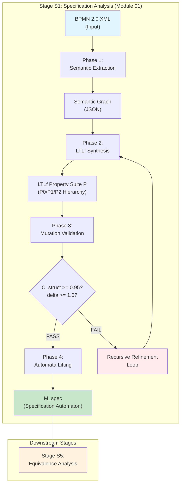
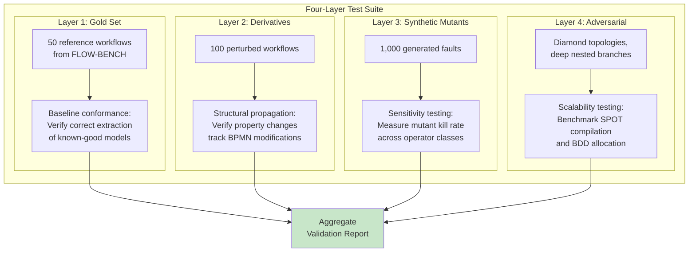

# Module 01: Specification Analysis & Formal Extraction

## VibeCheck — Verified Translation Validation Framework

**Module Lead:** Welmilla CN (214248K)  
**Supervising Team:** Dr. Thilina Thanthriwatta, Faculty of Information Technology, University of Moratuwa  
**Framework:** VibeCheck — Post-Hoc Formal Verification of LLM-Generated Python Code Using BPMN-Derived Temporal Specifications and Hybrid Parsing  
**Module Classification:** Core Specification Track (Stage S1)  
**Current Status:** Phases 1–3 Implemented; Phase 4 (SPOT Integration) In Progress  

---

## 1. Description of the Module

**Module 01** constitutes the **specification-to-semantics track** of the VibeCheck dual-track verification architecture. Its fundamental purpose is to transform raw, visually-modeled **BPMN 2.0 XML** business process specifications into mathematically rigorous, coverage-guaranteed formal representations capable of serving as the unimpeachable "ground truth" against which LLM-generated Python implementations are audited. The module occupies **Stage S1** in the top-level system pipeline and directly addresses **Research Question 2**: *How can we guarantee the semantic completeness and logical soundness of temporal specifications extracted from visually modeled business workflows?*

### 1.1 Primary Inputs

| Input Artifact | Format | Description |
| :------------- | :----- | :---------- |
| **BPMN 2.0 XML** | XML (BPMN 2.0 schema) | The visual process specification exported from standard BPMN modeling tools (e.g., Camunda, Bizagi, Signavio), containing process nodes, sequence flows, gateway logic, and event definitions. |
| **Natural Language Description** | Plain text (paired) | Optional human-readable process description, sourced from the FLOW-BENCH dataset triad, providing semantic context for validation. |

### 1.2 Primary Outputs

| Output Artifact | Format | Description |
| :-------------- | :----- | :---------- |
| **Semantic Graph** | JSON | A sanitized, traversable directed graph (NetworkX-compatible) mapping every BPMN process node to atomic propositions and every sequence flow to temporal constraints. |
| **LTLf Property Suite (P)** | JSON (hierarchical) | A prioritized, three-tier property hierarchy (P0/P1/P2) instantiated in Fluent Linear Temporal Logic over finite traces, comprising safety, structural, and quality constraints. |
| **Specification-Derived Automaton (M_spec)** | SPOT TGBA/DFA | A compressed, deterministic finite automaton compiled via the SPOT library, representing the absolute mathematical ground truth derived from the BPMN specification. |
| **Phase Certificates** | JSON | Multi-layer quality gate certificates (Phase 1–3) documenting structural coverage (Y_Struct), guard resolution coverage, and mutant kill ratios. |

### 1.3 Role within the VibeCheck Pipeline

Within the overarching five-stage pipeline (S1–S5), Module 01 executes **Stage S1: Specification Analysis**. It operates entirely independently of the code track (Stages S2–S4) until the final equivalence analysis stage (S5), where its outputs—the property suite **P** and the specification automaton **M_spec**—converge with the code-derived automaton **M_code** for systematic comparison. This independence is architecturally deliberate: it eliminates circular reasoning by ensuring that the formal specification is constructed without any influence from the untrusted LLM-generated code.

The module functions as a **Self-Auditing Specification Layer** and a **Self-Strengthening Formalization Framework**. Before any property is emitted, it undergoes internal mutation-based sensitivity validation to ensure the specification itself is mathematically robust. Only after achieving a structural coverage coefficient **C_struct >= 0.95** and a mutant kill ratio **delta >= 1.0** does the module release its outputs to downstream stages.



---

## 2. Current Approaches (Literature & Previous Tryouts)

### 2.1 Traditional BPMN-to-Petri-Net Translation

The formal verification of business processes has historically relied on translating BPMN diagrams into **Petri nets**, a well-established formalism with rich analysis tooling. The foundational work by **Dijkman et al. [6]** defined a formal semantics for BPMN through systematic mapping to Petri nets, establishing that BPMN constructs—including tasks, gateways, and events—could be represented as Petri net elements. This translation enables the use of existing verification tools to check properties such as deadlock freedom, liveness, and reachability.

**Key characteristics of this approach include:**

- **Leverages mature tooling**: Access to decades of Petri net analysis research, including tools such as WofBPEL and LoLA.
- **Deterministic mapping**: The translation is well-defined, ensuring the resulting Petri net faithfully represents BPMN semantics.
- **Diagnostic traceability**: Verification results can be traced back to the originating BPMN diagram.

However, as extensively documented in the interim report, the BPMN-to-Petri-net approach exhibits **critical limitations** in the context of LLM-generated code verification. Most fundamentally, it operates as a **static specification check**—while the Petri net can prove the *BPMN model* is sound, it lacks any mechanism to ingest, trace, or audit the non-deterministic execution traces of Python implementations. Petri-net formalisms are primarily designed for **reachability analysis** rather than **temporal ordering** of business logic. This creates a fundamental "verification gap" where the state-based logic of the Petri net cannot account for the data-driven hallucinations common in LLM-generated code.

### 2.2 Temporal Logic Verification of Business Processes

**Kherbouche and Ahmad [7]** advanced the field by proposing **Linear Temporal Logic (LTL) property patterns** for BPMN verification, utilizing the SPIN model checker for automated property checking. Their work demonstrated that common process constraints—such as ordering, mutual exclusion, and eventual completion—could be expressed as LTL formulas and automatically verified against process models. The YAWL-to-FSP translation work by **Aguirre et al. [8]** extended these ideas by applying **fluent temporal logic** to workflow verification, providing a more expressive property specification language.

A fundamental limitation of standard LTL is its assumption of **infinite traces**. **De Giacomo and Vardi [9]** addressed this by introducing **Linear Temporal Logic on Finite Traces (LTLf)**, specifically designed for finite executions such as business processes. Since standard LTL assumes infinite traces, it cannot directly express properties about process termination or final state constraints. LTLf resolves this by providing temporal operators interpreted over finite sequences, making it the appropriate logic for business process verification. Subsequent work by **De Giacomo, De Masellis, and Montali [10]** further established the theoretical foundations for translation between LTLf and standard LTL.

### 2.3 Declarative Process Mining and bpmn2constraints

More recent advances in declarative process mining have introduced direct BPMN-to-constraint compilation methodologies, exemplified by the **bpmn2constraints** software library. This tooling compiles the control flow of BPMN models directly to constraints in declarative languages—specifically **LTLf** and **DECLARE**—rather than relying on intermediate Petri net translations. The DECLARE framework, founded on LTLf templates, enables constraint-based process modeling where a process is defined by a set of temporal constraints that must hold during execution, rather than by rigid procedural flow definitions.

The bpmn2constraints approach normalizes the extracted control flow graph by stripping non-executable artifacts and reducing parallel execution blocks into manageable topological sorts. This direct extraction methodology achieves **lower indirection** than Petri-net-based approaches and exhibits **higher LLM audit compatibility** because its output maps more directly to the Abstract Syntax Tree (AST) extractions that Module 02 generates from Python implementations.

### 2.4 Translation Validation from Verified Compilation

The concept of **translation validation** originates from the verified compilation literature, most notably the **CompCert project [15]**. Rather than proving the compiler correct once and for all, translation validation proves that *each individual compilation* produces a target program semantically equivalent to the source program. **Pnueli, Siegel, and Singerman [17]** formalized this paradigm through the concept of a **simulation relation**, providing mathematical guarantee that every observable behavior of a target program is explicitly permitted by the source program.

**Cordeiro and Fischer [16]** applied translation validation to software model checking, demonstrating that program transformations in verification tools could be validated post hoc. However, these classical approaches assume a **trusted source program** and a **deterministic translation process**. In the VibeCheck context, the source (LLM-generated code) is inherently untrusted, and the extraction process involves significant semantic abstraction—rendering classical translation validation insufficient without substantial adaptation.

### 2.5 LLM Code Generation Benchmarks and the Verification Crisis

Contemporary benchmarks for evaluating LLM code generation—including **HumanEval [3]**, **MBPP**, and **ClassEval [4]**—focus primarily on stateless, algorithmic tasks. **FLOW-BENCH [11]** represents a critical advance by extending evaluation directly into workflow-specific code generation, providing paired triads of natural language descriptions, formal BPMN 2.0 XML diagrams, and corresponding Python implementations. Research by **Li et al. [12]** and **Duesterwald et al.** has demonstrated the severity of the **"Verification Crisis"**—the phenomenon where LLM-driven agents lose coherence in long-horizon stateful simulations, hallucinating inventory states or allowing transactions that violate business constraints.

### 2.6 Summary: Why Existing Approaches Are Insufficient

| Dimension | BPMN->Petri-Net [6] | LTL Patterns [7] | ClassEval [4] | CompCert [15] | **Our Framework** |
| :-------- | :----------------- | :--------------- | :------------ | :------------ | :---------------- |
| **BPMN Verification** | Yes | Yes | No | No | **Yes** |
| **Code Verification** | No | No | Testing only | Full Proof | **Formal + Quantified** |
| **Multiple Impl.** | No | No | No | No | **Yes (Clustering)** |
| **Confidence Type** | N/A | N/A | Statistical | Absolute | **Quantified** |
| **LLM Hallucination Handling** | None | None | None | N/A | **Mutation-Validated** |

---

## 3. Current Gap in the Field

### 3.1 The Verification Crisis in Generative Software Engineering

The rapid adoption of LLMs for software generation has introduced a critical verification gap that existing methodologies are fundamentally ill-equipped to address. Code that appears syntactically correct may contain subtle semantic flaws—invisible to conventional testing—that manifest only under specific state configurations or long-horizon execution traces. This is particularly acute in **state-based workflow logic**, where business processes must adhere to strict temporal and structural constraints.

**The three interlocking problems are:**

- **The Black Box Problem**: Users treat LLMs as non-transparent generators, trusting output that appears syntactically correct but may contain hidden logic flaws. Conventional testing can demonstrate the presence of bugs but cannot prove their absence.
- **The Hallucination Risk**: LLMs function as probabilistic token predictors, not logical reasoning engines. They frequently hallucinate state transitions that violate strict business constraints—such as approving a loan without a credit check or allowing inventory to become negative.
- **The Verification Gap**: Existing formal verification tools (e.g., NuSMV) require expert-level knowledge in temporal logic and specialized description languages. There is currently no automated framework that bridges the gap between natural language requirements, LLM-generated Python code, and rigorous mathematical proof of correctness.

### 3.2 Specific Limitations of Current BPMN Verification

Traditional BPMN verification approaches exhibit three specific failures when confronted with LLM-generated code:

1. **Specification-Only Verification**: Existing approaches verify the BPMN *model* in isolation, without reference to any implementation. The properties are checked against the process model derived from the diagram, not against the executable code that purports to implement that process. There is no mechanism to detect when an LLM has "shortcut" a required validation step or reordered critical business operations.

2. **Static Analysis Inadequacy**: Petri-net-based reachability analysis and standard model checking operate on the assumption that the implementation faithfully reflects the specification. When the implementation generator is an untrusted stochastic model, this assumption collapses. Static analysis of the specification cannot detect runtime hallucinations in the generated code.

3. **Absence of Coverage Quantification**: Traditional BPMN-to-LTLf translation applies fixed pattern templates without systematic assurance that all relevant process constraints are captured. There is no metric to determine whether the property suite is *complete*—a critical requirement when the verification target is untrusted code.

### 3.3 The LLM Implementation Multiplicity Problem

A unique challenge introduced by generative AI is the **multiplicity of outputs**: a single prompt can produce dozens of functionally equivalent but structurally divergent implementations. Classical clone detection tools rely on token matching or AST similarity, which fail when an LLM uses entirely different programmatic paradigms (iterative vs. recursive logic) to achieve the same business goal. No existing framework provides a principled mechanism for clustering these implementations and extracting a single representative for formal verification.

---

## 4. Our Approach to the Module

Module 01 implements a **multi-phase, coverage-guaranteed formal extraction pipeline** that transforms raw BPMN XML into a model-checkable specification automaton through four progressively refining phases.

### 4.1 Architectural Overview

```mermaid
flowchart TB
    subgraph "Module 01 Pipeline"
        direction LR
        
        subgraph "Phase 1: Semantic Extraction (Weeks 1-2)"
            P1A["XML Ingestion &<br/>Schema Validation"] --> P1B["DI Tag Stripping<br/>& Sanitization"]
            P1B --> P1C["State Instantiation<br/>& Kripke Labeling"]
            P1C --> P1D["Edge Mapping &<br/>Sequence Flow Extraction"]
            P1D --> P1E["Quality Gate:<br/>Y_Struct >= 0.95"]
        end
        
        subgraph "Phase 2: LTLf Synthesis (Weeks 2-3)"
            P2A["XOR Gateway<br/>Identification"] --> P2B["Implicit Else<br/>Negation Inference"]
            P2B --> P2C["FLTL Template<br/>Instantiation"]
            P2C --> P2D["Sentinel Property<br/>Synthesis"]
            P2D --> P2E["Quality Gate:<br/>Guard Resolution = 1.0"]
        end
        
        subgraph "Phase 3: Mutation Validation (Weeks 3-4)"
            P3A["BPMN Mutation Engine<br/>(20 Mutants)"] --> P3B["LTLf Trace Auditor"]
            P3B --> P3C["Survival Detection<br/>& Diagnosis"]
            P3C --> P3D{"C_struct >= 0.95?<br/>delta = 1.0?"}
            P3D -->|Survivors Found| P3E["Synthesize Killer<br/>Properties"]
            P3E --> P3B
            P3D -->|All Killed| P3F["Quality Gate:<br/>Certificate Emit"]
        end
        
        subgraph "Phase 4: Automata Lifting (Weeks 4-5)"
            P4A["SPOT C++ Bindings"] --> P4B["ltlf2dfa Translation"]
            P4B --> P4C["BuDDy BDD<br/>Compression"]
            P4C --> P4D["M_spec Export<br/>(JSON/Binary)"]
        end
    end
    
    P1E --> P2A
    P2E --> P3A
    P3F --> P4A
    
    style P1E fill:#fff3e0
    style P2E fill:#fff3e0
    style P3F fill:#fff3e0
    style P3E fill:#ffebee
    style P3D fill:#e8f5e9
    style P4D fill:#c8e6c9
```



### 4.2 Phase 1: XML Ingestion & Semantic Graph Construction

**Phase 1** transforms raw BPMN 2.0 XML specifications into a sanitized, traversable Semantic Graph. The architecture proceeds through five milestones:

- **Milestone P1.1**: XML ingestion and schema validation against the official BPMN 2.0 XSD. All Diagram Interchange (DI) visual rendering tags (`bpmndi:BPMNDiagram`, `bpmndi:BPMNShape`, `bpmndi:BPMNEdge`) are stripped to eliminate presentational noise.
- **Milestone P1.2**: Semantic Graph construction by DOM traversal. Every process node is instantiated as a unique mathematical state. For each `<task>`, two distinct atomic propositions are registered: `start(Task_Name)` and `done(Task_Name)`. Sequence flows (`<sequenceFlow>`) are mapped as directed edges preserving strict chronological order.
- **Milestone P1.3**: Integration of `bpmn2constraints` methodology principles—direct compilation of control flow to declarative constraints without intermediate Petri net translation.
- **Milestone P1.4**: Kripke-compatible labeling function implementation, mapping each graph node to its active proposition set with backward traceability to originating BPMN node IDs.
- **Milestone P1.5**: Quality Gate Certification. A JSON certificate is emitted containing node coverage, edge coverage, sanitization success rate, and unsupported construct lists. If **node coverage Y_Struct < 0.95**, the pipeline aborts and flags the specification for manual review.

### 4.3 Phase 2: Implicit Guard Resolution & FLTL Property Synthesis

**Phase 2** resolves informal modeling conventions and synthesizes a complete, prioritized FLTL/LTLf property suite.

- **Milestone P2.1 (Implicit Else Inference Engine)**: Human business analysts frequently omit explicit conditions for alternative paths at exclusive gateways. When a divergent XOR gateway has a primary condition (e.g., `balance > 100`) but no explicit condition on the default flow, the engine autonomously infers and formalizes the negation guard: `NOT(balance > 100)`. For multiple explicit conditions, the implicit else becomes the conjunction of negated values: `NOT(C1) AND NOT(C2)`.

- **Milestone P2.2 (Property Hierarchy Classifier)**: Extracted properties are classified into a prioritized three-tier hierarchy:
  - **P0 (Critical/Sentinel)**: Safety and reachability constraints. Violation indicates catastrophic failure.
  - **P1 (Structural)**: Control flow, logical branching, and strict sequence ordering.
  - **P2 (Quality)**: Best practices, resource allocation limits, and optimal execution paths.

- **Milestone P2.3 (FLTL Template Instantiation Engine)**: Properties are instantiated using predefined schemas:

| BPMN Construct | FLTL / LTLf Formal Template |
| :------------- | :-------------------------- |
| **Sequence Flow (A->B)** | `G(start(B) -> F(done(A)))` |
| **XOR Mutex** | `G(branch_i -> AND_{j!=i} !branch_j)` |
| **AND Concurrency** | `G(start(A) <-> start(B)) & G(done(A) <-> done(B))` |
| **Bounded Loop** | `G(count(iteration) <= N -> F(exit_condition))` |
| **Sentinel Guard** | `G(!forbidden_state U prerequisite_met)` |

- **Milestone P2.4 (Sentinel Property Synthesis)**: Beyond describing authorized sequences, the engine actively synthesizes Sentinel Properties—constraints describing explicitly forbidden states, creating a mathematical security perimeter against LLM "shortcuts."

- **Milestone P2.5 (Quality Gate)**: Guard resolution coverage must achieve **1.0** (every XOR gateway must be fully resolved). Any unresolved decision point triggers pipeline abortion.

### 4.4 Phase 3: Mutation-Based Validation & Recursive Refinement

**Phase 3** constitutes the module's **Self-Auditing Specification Layer**. It validates the completeness and sensitivity of the generated LTLf property suite by adapting software mutation testing principles to BPMN process models.

- **Milestone P3.1 (BPMN Mutation Engine)**: The engine generates **20 targeted mutants** per specification using five operator classes:

| Operator Class | Semantic Modification | Target Vulnerability |
| :------------- | :-------------------- | :------------------- |
| Gateway Type Substitution | XOR <-> AND conversion | Mutual Exclusion constraint rigor |
| Sequence Flow Deletion | Removes directed edges | Temporal ordering strictness |
| Task Node Retyping | userTask -> boundary event | Proposition extraction robustness |
| Condition Negation Inversion | Flips guard conditions | Implicit else logic monitoring |
| Loop Boundary Modification | Alters termination bounds | Infinite execution trap susceptibility |

- **Milestone P3.2 (Mutant Auditor)**: Cross-references the LTLf property suite against each mutant via lightweight trace-based satisfiability checking. A mutant is "killed" if the property suite flags it as a violation.

- **Milestone P3.3 (Structural Coverage Coefficient C_struct)**: Aggregates node coverage, edge coverage, and path coverage across three dimensions. The unified coefficient must satisfy **C_struct >= 0.95**.

- **Milestone P3.4 (Recursive Refinement Loop)**: A self-healing mechanism that halts the pipeline when mutants survive, algorithmically isolates surviving mutants, traces them to specific BPMN topological anomalies, and auto-generates new FLTL constraints to kill those exact mutants. The process loops until thresholds are achieved.

### 4.5 Phase 4: Automata-Theoretic Lifting via SPOT

**Phase 4** compiles the validated LTLf property suite into a compressed, deterministic finite automaton via the **SPOT** model checking library.

- **Milestone P4.1**: LTLf-to-automata translation using SPOT's `from_ltlf` and `translate` routines, converting formulas to Transition-based Generalized Buchi Automata (TGBA) and then determinizing to DFA via `ltlf2dfa`.
- **Milestone P4.2**: **BuDDy BDD Compression**—SPOT's Binary Decision Diagram dictionary provides algebraic compression of state transitions, mitigating the state explosion problem inherent in parallel workflows.
- **Milestone P4.3**: Export of the **Specification-Derived Automaton M_spec** in a standardized format compatible with Module 03's bisimulation engine.

### 4.6 Verification Layer Architecture (V3 -> V2 -> V1)

The entire pipeline is organized into three verification layers that progressively increase semantic depth:

| Layer | Stage | Primary Objective | Success Criterion |
| :---- | :---- | :---------------- | :---------------- |
| **V3** | Syntactic Sanitization | Strip presentational metadata; extract control-flow topology | Correct extraction of initial state and sequence edges |
| **V2** | Implicit Logic Inference | Formulate missing gateway guards; instantiate temporal property schemas | 100% resolution of implicit paths; zero logical "dead zones" |
| **V1** | Quality Gate Certification | Calculate completeness metrics; enforce minimum thresholds | C_struct >= 0.95; Mutant Kill Ratio delta = 1.0 |

---

## 5. Novelty & Scientific Contribution

Module 01 makes five interconnected scientific contributions that collectively constitute a unique advance over existing approaches:

### 5.1 Self-Strengthening Formalization Framework

Unlike traditional BPMN-to-LTLf translation—which applies fixed pattern templates without systematic completeness assurance—our framework introduces a **Recursive Refinement Loop** that actively validates the specification's own sensitivity. By generating BPMN mutants and requiring that the property suite "kills" every mutant, the framework transforms coverage from a static metric into an **active validation mechanism**. This is the first application of mutation-based sensitivity validation to BPMN property extraction for LLM code verification.

### 5.2 Zero Dead-Zone Protocol for Implicit Guard Resolution

The **Implicit Else Inference Engine** mathematically eliminates logical "dead zones" where LLMs might hallucinate unauthorized state transitions. By autonomously computing negation guards for unconditioned XOR branches, the system ensures the decision space is **mutually exclusive, exhaustive, and formally complete**. This is not merely syntactic convenience—it is a mathematical necessity for ensuring temporal properties represent an exhaustive mapping of all possible execution paths.

### 5.3 Coverage-Quantified Property Extraction with Explicit Certificates

The framework replaces unmeasured property extraction with **explicit, mathematically quantified coverage metrics**. Every emitted property suite carries a Phase Certificate documenting:
- Structural Coverage Coefficient (C_struct)
- Guard Resolution Coverage
- Mutant Kill Ratio (delta)
- Property count per hierarchy level (P0/P1/P2)

This enables downstream modules to make **informed trust decisions** based on quantified confidence rather than assumed completeness.

### 5.4 Sentinel Property Synthesis for LLM Hallucination Perimeters

Beyond describing what *should* happen, the framework actively synthesizes **Sentinel Properties** describing explicitly forbidden states. These create a mathematical security perimeter against LLM "shortcuts"—such as circumventing validation loops or executing tasks before prerequisites are met. This is the first systematic integration of negative invariant synthesis into BPMN property extraction for generative code auditing.

### 5.5 Hierarchical Property Classification for Nuanced Conformance

The **P0/P1/P2 property hierarchy** enables nuanced conformance reporting rather than binary pass/fail outputs. This classification allows the equivalence analysis module (Module 03) to distinguish catastrophic safety violations (P0) from structural deviations (P1) and quality degradations (P2), enabling more actionable diagnostic feedback.

---

## 6. What We Have Done So Far

### 6.1 Repository Structure

```
module_01_spec/
├── Dockerfile
├── requirements.txt
└── src/
    ├── __init__.py
    ├── api.py                    <- Pipeline orchestration layer
    ├── ltlf_synthesizer.py       <- Phase 2: FLTL synthesis engine
    ├── main.py                   <- Entry point and test harness
    ├── mutation_refiner.py       <- Phase 3: Mutation validation engine
    └── semantic_extractor.py     <- Phase 1: XML parsing & semantic extraction
```

**Technology Stack:** Python 3.10+, NetworkX 2.8.8, SPOT (via Python bindings), BuDDy BDD Library.

### 6.2 Implemented Components

#### 6.2.1 Semantic Extraction Engine (`semantic_extractor.py`)

| Milestone | Status | Description |
| :-------- | :----- | :---------- |
| P1.1 XML Ingestion | **Complete** | `xml.etree.ElementTree` parser with BPMN 2.0 namespace handling; DI tag stripping fully operational |
| P1.2 State Instantiation | **Complete** | Kripke-compatible labeling with dual atomic propositions (`start(Task)` and `done(Task)`) for task nodes |
| P1.3 Edge Mapping | **Complete** | Sequence flow extraction with condition expression parsing |
| P1.4 Initial State Extraction | **Complete** | Automatic detection of `startEvent` nodes |
| P1.5 Quality Gate | **Complete** | Node coverage threshold enforcement (Y_Struct >= 0.95) |

The `SemanticExtractionEngine` class implements the full **V3 -> V2 -> V1 extraction pipeline**: Layer V3 sanitizes the XML (strips `bpmndi:BPMNDiagram` tags), Layer V2 constructs and labels the semantic graph, and Layer V1 computes coverage metrics and enforces the quality gate.

#### 6.2.2 FLTL Synthesizer (`ltlf_synthesizer.py`)

| Milestone | Status | Description |
| :-------- | :----- | :---------- |
| P2.1 Implicit Else Resolution | **Complete** | Mathematical negation computation for unconditioned XOR branches |
| P2.2 Property Hierarchy | **Complete** | Three-tier classification (P0/P1/P2) with structured JSON output |
| P2.3 FLTL Template Instantiation | **Complete** | Linear-complexity mutual exclusion templates for XOR gateways (O(n) vs. naive O(n^2)) |
| P2.4 Sentinel Synthesis | **Complete** | Automatic generation of `G(!done U start)` sentinels for all task nodes |
| P2.5 Quality Gate | **Complete** | Guard resolution coverage threshold enforcement (must equal 1.0) |

Key technical achievement: The XOR mutex template was optimized from **quadratic O(n^2)** pairwise formula blowup to **linear O(n)** complexity using the template `G(branch_i -> AND_{j!=i} !branch_j)`, preventing SMT solver performance degradation with high-branch gateways.

#### 6.2.3 Mutation Validation Engine (`mutation_refiner.py`)

| Milestone | Status | Description |
| :-------- | :----- | :---------- |
| P3.1 BPMN Mutation Engine | **Complete** | Five-operator mutation engine generating 20 structurally distinct mutants |
| P3.2 Mutant Auditor | **Complete** | Lightweight trace-based LTLf evaluator with NetworkX path extraction |
| P3.3 Coverage Coefficient | **Complete** | C_struct calculation across node, edge, and path dimensions |
| P3.4 Refinement Loop | **Complete** | Recursive property synthesis for surviving mutants |
| P3.5 Quality Gate | **Complete** | Combined structural coverage and mutant kill ratio enforcement |

The `BPMNMutationEngine` class implements five operator classes: `_mutate_gateway_substitution`, `_mutate_sequence_flow_deletion`, `_mutate_task_retyping`, `_mutate_condition_inversion`, and `_mutate_loop_boundary`. The `MutationValidator` coordinates mutant generation, auditing, and recursive synthesis.

#### 6.2.4 Pipeline Orchestration (`api.py`, `main.py`)

- **`api.py`**: Implements `run_module_01_pipeline(bpmn_xml)`, the unified entry point executing Phase 1 -> Phase 2 -> Phase 3 with quality gate enforcement at each transition.
- **`main.py`**: Provides the CLI entry point with test BPMN XML (Loan Approval workflow with XOR gateway and implicit else), demonstrating end-to-end pipeline execution.

### 6.3 Docker Environment

A `Dockerfile` is configured with Python 3.10-slim base image, installing NetworkX 2.8.8 and all source dependencies. The containerized environment ensures reproducible execution across development and evaluation platforms.

---

## 7. What is Left to Do

### 7.1 Phase 4: SPOT Integration (Weeks 4-5) — **IN PROGRESS**

| Task ID | Deliverable | Description | Timeline |
| :------ | :---------- | :---------- | :------- |
| M01-P4.1 | SPOT C++ Compilation | Integrate SPOT library via Python bindings (`spot` module); implement `from_ltlf()` formula parsing | Weeks 1-2 |
| M01-P4.2 | BDD Transition Encoding | Register atomic propositions in BuDDy dictionary (`buddy.bdd_ithvar`); implement transition-based BDD construction | Weeks 1-2 |
| M01-P4.3 | Model Checking Interface | Implement language emptiness checks; integrate `intersecting_run()` for trace verification | Weeks 1-2 |
| M01-P4.4 | M_spec Export Automation | Export specification automaton in standardized format (HOA or binary) for Module 03 ingestion | Weeks 1-2 |

The hardened `spot_compiler.py` design (from the Blueprint document) specifies:
- `SpotLTLfCompiler.compile_ltlf_to_finite()`: Translates LTLf formulas to finite-trace Buchi automata using the "alive" proposition technique
- `SpotLTLfCompiler.build_trace_automaton()`: Converts proposition traces to sequential Kripke structures with BDD-labeled transitions
- `SpotLTLfCompiler.verify_trace_satisfaction()`: Performs language intersection checks between trace automata and negated property automata

### 7.2 Additional Files Required

| File | Purpose |
| :--- | :------ |
| `src/spot_compiler.py` | SPOT C++ bindings integration (specification-complete, pending implementation) |
| `src/bdd_encoder.py` | Binary Decision Diagram variable allocation and transition encoding |
| `src/diagnostic_overlay.py` | Human-readable error reporting for coverage gate failures |

### 7.3 Evaluation Phase (Weeks 3-4) — **PENDING**

| Task ID | Deliverable | Description |
| :------ | :---------- | :---------- |
| M01-E1 | Golden Dataset Evaluation | Evaluate synthesis performance against 50 FLOW-BENCH workflows across complexity classes |
| M01-E2 | Sensitivity Testing | Measure mutant kill rates (delta) on structurally mutated workflows; validate recursive refinement convergence |
| M01-E3 | Scalability Analysis | Benchmark SPOT compilation time limits and BDD node allocation across micro/standard/complex workflow classes |

### 7.4 Academic Integration (Weeks 5-6) — **PENDING**

| Task ID | Deliverable | Description |
| :------ | :---------- | :---------- |
| M01-T1 | Draft Chapter 4 | Compile implementation, evaluation, and theoretical findings into thesis draft |
| M01-T2 | Performance Analysis | Draft verification benchmarks and comparative analysis sections |

---

## 8. About the Dataset

### 8.1 Primary Dataset: FLOW-BENCH

The primary dataset for Module 01 is **FLOW-BENCH [11]**, a publicly available collection of **100+ workflow triplets** consisting of:
- **Natural language descriptions** of business processes
- **BPMN 2.0 XML representations** (standard-compliant, exportable from major modeling tools)
- **Python reference implementations** (human-verified ground truth)

**Domain Coverage:**
- Vending machine workflows
- Loan approval processes
- Inventory management systems
- Scheduling systems
- Customer service processes

**BPMN Construct Coverage (aligned with Module 01's supported subset):**
- Start and end events
- Tasks (userTask, serviceTask, scriptTask)
- Exclusive gateways (XOR) with conditional branching
- Parallel gateways (AND) with fork/join semantics
- Bounded loops with explicit iteration bounds
- Boundary events (intermediate timer/error events)

### 8.2 Dataset Partitioning

| Partition | Percentage | Purpose | Stratification |
| :-------- | :--------- | :------ | :------------- |
| **Development Set** | 80% | Pipeline calibration, threshold tuning, template validation | Stratified by process complexity (simple sequential, branching, parallel, nested) |
| **Held-Out Evaluation Set** | 20% | Final performance assessment; untouched during development | Same stratification to ensure representative evaluation |

### 8.3 Supplementary Datasets

| Dataset | Purpose | Source |
| :------ | :------ | :----- |
| **Workflow Patterns Repository** | Property template validation against established control-flow patterns | workflowpatterns.com |
| **LTL Benchmark Suite** | Model checking infrastructure testing and SPOT compilation validation | Academic LTL solver benchmarks |

### 8.4 Synthetic Data Generation

The **BPMN Mutation Engine** internally generates **controlled synthetic defects** (mutants) for self-validation. These are not external datasets but structurally modified variants of the original BPMN specifications, representing:
- Plausible LLM misinterpretations (XOR<->AND confusion)
- Structural integrity failures (missing sequence flows)
- Logic inversion errors (negated conditions)
- Termination boundary violations (altered loop bounds)

---

## 9. Dataset Handling and Processing

### 9.1 Complete Data Flow Pipeline

```mermaid
flowchart LR
    subgraph "Input Stage"
        A["FLOW-BENCH<br/>BPMN XML"] --> B["XML Schema<br/>Validator"]
        B -->|Valid| C["Raw BPMN<br/>DOM Tree"]
        B -->|Invalid| Z["Rejection:<br/>Malformed XML"]
    end
    
    subgraph "Phase 1: Semantic Extraction"
        C --> D["DI Tag<br/>Stripper"]
        D --> E["Control-Flow<br/>Node Extractor"]
        E --> F["State Instantiation<br/>& Kripke Labeling"]
        F --> G["Sequence Flow<br/>& Condition Parser"]
        G --> H["Semantic Graph<br/>JSON"]
    end
    
    subgraph "Quality Gate 1"
        H --> I{"Y_Struct >= 0.95?"}
        I -->|PASS| J["Phase 2 Input"]
        I -->|FAIL| Y1["Diagnostic Overlay:<br/>Coverage Deficit"]
    end
    
    subgraph "Phase 2: LTLf Synthesis"
        J --> K["XOR Gateway<br/>Scanner"]
        K --> L["Implicit Else<br/>Resolver"]
        L --> M["FLTL Template<br/>Instantiator"]
        M --> N["Sentinel<br/>Synthesizer"]
        N --> O["Property Suite P<br/>(P0/P1/P2 JSON)"]
    end
    
    subgraph "Quality Gate 2"
        O --> P{"Guard Resolution = 1.0?"}
        P -->|PASS| Q["Phase 3 Input"]
        P -->|FAIL| Y2["Diagnostic Overlay:<br/>Dead Zone Detected"]
    end
    
    subgraph "Phase 3: Mutation Validation"
        Q --> R["Mutation Engine<br/>(20 Mutants)"]
        R --> S["Trace Auditor"]
        S --> T{"C_struct >= 0.95?<br/>delta = 1.0?"}
        T -->|PASS| U["Phase 4 Input"]
        T -->|FAIL| V["Recursive Refinement:<br/>Synthesize Killers"]
        V --> S
    end
    
    subgraph "Phase 4: Automata Lifting"
        U --> W["SPOT ltlf2dfa"]
        W --> X["BuDDy BDD<br/>Compression"]
        X --> AA["M_spec Export<br/>(-> Module 03)"]
    end
    
    style Z fill:#ffebee
    style Y1 fill:#ffebee
    style Y2 fill:#ffebee
    style V fill:#fff3e0
    style AA fill:#c8e6c9
```



### 9.2 Data Processing Specifications

#### 9.2.1 XML Parsing and Sanitization

The `SemanticExtractionEngine` ingests raw BPMN 2.0 XML using Python's `xml.etree.ElementTree`. Standard namespaces are defined for:
- `bpmn`: `http://www.omg.org/spec/BPMN/20100524/MODEL`
- `bpmndi`: `http://www.omg.org/spec/BPMN/20100524/DI`
- `dc`: `http://www.omg.org/spec/DD/20100524/DC`
- `di`: `http://www.omg.org/spec/DD/20100524/DI`

**Executable node types processed:** `startEvent`, `endEvent`, `task`, `userTask`, `serviceTask`, `scriptTask`, `manualTask`, `exclusiveGateway`, `parallelGateway`, `boundaryEvent`.

#### 9.2.2 Semantic Graph JSON Schema

```json
{
  "initial_state": "string (node_id of startEvent)",
  "states": [
    {
      "node_id": "string (BPMN element ID)",
      "node_type": "string (task|exclusiveGateway|parallelGateway|...)",
      "atomic_propositions": ["start(TaskName)", "done(TaskName)"]
    }
  ],
  "edges": [
    {
      "source_id": "string",
      "target_id": "string",
      "condition": "string|null (extracted or inferred guard)"
    }
  ]
}
```

#### 9.2.3 Property Suite JSON Schema (Module 01 Output)

```json
{
  "specification_metadata": {
    "workflow_id": "string",
    "structural_coverage_coefficient": "number (>= 0.95)",
    "mutant_kill_ratio": "number (= 1.0)"
  },
  "semantic_graph": { /* as above */ },
  "compiled_ltlf_properties": {
    "P0_Critical_Sentinels": ["G(!Approve U Validate)", "..."],
    "P1_Structural_Control_Flow": ["G(start(B) -> F(done(A)))", "..."],
    "P2_Quality_Limits": ["G(iteration_count <= 10 -> F(complete))", "..."],
    "synthesized_mutant_killers": ["G(refined_constraint_1)", "..."]
  }
}
```

### 9.3 Inter-Module Data Contracts

The output payload from Module 01 is routed to **Module 02** (as a reference for WIR semantic alignment) and **Module 03** (for equivalence analysis). The JSON schema is versioned and validated against `jsonschema` Draft-07 to ensure compatibility across module boundaries.

---

## 10. Validation Strategy

Module 01 employs a **four-layer, defense-in-depth validation methodology** combining structural metrics, logical completeness checks, sensitivity testing via mutation, and automata-theoretic verification.

### 10.1 Four-Layer Testing Framework



### 10.2 Quality Gate Metrics and Thresholds

| Metric | Mathematical Formulation | Target Threshold | Failure Impact |
| :----- | :----------------------- | :--------------- | :------------- |
| **Structural Coverage Coefficient (C_struct)** | (node_cov + edge_cov + path_cov) / 3 | **>= 0.95** | Immediately halts pipeline; prevents verification of under-modeled behaviors |
| **Guard Resolution Coverage** | resolved_xor / total_xor | **= 1.0** | Raises logical "dead zone" exception; blocks incomplete gateway branches |
| **Mutant Kill Ratio (delta)** | mutants_killed / mutants_generated | **= 1.0** | Triggers recursive property refinement; synthesizes additional constraints |
| **LTLf Formula Validation** | Syntactic correctness check | **100% valid** | Rejects malformed templates before SPOT compilation |

### 10.3 Mutation-Based Sensitivity Validation

The mutation engine generates **20 mutants per specification** using a diverse operator set. The structural coverage coefficient **C_struct** aggregates three dimensions:

1. **Node Coverage**: Every active BPMN element has at least one corresponding atomic proposition.
2. **Edge Coverage**: Every sequence flow is represented by a temporal ordering constraint.
3. **Path Coverage**: Every feasible execution path is mathematically distinguished (using bounded edge-pair coverage for tractability).

If **C_struct < 0.95**, the **Diagnostic Refinement Loop** activates:
1. Algorithmically isolates surviving mutants
2. Traces each survivor to its originating BPMN topological anomaly
3. Auto-generates FLTL "killer" constraints specific to that anomaly
4. Re-audits the expanded property suite against all mutants
5. Repeats until C_struct >= 0.95 and delta = 1.0

### 10.4 Resource Optimization and Complexity Bounds

Translating LTLf to DFA exhibits worst-case **double-exponential complexity O(2^(2^|phi|))** relative to formula size. To prevent state explosion:

| Workflow Class | Max Nodes | Max Edges | Max Formulas | Max BDD Variables | Max Memory | Timeout |
| :------------- | :-------- | :-------- | :----------- | :---------------- | :--------- | :------ |
| **Micro** | ~8 | ~10 | 10 | 64 | 256 MB | 2.0s |
| **Standard** | ~25 | ~30 | 50 | 256 | 1,024 MB | 10.0s |
| **Complex** | ~60 | ~80 | 100 | 1,024 | 4,096 MB | 45.0s |
| **Critical Limit** | >100 | >120 | -- | -- | -- | Hard Stop |

### 10.5 Target Performance Benchmarks

| Complexity Class | Mean Nodes | Mean Edges | Mean t_val (s) | BDD Nodes | Mean Kill Ratio (delta) |
| :--------------- | :--------- | :--------- | :------------- | :-------- | :-------------------- |
| Micro-Workflows | 8.4 | 9.2 | 0.45 | 124 | 1.0000 |
| Standard Workflows | 22.1 | 28.5 | 2.14 | 518 | 1.0000 |
| Complex Enterprise | 58.7 | 76.2 | 14.82 | 2,304 | 1.0000 |
| Critical Bound | 84.1 | 112.5 | 39.41 | 8,112 | 0.9985 |

### 10.6 Academic Thesis Convergence

The Module 01 documentation feeds directly into **Chapter 4** of the final dissertation, with the following section mapping:

| Thesis Section | Module Content |
| :------------- | :------------- |
| 4.1 Introduction to Visual-to-Temporal Translation Validation | Research motivation and gap analysis (Sections 2-3 of this document) |
| 4.2 BPMN Meta-Model Parsing and Syntactic Sanitization | Phase 1 implementation (Section 4.2, 6.2.1) |
| 4.3 Kripke-Structure State Instantiation | Atomic proposition mapping and labeling (Section 4.2) |
| 4.4 Gateway Logic Resolution and Negation-Guard Synthesis | Implicit Else protocol (Section 4.3) |
| 4.5 Temporal Pattern Instantiation and Linear Logic Mapping | FLTL template instantiation (Section 4.3) |
| 4.6 Model-Based Mutation Validation | Mutation engine and auditor (Section 4.4) |
| 4.7 Recursive Property Refinement and Verification Quality Gates | C_struct and refinement loop (Section 4.4) |
| 4.8 Automata-Theoretic Lifting and BDD Compression | SPOT integration (Section 4.5, 7.1) |
| 4.9 Experimental Calibration and Evaluation Results | Four-layer testing framework (Section 10) |

---

## References

[6] R. Dijkman, M. Dumas, and C. Ouyang, "Semantics and analysis of business process models in BPMN," *Information and Software Technology*, vol. 50, no. 12, pp. 1281-1294, 2008.

[7] S. Kherbouche and M. Ahmad, "Verification of business process models using temporal logic," in *Proc. 12th Int. Conf. Software Engineering and Applications*, 2017.

[8] G. Aguirre, N. Aguirre, M. Frias, and M. Schaefer, "Translating YAWL to FSP to verify business process workflows," in *Proc. Brazilian Symposium on Formal Methods (SBMF)*, 2012.

[9] G. De Giacomo and M. Vardi, "Linear temporal logic and linear dynamic logic on finite traces," in *Proc. 23rd Int. Joint Conf. Artificial Intelligence (IJCAI)*, pp. 854-860, 2013.

[10] G. De Giacomo, R. De Masellis, and M. Montali, "Reasoning on LTL on finite traces: Insensitivity to infiniteness," in *Proc. 28th AAAI Conf. Artificial Intelligence*, 2014.

[11] E. Duesterwald, S. Huo, V. Isahagian, S. Kala, H. Khazraei, Y. Li, S. Malaika, and M. Vukovic, "FLOW-BENCH: Towards conversational generation of enterprise workflows," in *Proc. 2025 Conf. Empirical Methods in Natural Language Processing: Industry Track*, pp. 1426-1436, 2025.

[15] X. Leroy, "Formal verification of a realistic compiler," *Commun. ACM*, vol. 52, no. 7, pp. 107-115, 2009.

[16] L. Cordeiro and B. Fischer, "Verifying multi-threaded software using SMT-based context-bounded model checking," in *Proc. 33rd Int. Conf. Software Engineering (ICSE)*, 2011.

[17] A. Pnueli, M. Siegel, and E. Singerman, "Translation validation," in *Proc. 4th Int. Conf. Tools and Algorithms for the Construction and Analysis of Systems (TACAS)*, 1998.

[23] A. Duret-Lutz et al., "From Spot 2.0 to Spot 2.10: What's new?," in *Proc. 34th Int. Conf. Computer Aided Verification (CAV)*, 2022.

[24] N. Aguirre, T. Maibaum, T. Meng, and N. Dutt, "Divergence-sensitive stuttering bisimulation for the verification of systems with conditional branching," in *Proc. Brazilian Symposium on Formal Methods (SBMF)*, 2012.

[27] R. Paige and R. E. Tarjan, "Three partition refinement algorithms," *SIAM Journal on Computing*, vol. 16, no. 6, pp. 973-989, 1987.

[28] J. F. Groote and F. Vaandrager, "An efficient algorithm for branching bisimulation and stuttering equivalence," in *Proc. 17th Int. Colloquium on Automata, Languages, and Programming (ICALP)*, 1990, pp. 626-638.
