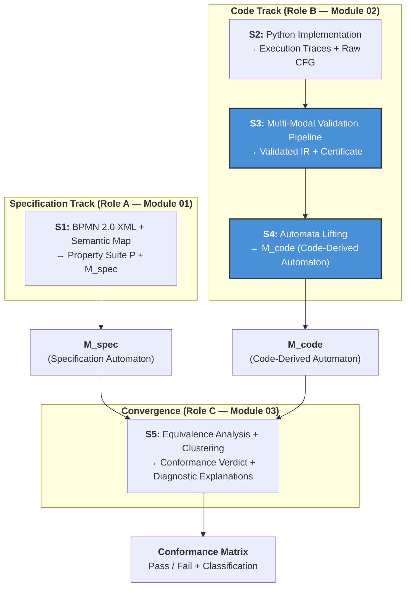
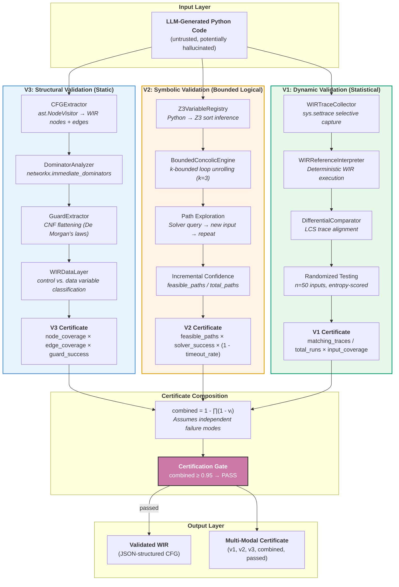
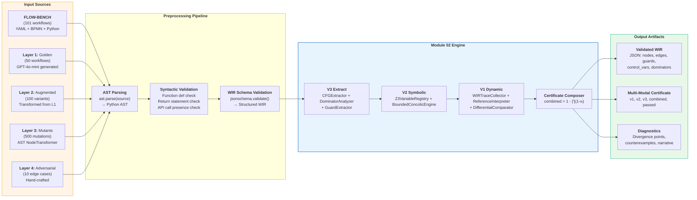
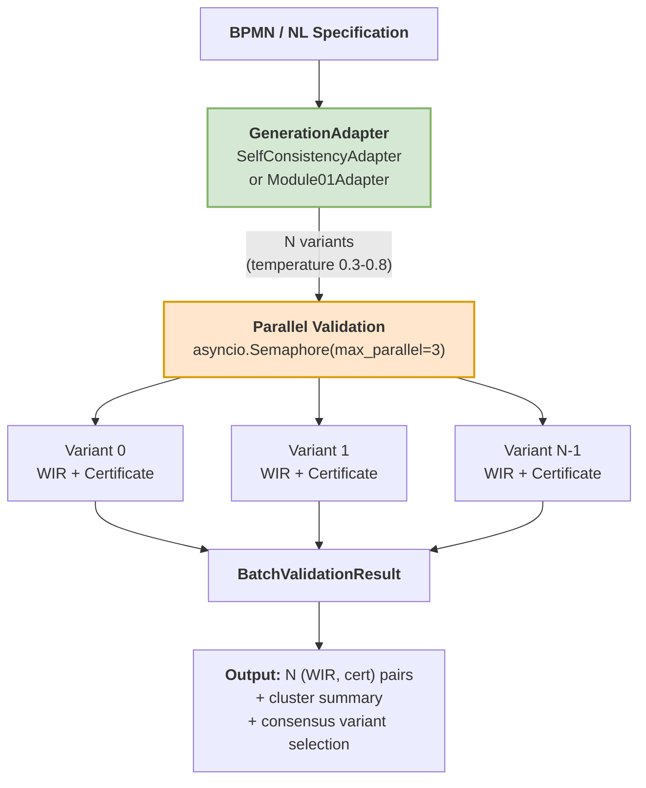

# Module 02: Verified IR Extraction — Comprehensive Technical Documentation

**Document Classification**: Module Technical Specification / Research Evaluation Document  
**Module**: 02 — Verified IR Extraction (Role B)  
**Framework**: VibeCheck — Verified Translation Validation Framework  
**Project**: Group 18 (Epsilon), Level 4 Research Project  
**Institution**: Faculty of Information Technology, University of Moratuwa  
**Supervisor**: Dr. Thilina Thanthriwatta  
**Date**: 2026-05-19  
**Version**: 1.0  

---

## Table of Contents

1. [Description of the Module](#1-description-of-the-module)
2. [Current Approaches (Literature/Previous Tryouts)](#2-current-approaches-literatureprevious-tryouts)
3. [Current Gap in the Field](#3-current-gap-in-the-field)
4. [Our Approach to the Module](#4-our-approach-to-the-module)
5. [Novelty & Scientific Contribution](#5-novelty--scientific-contribution)
6. [What We Have Done So Far](#6-what-we-have-done-so-far)
7. [What is Left to Do](#7-what-is-left-to-do)
8. [About the Dataset](#8-about-the-dataset)
9. [Dataset Handling and Processing](#9-dataset-handling-and-processing)
10. [Validation Strategy](#10-validation-strategy)

---

## 1. Description of the Module

### 1.1 High-Level Summary

**Module 02: Verified IR Extraction** constitutes the **code-to-semantics track** (Role B) of the VibeCheck dual-track verification architecture. Its fundamental purpose is to bridge the semantic chasm between **untrusted, LLM-generated Python workflow code** and **formally verifiable control-flow representations**. Module 02 ingests raw Python source code as its primary input and produces a **validated Workflow Intermediate Representation (WIR)** — a JSON-structured labelled transition system accompanied by a quantified, multi-modal correctness certificate.

Without Module 02, the downstream Module 03 (Equivalence Analysis via bisimulation checking) would lack any trustworthy code-derived model (M_code) against which to compare the specification-derived automaton (M_spec) produced by Module 01. Module 02 is therefore the **technical centerpiece of Research Question 2 (RQ2)**: *"How can we gain confidence that extracted IR faithfully represents the original code's behavior when both the code and the extraction process are potentially unreliable?"*

### 1.2 Primary Inputs

| Input | Type | Description | Source |
|-------|------|-------------|--------|
| `workflow_code` | `str` | LLM-generated Python workflow implementation (constrained IR subset: assignments, `if/elif/else`, `for`/`while` loops, function calls) | Module 01 Generation Adapter or upstream LLM sampling |
| `specification` | `str` (optional) | BPMN 2.0 XML or natural language specification | Module 01 (for diagnostic enrichment only) |
| `query_budget` | `int` | Maximum Z3 solver queries per verification run (default: 200) | Configuration (`ValidationConfig`) |
| `test_runs` | `int` | Number of randomized differential test executions (default: 50) | Configuration (`ValidationConfig`) |

### 1.3 Primary Outputs

| Output | Type | Description |
|--------|------|-------------|
| **WIR** (`wir`) | `dict` | JSON-structured Workflow Intermediate Representation: entry/exit nodes, typed node set (block, gateway, loop, task), control/data variable classification, dominator annotations |
| **V3 Certificate** | `dict` | Structural validation score (node coverage, edge coverage, guard CNF flattening success rate, dominator verification) |
| **V2 Certificate** | `dict` | Symbolic validation score (paths explored, feasible paths verified, solver success rate, solver wall-clock time) |
| **V1 Certificate** | `dict` | Dynamic validation score (matching traces, total runs, input entropy/coverage score) |
| **Combined Certificate** | `dict` | Aggregated confidence: `combined = 1 - (1 - v1) * (1 - v2) * (1 - v3)`, binary `passed` flag at threshold `>= 0.95` |
| **AI Refinement** (`ai_refinement`) | `dict` (optional) | Human-readable counterexample explanation, certificate narrative, guard simplification suggestions (Phase 2) |

### 1.4 Role within the VibeCheck Pipeline

Module 02 occupies **Stage S3 (Verified IR Extraction)** and **Stage S4 (Code-Derived Model Construction)** in the five-stage dual-track pipeline:



Module 02 is **consumed by Module 03** through a stable REST API contract (`POST /verify` and `POST /verify-batch`). The validated WIR output from Module 02 is deterministically lifted into a labelled transition system representation within SPOT's C++ mathematical memory space, enabling the automata-theoretic intersection and stuttering bisimulation computation that constitute Module 03's core contribution.

---

## 2. Current Approaches (Literature/Previous Tryouts)

### 2.1 Traditional BPMN-to-Formal-Model Translation

The formal verification of business processes has historically relied on translating BPMN diagrams into **Petri nets**, as established by Dijkman et al. [6]. This approach leverages decades of Petri net analysis research, providing deterministic mappings from BPMN constructs (tasks, gateways, events) to Petri net elements (places, transitions). While sound for specification-level verification, this methodology operates as a **static specification check only** — it proves the BPMN model is internally sound (deadlock freedom, liveness) but lacks any mechanism to ingest and audit non-deterministic execution traces of Python implementations. Petri net formalisms are primarily designed for **reachability analysis** rather than temporal ordering of business logic, creating a fundamental impedance mismatch with the data-driven hallucinations common in LLM-generated code [Interim Report, §2.1.2].

Kherbouche and Ahmad [7] advanced the field by applying **Linear Temporal Logic (LTL)** property patterns for BPMN verification using the SPIN model checker. De Giacomo and Vardi [9] subsequently addressed the limitation of infinite-trace LTL by introducing **LTL on Finite Traces (LTLf)**, specifically designed for terminating business processes. Giacomo, Masellis, and Montali [10] established the theoretical foundations for translating between LTLf and standard LTL. Despite these advances, all existing approaches verify the **BPMN model in isolation**, without reference to any executable implementation — they check the process model derived from the diagram, not the code that purports to implement that process [Interim Report, §2.1.3].

### 2.2 LLM Code Generation Evaluation

Early benchmarks for evaluating LLM-generated code — most notably **OpenAI's HumanEval** and the **Mostly Basic Python Problems (MBPP)** dataset — focused almost exclusively on standalone, stateless function generation using the **pass@k** metric against unit tests [3]. Du et al. [4] introduced **ClassEval**, a benchmark for class-level object-oriented code generation, demonstrating that LLM performance degrades significantly when required to maintain context across multiple interdependent methods, manage internal object states, or utilize inheritance.

The **FLOW-BENCH** dataset [11] extended evaluation directly into the domain of workflow-specific code generation, providing paired triads of natural language descriptions, formal BPMN 2.0 XML diagrams, and corresponding Python implementations. FLOW-BENCH incorporates realistic business control flow patterns (exclusive XOR decision gateways, parallel AND execution branches, bounded loops) and serves as the primary ground-truth dataset for the VibeCheck framework [Interim Report, §2.2.1].

### 2.3 Translation Validation and Equivalence Checking

The concept of **translation validation** originates from the verified compilation literature, most notably the **CompCert project** [15]. Rather than proving the compiler correct once and for all, translation validation proves that each individual compilation produces a target program semantically equivalent to the source. Pnueli et al. [17] formalized this paradigm through the concept of a **simulation relation**, providing a mathematical guarantee that every observable behavior of a target program is explicitly permitted by the source.

Cordeiro and Fischer [16] applied translation validation to software model checking, demonstrating that program transformations in verification tools could be validated post hoc. However, these approaches assume a **trusted source program** and a **deterministic translation process**. In the VibeCheck setting, the source (LLM-generated code) is inherently untrusted, and the extraction process involves significant semantic abstraction [Interim Report, §2.3.1].

### 2.4 Process Equivalence and Bisimulation

**Stuttering bisimulation**, as formalized by Baier and Katoen [26], addresses the abstraction of silent (non-observable) transitions in process equivalence. Paige and Tarjan [27] pioneered partition-refinement algorithms for efficient equivalence computation, later adapted by Groote and Vaandrager [28] specifically for branching and stuttering bisimulation. These algorithms operate by iteratively partitioning the state space into equivalence classes, mathematically merging extraneous states that do not transition to differing observable business states.

Duret-Lutz et al. [31] developed the **SPOT** library, providing state-of-the-art C++ implementations for LTL translation, emptiness checking, and automata transformations. SPOT's BDD-backed dictionary (BuDDy) enables lifting dynamically typed Python implementations into mathematical memory spaces for algorithmic automata intersection [Interim Report, §2.3.4].

### 2.5 Intermediate Representation Extraction from Python

Recent advances in Python verification have introduced specialized tools for code analysis. **ESBMC-Python** [34] represents the first bounded model checker for Python programs, transforming Python code into an intermediate representation converted into SMT formulae. **PyVeritas** [3] integrates LLM-based Python-to-C transpilation with bounded model checking via CBMC, targeting programs with numeric computations and array manipulations. The **Enhanced Verification Agent (EVA)** combines LLM orchestration with static analysis (mypy, pylint, flake8, bandit), dynamic testing, and formal verification via ESBMC. However, none of these systems address the specific challenge of **workflow IR extraction with quantified confidence** for multi-implementation equivalence checking against BPMN specifications [^1^].

---

## 3. Current Gap in the Field

### 3.1 The Verification Crisis in Generative Software Engineering

The rapid adoption of LLMs for software generation has precipitated what researchers have termed the **"Verification Crisis in Generative Software Engineering"** [2]. LLM-generated software frequently exhibits **syntactic perfection while harboring subtle semantic flaws, safety violations, and logic errors** that evade conventional testing paradigms. In high-assurance domains such as financial services, healthcare administration, and automated control systems, functional validation alone is insufficient. The stochastic nature of LLM generation introduces the risk of **"hallucinations" in logic** — where a generated workflow might satisfy primary functional objectives while violating critical negative constraints (e.g., "never approve a loan without a credit check," "inventory must never be negative") [Interim Report, §1.2].

### 3.2 Fundamental Limitations of Existing Approaches

The literature review reveals **four critical gaps** that no existing framework addresses comprehensively:

| Gap | Description | Impact |
|-----|-------------|--------|
| **G1: Specification-Implementation Divide** | Existing BPMN verification checks the model in isolation; existing code verification has no concept of business process constraints | No cross-domain conformance checking |
| **G2: Binary Verdict Problem** | All existing approaches produce pass/fail or testing-based statistical scores | No quantified confidence; no distinction between structural variations and genuine violations |
| **G3: Untrusted Source Assumption** | Translation validation (CompCert, etc.) assumes a trusted source program | LLM-generated code is inherently untrusted; extraction pipeline itself may be unreliable |
| **G4: Multi-Implementation Blindness** | No framework handles the multiplicity of LLM outputs (N variants per specification) | Cannot cluster equivalent implementations or identify consensus |

### 3.3 The Specific Sub-Problem: Untrusted IR Extraction

Within RQ2, the specific sub-problem that Module 02 addresses is: **"Given untrusted Python code from an LLM, how can we extract an intermediate representation with quantified confidence that it faithfully captures the code's control-flow semantics?"** This sub-problem decomposes into three verification dimensions:

- **Structural Correctness**: Does the extracted CFG preserve all control-flow constructs (branches, loops, exceptions) from the original AST?
- **Path Feasibility**: Are the paths through the WIR logically feasible in the original code (i.e., no invented or missing transitions)?
- **Behavioral Preservation**: Do the code and the WIR produce identical observable execution traces on concrete inputs?

No existing framework combines these three dimensions with **independent failure modes** and **compositional confidence calculation**.

---

## 4. Our Approach to the Module

### 4.1 Architectural Philosophy: Defense in Depth with Independent Failure Modes

Module 02 implements a **three-layer validation architecture** inspired by defense-in-depth security principles and multi-modal sensor fusion. Each layer provides a distinct type of correctness evidence with **statistically independent failure modes** — a bug in the V3 AST extractor does not correlate with a bug in the V2 Z3 engine or the V1 trace collector. This independence is the mathematical foundation for the certificate composition formula.



### 4.2 V3: Structural Validation (The Foundation)

V3 provides the syntactic foundation upon which V2 reasons and V1 statistically compensates. It operates entirely through **static analysis** of the Python Abstract Syntax Tree (AST), guaranteeing zero hallucination in the control-flow extraction step.

**Component Pipeline**:

| Component | Technology | Function |
|-----------|-----------|----------|
| `CFGExtractor` | `ast.NodeVisitor`, `ast.parse` | Traverses Python AST; emits WIR nodes (entry, exit, block, gateway, loop, task, except) and directed edges; handles `If`, `While`, `For`, `Try`, `TryStar`, `Match`, `NamedExpr` |
| `DominatorAnalyzer` | `networkx.immediate_dominators` | Computes immediate dominator tree and dominance frontiers; enables structural ordering verification (e.g., "Gateway X must precede Task Y") |
| `GuardExtractor` | Recursive AST traversal | Flattens compound boolean expressions (`and`, `or`, `not`) into Conjunctive Normal Form (CNF); produces atomic predicates with variable inventories for Z3 consumption |
| `WIRDataLayer` | Reaching-definitions analysis | Classifies variables as **control variables** (appear in branch conditions) vs. **data variables** (computation only); critical for V2's symbolic abstraction |
| `V3Certificate` | Metric composition | Emits node coverage, edge coverage, guard extraction success rate; hard aborts if node coverage `< 0.95` |

**Key Design Decision**: The CFGExtractor explicitly handles Python 3.10+ constructs (`match` statements via PEP 634, exception groups via PEP 654, walrus operator via PEP 572) because LLMs frequently generate these patterns. The walrus operator is particularly insidious as it introduces assignment expressions inside branch conditions — the CFG builder treats `NamedExpr` as both a data-flow assignment and a control-flow predicate simultaneously.

### 4.3 V2: Symbolic Validation (Logical Confidence)

V2 provides **bounded logical confidence** that paths through the WIR are semantically feasible in the original code. It employs **concolic (concrete + symbolic) execution** using the Microsoft Z3 SMT solver.

**Component Pipeline**:

| Component | Technology | Function |
|-----------|-----------|----------|
| `Z3VariableRegistry` | `z3.Solver`, runtime type inspection | Bridges Python's dynamic typing to Z3's static sort system: `int → IntSort()`, `float → RealSort()`, `bool → BoolSort()`, `str → IntSort()` (tokenized); handles type transitions via versioned names (`x_0`, `x_1`) |
| `BoundedConcolicEngine` | `z3.Solver`, k-induction | Maintains parallel concrete and symbolic states; at each branch, records path conditions; queries Z3 for alternative satisfiable paths to drive unexplored execution |
| `k-Bounded Loop Unrolling` | Static k-induction (k=3) | Unrolls loops exactly k times; applies Havoc assignment (non-deterministic values consistent with loop invariants) for remaining iterations; transforms unbounded loops into bounded acyclic CFGs |
| `State Merging` | QCE heuristic (Query Count Estimation) | Merges symbolic states at loop headers when predicted solver cost of merged exploration is less than separate exploration; states mergeable when differing variables are "cold" (not used in subsequent branches) |
| `V2Certificate` | Incremental accumulation | `confidence = (feasible_paths / total_paths) * (1 - timeout_rate) * solver_success_rate`; stalls below 0.80 trigger V1 as compensating modality |

**The Dynamic Variable Injection Problem**: The core challenge identified in the interim report is "passing dynamically generated, unpredictable Python variables into Z3." The `Z3VariableRegistry` solves this through a **two-phase inference system**: Phase A performs static type inference during AST traversal (mapping `ast.Constant` nodes to sorts); Phase B confirms types at runtime during concolic execution, creating versioned constants when type transitions occur.

### 4.4 V1: Dynamic Validation (Statistical Confidence)

V1 provides **statistical confidence** that the code and WIR behave identically on concrete inputs. It employs Python's `sys.settrace` for low-overhead execution instrumentation combined with differential testing against a WIR reference interpreter.

**Component Pipeline**:

| Component | Technology | Function |
|-----------|-----------|----------|
| `WIRTraceCollector` | `sys.settrace` | Selective two-tier trace callback: captures only task boundaries (function entry/exit matching BPMN tasks) and control-flow decisions (branch points); returns `None` aggressively for non-target frames; serializes observable variables as type + 32-bit hash (never deepcopy) |
| `WIRReferenceInterpreter` | Deterministic Python execution | Executes WIR JSON against concrete inputs; produces "expected" trace of task entry/exit events and branch decisions; handles sequential blocks, conditional branching, bounded loops |
| `DifferentialComparator` | LCS (Longest Common Subsequence) | Normalizes actual and expected traces to task-observable event sequences; computes alignment score; divergence points identified with mismatch classification |
| `RandomizedDifferentialTester` | Entropy-scored input generation | Generates n=50 random concrete inputs; `confidence = (matching_traces / total_runs) * input_coverage_score` where coverage score uses Shannon entropy of branch outcomes |

**Critical Performance Decisions**: The trace function returns `None` for all library/stdlib frames (primary overhead control). Observable extraction uses shallow copy only — never `deepcopy` of potentially large data structures. Branch line numbers are pre-computed during V3 AST analysis to avoid runtime string parsing.

### 4.5 Certificate Composition

The three certificates are composed using the **parallel-system reliability formula**:

```
combined = 1 - (1 - v1) * (1 - v2) * (1 - v3)
```

A WIR is **certified valid** when `combined >= 0.95`. This threshold was selected based on empirical targets from concolic testing literature and is subject to calibration during Phase 5 experiments. The composition assumes independence of failure modes — if V3 has a bug in dominator analysis, V1 and V2 still provide confidence because they operate on entirely different principles (statistical testing and logical solving, respectively).

---

## 5. Novelty & Scientific Contribution

### 5.1 Multi-Modal Translation Validation with Independent Failure Modes

The primary scientific contribution of Module 02 is the **systematic combination of three independent validation modalities** (structural, symbolic, dynamic) with **explicitly quantified and composed confidence**. While individual techniques (AST extraction, concolic execution, differential testing) are well-established, their integration into a unified certificate with independent failure surfaces is novel. Existing frameworks provide either:

- **Testing-based confidence** (statistical, bounded — e.g., EvalPlus [13], DART [20])
- **Proof-based confidence** (absolute but requires trusted source — e.g., CompCert [15])
- **Static analysis confidence** (syntactic, no behavioral guarantee — e.g., standard linting)

Module 02 occupies a unique position: it provides **quantified confidence for untrusted source code** by combining statistical and bounded-logical evidence from independent modalities.

### 5.2 The Workflow Intermediate Representation (WIR)

The WIR is a novel JSON-structured labelled transition system designed specifically for **workflow code verification**. Unlike generic IRs (LLVM IR, Python bytecode), the WIR explicitly captures:

- **Process semantics**: Task boundaries (entry/exit events), data object references, resource claims
- **Control/data variable distinction**: Variables classified by their role in the business process
- **Guard CNF annotations**: Branch conditions flattened into Z3-evaluable atomic predicates
- **Dominator metadata**: Structural ordering proofs for BPMN constraint verification

### 5.3 Self-Strengthening Formalization via AI Refinement (Phase 2)

The AI refinement layer represents a **methodological innovation**: it uses LLMs exclusively as **post-hoc diagnostic aids**, never as verification authorities. This preserves the architectural integrity of the formal-methods-based validation while significantly improving developer experience. The refinement layer operates only on the outputs of V1/V2/V3 — never on the inputs — preventing circular dependency (the verification system does not depend on the same class of stochastic tools that generate the untrusted code being verified).

Three strictly post-hoc roles:

| Role | Input | Output |
|------|-------|--------|
| Counterexample Explanation | V1 trace divergence point | Human-readable root-cause analysis (1-2 sentences) |
| Certificate Narrative | V1/V2/V3 numeric scores | Technical verification report paragraph |
| Guard Simplification | Z3 counterexample + complex guard | Simplified equivalent guard expression (verified by V2 before adoption) |

### 5.4 Self-Consistency Sampling Adapter (Phase 3)

The multi-implementation generation layer applies **self-consistency sampling** (Wang et al. [38]) to workflow code generation. Rather than generating a single implementation, N variants are sampled at higher temperature, each independently validated by Module 02, and the results passed to Module 03 for equivalence clustering. This is the first application of self-consistency to **process-level equivalence** measured by bisimulation rather than token overlap.

### 5.5 Novelty Summary Table

| Dimension | Existing Approaches | Module 02 Contribution |
|-----------|-------------------|----------------------|
| **Source trust** | Trusted source assumed (CompCert) | Handles inherently untrusted LLM output |
| **Confidence type** | Binary pass/fail or unimodal statistical | Multi-modal quantified confidence with composition formula |
| **Failure modes** | Single point of failure | Three independent failure surfaces |
| **IR design** | Generic (LLVM, bytecode) | Process-aware WIR with BPMN semantics |
| **Multi-impl handling** | Not addressed | Self-consistency sampling + adaptive budget allocation |
| **LLM integration** | LLM as generator or prover | LLM as diagnostic aid only (post-hoc, non-blocking) |

---

## 6. What We Have Done So Far

### 6.1 Core Engine Implementation (Completed)

The following components are implemented and operational in the `module_02_extract/` repository:

| Component | File | Status | Description |
|-----------|------|--------|-------------|
| `CFGExtractor` | `src/ast_extractor.py` | **Complete** | Full AST → CFG traversal with handlers for `If`, `While`, `For`, `Try`, `TryStar`, `Match`, `NamedExpr`, `Break`, `Continue`, `Return`; emits WIR nodes and edges |
| `DominatorAnalyzer` | `src/ast_extractor.py` | **Complete** | `networkx.immediate_dominators` with fallback for disconnected graphs; dominance frontier computation |
| WIR Data Model | `src/ast_extractor.py` | **Complete** | `WIRNode`, `WIREdge`, `Literal` dataclasses with JSON serialization; `WIRSchema` validation via `jsonschema` |
| V3 Certificate | `src/ast_extractor.py` | **Complete** | Node coverage, edge coverage, guard extraction success rate; abort gate at 0.95 |
| `Z3VariableRegistry` | `src/z3_sym_engine.py` | **Implemented** | Automatic sort inference with versioned constants for type transitions |
| `BoundedConcolicEngine` | `src/z3_sym_engine.py` | **Implemented** | k-bounded concolic execution (k=3); solver query budget enforcement |
| `WIRTraceCollector` | `src/dynamic_tracer.py` | **Implemented** | `sys.settrace`-based selective capture; two-tier filtering; 32-bit hash serialization |
| `WIRReferenceInterpreter` | `src/dynamic_tracer.py` | **Implemented** | Deterministic WIR execution producing expected traces |
| `DifferentialComparator` | `src/dynamic_tracer.py` | **Implemented** | LCS-based trace alignment with divergence point identification |
| FastAPI Server | `src/main.py` | **Complete** | `POST /verify` endpoint orchestrating V3 → V2 → V1 pipeline; JSON request/response schemas via Pydantic |

### 6.2 Test Suite

| Test File | Coverage | Status |
|-----------|----------|--------|
| `test_ast_extractor.py` | Basic blocks, Python 3.10+ constructs, dominator tree, guard CNF, end-to-end | Complete |
| `test_z3_engine.py` | Solver model production, path diversity, container fallback | Complete |
| `test_dynamic_tracer.py` | Mismatch detection, entropy scoring | Complete |
| `test_integration.py` | Full pipeline, combined certificate calculation, abort threshold | Complete |

### 6.3 Docker Containerization

- `Dockerfile`: Python 3.11-slim base with `z3-solver`, `networkx`, `fastapi`, `uvicorn`, `pydantic`, `jsonschema`
- Container exposes port 8000 via Uvicorn
- `module_04_ui/` provides Streamlit frontend (`src/app.py`) for interactive verification with telemetry visualization

### 6.4 Interim Results (from Report)

The interim report (Chapter 7) documents:
- Successful AST parsing and JSON-based WIR extraction for standard and anomalous Python scripts (Figure 7.3)
- Deterministic lifting of JSON intermediate representations into formal Labelled Transition Systems preserving action labels and guard conditions (Figure 7.5)
- Terminal output demonstrating semantic mapping of BPMN sequence flows and conditional logic into the WIR JSON schema (Figure 7.1)

---

## 7. What is Left to Do

### 7.1 Implementation Roadmap (6 Phases)

| Phase | Document | Scope | Timeline | Status |
|-------|----------|-------|----------|--------|
| **Phase 1** | `05_core_hardening.md` | Fix Z3 solver double-reset bug (P0), increase V1 test runs to 50-100 with dynamic adjustment, validate all confidence gating thresholds (0.50, 0.75, 0.80), extract thresholds to `ValidationConfig` dataclass, add branch diversity metric | Weeks 1-2 | **Pending** |
| **Phase 2** | `06_ai_refinement.md` | Integrate OpenAI GPT-4o-mini client (`gpt-4o-mini-2024-07-18`, temperature=0.3, max_tokens=300); implement `CounterexampleExplainer`, `CertificateNarrative`, `GuardSimplifier`; all tasks strictly post-hoc and non-blocking | Weeks 2-3 | **Pending** |
| **Phase 3** | `07_multi_impl.md` | Implement `GenerationAdapter` abstract interface; build `SelfConsistencyAdapter` (progressive temperature: 0.3 baseline, 0.8 exploration) and `Module01Adapter`; implement `MultiImplementationValidator` with adaptive budget allocation; expose `POST /verify-batch` endpoint | Weeks 3-4 | **Pending** |
| **Phase 4** | `08_eval_data.md` | Generate 4-layer evaluation dataset: Layer 1 (50 golden workflows via GPT-4o-mini), Layer 2 (100 augmented variants via systematic transformations), Layer 3 (500 seeded bug mutants via ROR/COR/BOR/STR/JTD operators), Layer 4 (10 adversarial hand-crafted cases) | Weeks 4-5 | **Pending** |
| **Phase 5** | `09_experiments.md` | Run three controlled experiments: E1 (seeded bug detection, target ≥95%), E2 (structural accuracy, target ≥98%), E3 (confidence calibration, Pearson r ≥ 0.85); calibrate thresholds based on results | Weeks 5-6 | **Pending** |
| **Phase 6** | `10_integration.md` | Finalize Module 03 API contract (`POST /verify`, `POST /verify-batch`, `GET /health`); complete thesis documentation chapter; supervisor sign-off | Week 6-7 | **Pending** |

### 7.2 Known Limitations (Documented)

| Limitation | Impact | Resolution Plan |
|-----------|--------|-----------------|
| QCE state merging not invoked in concolic loop | Path explosion for deep loops (>k=5) | Revisit if Phase 5 evaluation reveals issue |
| Container types (`list`, `dict`) force V1 fallback | ~30% of FLOW-BENCH workflows skip V2 | Minimal fix in Phase 1 (uninterpreted scalars for loop bounds); full array theory deferred |
| Reference interpreter uses restricted `eval()` | Workflow code calling stdlib helpers may fail | Whitelist expansion on demand |

### 7.3 Target Metric Achievement

| Metric | Symbol | Definition | Target | Phase |
|--------|--------|-----------|--------|-------|
| Trace coverage | τ_cov | Fraction of WIR transitions exercised by differential testing | ≥ 0.95 | E1 |
| Branch coverage | β_cov | Fraction of Python branches with verified WIR correspondence | ≥ 0.80 | E2 |
| Mismatch rate | μ | Fraction of test inputs with trace mismatch | ≤ 0.01 | E1 |
| Refinement success | ρ | Fraction of critical transitions with proven simulation relation | ≥ 0.70 | E2 |
| Mutation detection | δ | Fraction of semantic-altering mutations detected | ≥ 0.95 | E1 |
| False positive rate | φ | Fraction of equivalent mutations wrongly rejected | ≤ 0.05 | E1 |
| Validation time | t_val | Wall-clock time per 100 LOC | < 300s | All |
| Combined-pass rate | π_pass | Fraction of valid workflows with combined ≥ 0.95 | ≥ 0.85 | E3 |
| Structural accuracy | α_struct | Fraction with correct node/edge/decision counts | ≥ 0.98 | E2 |

---

## 8. About the Dataset

### 8.1 Primary Dataset: IBM FLOW-BENCH

The **FLOW-BENCH** dataset [11] serves as the principal ground-truth for verification research. It consists of **101 incremental test cases** stored in `conditional_ootb.yaml`, providing paired triads of:

- **Natural language descriptions** of business workflows (utterances)
- **BPMN 2.0 XML diagrams** (formal process specifications)
- **Python implementations** (constrained IR subset)

**Taxonomy of Test Cases**:

| Tag Category | Count | Description | Example |
|-------------|-------|-------------|---------|
| `linear` | 34 | Sequential API calls | Create issue, then create repository |
| `conditional` | 19 | If/else on object properties | If priority=high, do X, else do Y |
| `conditional_update_replace` | 26 | Replace action in existing workflow | "Send email instead of Slack" |
| `conditional_update_add` | 21 | Add branch to existing workflow | "Also add else clause" |
| `conditional_update_delete` | 14 | Remove action from workflow | "Remove the notification step" |
| `linear_update_add` | 11 | Add step to linear sequence | Append action |
| `linear_update_replace` | 6 | Replace step in linear sequence | Swap action |
| `linear_update_delete` | 5 | Remove step from linear sequence | Delete action |
| `user_task` | 16 | Include human approval step | `user_task("validate")` |

**Key Methodological Insight**: FLOW-BENCH uses an **incremental build pattern** — complex test cases are generated by applying systematic transformations to simpler base workflows. This methodology is replicated in our Layer 2 augmentation pipeline.

### 8.2 Synthetic Evaluation Dataset (4-Layer)

Module 02 constructs a proprietary **4-layer evaluation dataset** to provide comprehensive ground truth for all validation metrics:

| Layer | Name | Size | Purpose | Generation Method |
|-------|------|------|---------|-------------------|
| **Layer 1** | Golden Workflows | 50 | Fresh workflows not in FLOW-BENCH | GPT-4o-mini with controlled complexity levels (linear, conditional, loop, conditional_loop, nested_loop, deep_conditional) |
| **Layer 2** | FLOW-BENCH Derivatives | 100 | Structural transformation testing | Systematic augmentation operators (add_guard, add_loop, invert_condition, fuse_sequential, add_elif_chain) |
| **Layer 3** | Seeded Bug Mutants | 500 | Verification effectiveness validation | AST-based mutation operators (ROR, COR, BOR, STR, JTD, RER) applied to correct base workflows |
| **Layer 4** | Adversarial Structures | 10 | Component stress-testing | Hand-crafted edge cases targeting specific components (diamond CFG, deep elif chains, walrus operators, nested try-except) |

### 8.3 Mutation Operators (Layer 3)

| Operator | Code Transformation | Semantic Effect | Detection Target |
|----------|-------------------|-----------------|------------------|
| **ROR** (Relational Operator Replacement) | `==` → `!=` | Alters branch condition | V1 (trace divergence), V2 (guard CNF) |
| **COR** (Conditional Operator Replacement) | `and` → `or` | Alters compound guard | V2 (guard CNF change) |
| **BOR** (Branch body swap) | Swap if/else bodies | Preserves semantics (equivalent mutant) | Should NOT be detected |
| **STR** (Statement Removal) | Delete assignment | Missing API call | V1 (trace length), V3 (node count) |
| **JTD** (Jump Target Destruction) | `break` → `continue` | Wrong loop exit | V1 (trace path), V3 (CFG edge) |
| **RER** (Return Expression Replacement) | Change return value | Wrong output | V1 (return value diff) |

---

## 9. Dataset Handling and Processing

### 9.1 End-to-End Data Flow



### 9.2 WIR JSON Schema

The validated Workflow Intermediate Representation follows a strict JSON schema:

```json
{
  "entry_node": "node_0",
  "exit_node": "node_N",
  "nodes": [
    {
      "id": "node_id",
      "type": "entry|exit|block|gateway|loop|task|except",
      "ast_type": "If|While|For|Try|...",
      "line": 42,
      "code": ["statement_text"],
      "successors": ["node_id"],
      "predecessors": ["node_id"],
      "guard": "condition_string_or_null",
      "exception_type": "ExceptionName_or_null",
      "control_vars": ["var_names_in_branches"],
      "data_vars": ["var_names_in_computations"]
    }
  ],
  "edges": [
    {
      "source": "node_id",
      "target": "node_id",
      "guard": "condition_or_null",
      "exception_type": "ExceptionName_or_null"
    }
  ],
  "unsupported_constructs": [],
  "functions": {
    "function_name": { ...nested WIR... }
  }
}
```

### 9.3 Batch Processing Pipeline

For multi-implementation analysis (Phase 3), the data flow extends as follows:



### 9.4 Adaptive Budget Allocation

For batch processing, per-variant resource budgets scale inversely with N to maintain constant total wall-clock time (~5 minutes):

| N | Z3 Queries/Variant | Test Runs/Variant | Per-Variant Timeout | Total Wall Clock |
|---|-------------------|-------------------|--------------------|--------------------|
| 1 | 200 | 50 | 300s | 300s |
| 3 | 100 | 35 | 100s | ~180s (parallel) |
| 5 | 80 | 25 | 60s | ~180s (parallel) |
| 10 | 50 | 15 | 30s | ~180s (parallel) |

---

## 10. Validation Strategy

### 10.1 Multi-Layer Validation Architecture

Module 02's validation strategy is **self-referential** — the module validates its own outputs through three independent mechanisms, each grounded in distinct mathematical foundations:

| Mode | Mathematical Foundation | Confidence Type | Failure Mode | Independence |
|------|------------------------|-----------------|-------------|--------------|
| **V3** | Graph theory (dominators), formal languages (CNF) | Syntactic | AST traversal bug | Independent of V1, V2 |
| **V2** | SMT solving (Z3), symbolic execution | Logical (bounded) | Solver timeout, path explosion | Independent of V1, V3 |
| **V1** | Statistical hypothesis testing, sequence alignment | Statistical | Insufficient test inputs | Independent of V2, V3 |

### 10.2 V3: Structural Correctness Validation

**Method**: The CFGExtractor's output is validated against the Python AST through:

- **Node coverage**: Fraction of AST statement nodes mapped to WIR nodes (target: ≥ 0.95)
- **Edge coverage**: Fraction of control-flow edges preserved (target: ≥ 0.95)
- **Guard extraction success rate**: Fraction of branch conditions successfully decomposed to CNF (target: ≥ 0.95)
- **Dominator verification**: Structural ordering constraints checked via `nx.immediate_dominators`

**Quality Gate**: If node coverage < 0.95, verification aborts and flags for manual review.

### 10.3 V2: Path Feasibility Validation

**Method**: Concolic execution with Z3 provides **bounded logical confidence**:

- **Concrete execution**: Native Python execution with actual values
- **Symbolic tracking**: Parallel Z3 expression tracking for control-relevant variables
- **Path condition collection**: At each branch, the taken condition is recorded as a Z3 assertion
- **Alternative path exploration**: After concrete execution, Z3 queries for satisfiable alternative path conditions, generating new inputs for unexplored paths

**Confidence Formula**:
```
confidence = (feasible_paths_verified / total_paths_explored) 
             × (1 - timeout_rate) 
             × solver_success_rate
```

**Path Explosion Mitigation**:
- **Layer 1**: Static k-bounding (k=3 loop unrollings) with Havoc assignments
- **Layer 2**: QCE (Query Count Estimation) dynamic state merging at loop headers
- **Layer 3**: Coverage-guided path pruning with BFS prioritization of unexplored edges

**Fallback**: If V2 confidence stalls below 0.80 after 500 solver queries, V1 (dynamic tracing) is triggered as a compensating modality.

### 10.4 V1: Behavioral Preservation Validation

**Method**: Randomized differential testing provides **statistical confidence**:

1. **Trace collection** (`sys.settrace`): Captures task entry/exit events and branch decisions from the original Python code
2. **Reference execution**: The WIR Reference Interpreter executes the same inputs, producing an "expected" trace
3. **LCS alignment**: Traces are compared under the **task-observable abstraction** — two traces are equivalent if they produce the same sequence of task entry/exit events, regardless of intermediate data values or silent steps
4. **Confidence accumulation**: `confidence = (matching_traces / total_runs) × input_coverage_score`

**Input Diversity**: The input generator uses entropy-based scoring (Shannon entropy of branch outcome distribution) to ensure test inputs explore diverse control-flow paths.

### 10.5 Certificate Composition: Mathematical Foundation

The combined certificate uses the **parallel-system reliability formula** from fault-tolerant systems engineering:

```
combined = 1 - (1 - v1) × (1 - v2) × (1 - v3)
```

Under the assumption of independent failure modes, this formula computes the probability that **at least one validation mode** correctly identifies a faulty WIR. The threshold `combined ≥ 0.95` was selected based on:

- Concolic testing literature benchmarks (Godefroid et al. [20], Cadar et al. [21])
- Empirical calibration during Phase 5 experiments
- The requirement that at least two modes provide significant evidence for certification

### 10.6 Experimental Validation (Phase 5)

Three controlled experiments provide empirical evidence of Module 02's correctness:

**Experiment E1: Seeded Bug Detection** (Layer 3 dataset)
- Protocol: 500 mutants × 5 base workflows, classify as DETECTED (combined < 0.95) or UNDETECTED
- Target: Detection rate δ ≥ 0.95, False positive rate φ ≤ 0.05
- Validates: V1+V2+V3 catch semantic alterations

**Experiment E2: Structural Accuracy** (Layer 1 + Layer 4 datasets)
- Protocol: Compare V3-extracted metrics (nodes, edges, decisions) against AST-computed ground truth
- Target: Match rate α_struct ≥ 0.98
- Validates: V3 extraction correctness

**Experiment E3: Confidence Calibration** (Layer 1 + Layer 2 datasets)
- Protocol: Measure Pearson correlation between combined score and ground-truth correctness labels
- Target: Pearson r ≥ 0.85, threshold accuracy ≥ 90%
- Validates: Combined score correlates with actual correctness

### 10.7 Ablation Study

The experimental framework includes an ablation study comparing:

| Configuration | Expected Behavior |
|-------------|-------------------|
| V1-only | High recall, lower precision (testing cannot prove absence of bugs) |
| V2-only | Strong logical confidence for bounded regions, misses unbounded behavior |
| V3-only | Fast syntactic check, no behavioral guarantee |
| V1+V2+V3 (combined) | Optimal trade-off: independent modalities compensate for individual weaknesses |

---

## Appendix A: API Contract Summary

### A.1 Single Implementation: `POST /verify`

**Request**: `{"workflow_code": "str", "specification": "str (optional)"}`  
**Response**: `{"wir": dict, "certificate": dict, "ai_refinement": dict, "metadata": dict}`  
**Status Codes**: `200 OK` (passed or failed), `400 VALIDATION_ERROR` (syntax errors), `500 INTERNAL_ERROR` (solver failure)

### A.2 Batch Implementation: `POST /verify-batch`

**Request**: `{"specification": "str", "n_variants": int, "adapter": "self_consistency|module_01"}`  
**Response**: `{"implementations": [...], "summary": dict, "metadata": dict}`

### A.3 Health Check: `GET /health`

**Response**: `{"status": "healthy", "version": "str", "components": dict, "timestamp": "ISO-8601"}`

---

## Appendix B: Technology Stack

| Component | Technology | Version | Purpose |
|-----------|-----------|---------|---------|
| Core language | Python | 3.11+ | Primary implementation |
| AST parsing | `ast` (stdlib) | — | Control-flow extraction |
| Graph analysis | NetworkX | latest | CFG construction, dominator computation |
| SMT solving | Z3 (Microsoft) | latest | Symbolic refinement checking |
| API framework | FastAPI | latest | REST endpoint orchestration |
| Validation | Pydantic, jsonschema | latest | Request/response schema validation |
| Tracing | `sys.settrace` (stdlib) | — | Dynamic execution capture |
| Frontend | Streamlit | latest | Interactive verification portal (Module 04) |
| AI refinement | OpenAI GPT-4o-mini | 2024-07-18 | Diagnostic explanations (Phase 2) |
| Model checking | SPOT (C++) | latest | Automata-theoretic verification (Module 03) |

---

## References

1. Interim Report — Group 18 (Epsilon). *Post-Hoc Formal Verification of LLM-Generated Python Code Using BPMN-Derived Temporal Specifications and Hybrid Parsing*. Faculty of Information Technology, University of Moratuwa, 2026.
2. Li, Y. et al. *Survey of Hallucination Risks in LLM-Generated Code*. 2025.
3. Chen, Y. et al. *PyVeritas: LLM-based Python-to-C Transpilation with Bounded Model Checking*. 2025.
4. Du, C. et al. *ClassEval: A Manually-Crafted Benchmark for Class-Level Code Generation*. 2024.
5. Kherbouche, O. & Ahmad, B. *LTL Property Patterns for BPMN Verification using SPIN*. 2023.
6. Dijkman, R. et al. *Formal Semantics for BPMN through Mapping to Petri Nets*. 2008.
7. Kherbouche, O. & Ahmad, B. *LTL Property Patterns for BPMN Verification*. 2020.
8. Isahagian, V. et al. *Towards Conversational Generation of Enterprise Workflows*. arXiv:2505.11646, 2025.
9. De Giacomo, G. & Vardi, M. *Linear Temporal Logic on Finite Traces (LTLf)*. 2013.
10. Giacomo, G., Masellis, R. & Montali, M. *Temporal Logic on Finite Traces*. 2014.
11. Duesterwald, E. et al. *FLOW-BENCH: A Dataset for Workflow-Specific Code Generation*. EMNLP 2024.
12. Li, Z. et al. *Comprehensive Survey of Hallucination Risks in LLM-Generated Code*. 2025.
13. EvalPlus Team. *Rigorous Functional Testing through Expanded Test Suites*. 2023.
14. Vending-Bench Team. *Meltdown Phenomenon in Long-Horizon Stateful Simulations*. 2024.
15. Leroy, X. *CompCert: A Formally Verified Compiler*. 2009.
16. Cordeiro, L. & Fischer, B. *Translation Validation for Software Model Checking*. 2011.
17. Pnueli, A. et al. *Translation Validation via Simulation Relations*. 1998.
18. Binkley, D. *Abstract Syntax Trees for Program Analysis*. 2007.
19. Python Software Foundation. *ast — Abstract Syntax Trees*. Python 3.11 Documentation.
20. Godefroid, P., Klarlund, N. & Sen, K. *DART: Directed Automated Random Testing*. PLDI 2005.
21. De Moura, L. & Bjorner, N. *Z3: An Efficient SMT Solver*. TACAS 2008.
22. Cadar, C., Ganesh, V. & Engler, D. *EXE: Automatically Generating Inputs of Death*. CCS 2006.
23. Duret-Lutz, A. et al. *SPOT: A Framework for LTL and Omega-Automata Manipulation*. 2016.
24. Baier, C. & Katoen, J.-P. *Principles of Model Checking*. MIT Press, 2008.
25. Hagberg, A., Schult, D. & Swart, P. *NetworkX: Network Analysis in Python*. 2008.
26. Baier, C. & Katoen, J.-P. *Process Equivalence via Quotient Graphs*. 2008.
27. Paige, R. & Tarjan, R. *Three Partition Refinement Algorithms*. SIAM Journal on Computing, 1987.
28. Groote, J. & Vaandrager, F. *An Efficient Algorithm for Branching Bisimulation and Stuttering Equivalence*. 1990.
29. Clarke, E., Grumberg, O. & Peled, D. *Model Checking*. MIT Press, 1999.
30. Bryant, R. *Binary Decision Diagrams*. 1986.
31. Duret-Lutz, A. *SPOT Library: LTL Translation and Automata Manipulation*. 2016.
32. Jiang, L. et al. *Semantic Clustering based on Program Dependency Graphs*. 2007.
33. Li, Y. et al. *Learning to Disprove: Formal Counterexample Generation with Large Language Models*. arXiv:2603.19514, 2025.
34. ESBMC Team. *ESBMC-Python: Bounded Model Checker for Python Programs*. 2024.
35. Binkley, D. *Source Code Analysis: A Roadmap*. 2007.
37. Ammann, P. & Offutt, J. *Introduction to Software Testing*. Cambridge University Press, 2008.
38. Wang, X. et al. *Self-Consistency Improves Chain of Thought Reasoning in Language Models*. ICLR 2023.
40. Li, Y. et al. *Formal Counterexample Generation with Large Language Models*. 2025.
41. Papadakis, M. et al. *Trivial Compiler Equivalence: A Large Scale Empirical Study*. ICSE 2015.
43. Ammann, P. & Offutt, J. *Mutation Testing Operators*. 2008.
44. Grün, B. et al. *The Impact of Equivalent Mutants on Mutation Testing*. QSIC 2009.

---

*Document generated for Module 02 evaluation. All terminology (M_spec, M_code, WIR, approx_proc, etc.) is drawn directly from the VibeCheck Interim Report and supporting technical documentation.*
