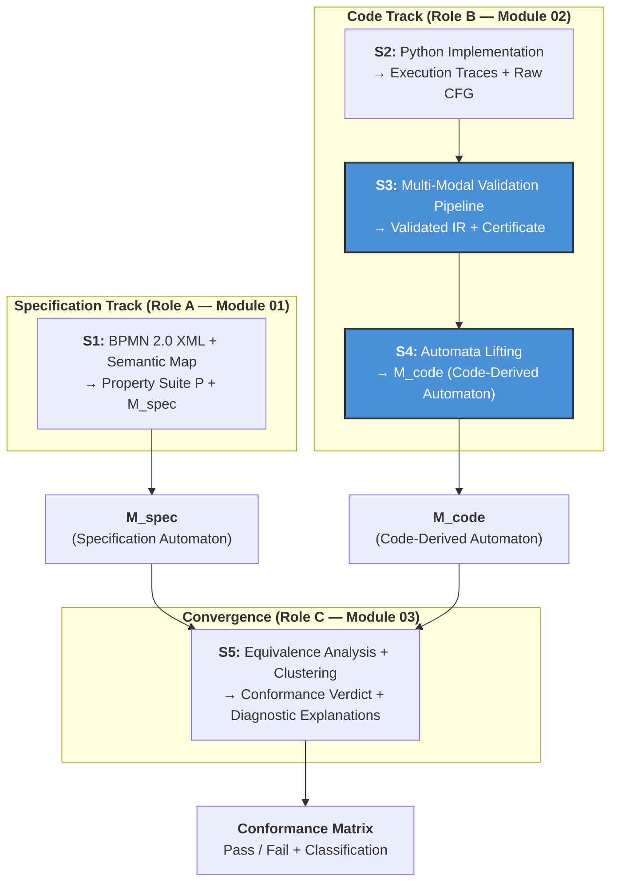
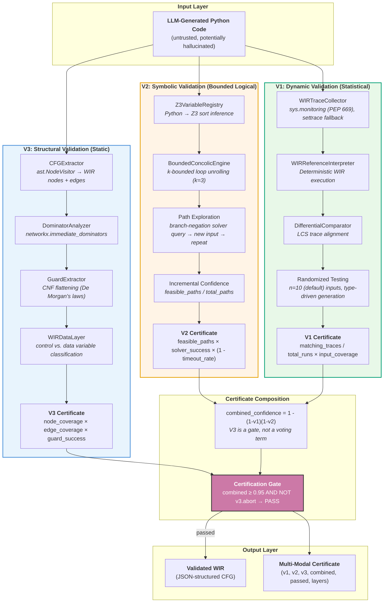
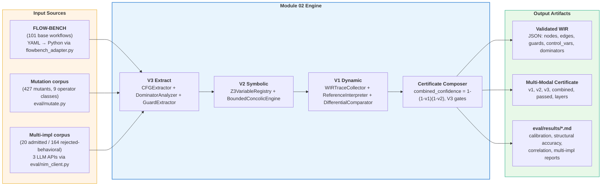

# Module 02: Verified IR Extraction — Comprehensive Technical Documentation

**Document Classification**: Module Technical Specification / Research Evaluation Document
**Module**: 02 — Verified IR Extraction (Role B)
**Framework**: VibeCheck — Verified Translation Validation Framework
**Project**: Group 18 (Epsilon), Level 4 Research Project
**Institution**: Faculty of Information Technology, University of Moratuwa
**Supervisor**: Dr. Thilina Thanthriwatta
**Date**: 2026-07-09 (rewritten from the current implementation; supersedes the 2026-05-19 version below)
**Version**: 2.0

> This document was rewritten in a docs-refresh session to reconcile it with the implemented reality after seven engineering sessions of changes (verdict-formula fix, QCE deletion, tracer migration to `sys.monitoring`, a full evaluation harness, a multi-implementation corpus). The literature review (§2) and problem-framing (§3) sections below predate the implementation and remain valid background — everything from §4 onward describes what is actually built and measured today, not the original plan. See §11 ("Design History") for the auditable correction trail.

---

## Table of Contents

1. [Description of the Module](#1-description-of-the-module)
2. [Current Approaches (Literature/Previous Tryouts)](#2-current-approaches-literatureprevious-tryouts)
3. [Current Gap in the Field](#3-current-gap-in-the-field)
4. [Our Approach to the Module](#4-our-approach-to-the-module)
5. [Novelty & Scientific Contribution](#5-novelty--scientific-contribution)
6. [What We Have Done So Far](#6-what-we-have-done-so-far)
7. [What is Left to Do](#7-what-is-left-to-do)
8. [About the Dataset](#8-about-the-dataset)
9. [Dataset Handling and Processing](#9-dataset-handling-and-processing)
10. [Validation Strategy](#10-validation-strategy)
11. [Design History](#11-design-history)

---

## 1. Description of the Module

### 1.1 High-Level Summary

**Module 02: Verified IR Extraction** constitutes the **code-to-semantics track** (Role B) of the VibeCheck dual-track verification architecture. Its fundamental purpose is to bridge the semantic chasm between **untrusted, LLM-generated Python workflow code** and **formally verifiable control-flow representations**. Module 02 ingests raw Python source code as its primary input and produces a **validated Workflow Intermediate Representation (WIR)** — a JSON-structured control-flow graph accompanied by a quantified, multi-modal correctness certificate.

Without Module 02, the downstream Module 03 (Equivalence Analysis via bisimulation checking) would lack any trustworthy code-derived model against which to compare the specification-derived automaton produced by Module 01. Module 02 is therefore the **technical centerpiece of Research Question 2 (RQ2)**: *"How can we gain confidence that extracted IR faithfully represents the original code's behavior when both the code and the extraction process are potentially unreliable?"*

### 1.2 Primary Inputs

| Input | Type | Description | Source |
|-------|------|-------------|--------|
| `source_code` | `str` | LLM-generated Python workflow implementation (assignments, `if`/`elif`/`else`, `for`/`while` loops, function calls, `try`/`except`, `match`) | Module 01 / upstream LLM sampling |
| `specification` | — | **Planned, not implemented.** No field for BPMN/LTLf context is currently accepted by `POST /verify`. | — |
| `V2_QUERY_BUDGET` | env var, `int` | Max Z3 solver queries per verification run. Default **20** (not 200 as originally planned), dynamically reduced further for larger programs. | Read once per request in `main.py` |
| `V1_RUNS` | env var, `int` | Number of randomized differential test executions. Default **10** (not 50 as originally planned), dynamically reduced further for larger programs. | Read once per request in `main.py` |
| `VERIFY_TIMEOUT_S` | env var, `float` | Wall-clock budget for the whole `/verify` call. Default **30**. See §4.4's honest limitation note on what this can and cannot bound. | Read once at import time in `main.py` |

The actual request body is a single JSON field, not the originally-envisioned `workflow_code`/`specification` pair — see §9.2 and Appendix A for the verified current schema.

### 1.3 Primary Outputs

| Output | Type | Description |
|--------|------|-------------|
| **WIR** (`wir`) | `dict` | JSON-structured Workflow Intermediate Representation: entry/exit nodes, typed node set (`entry`/`exit`/`block`/`gateway`/`loop`/`task`/`break`/`continue`/`return`/`except`/`finally`/`match`), control/data variable classification, dominator + dominance-frontier annotations, guard CNF extraction. See §9.2 for the full schema. |
| **V3 Certificate** | `dict` | Structural validation score (node coverage, edge coverage, guard extraction success rate, `abort` gate) |
| **V2 Certificate** | `dict` | Symbolic validation score (feasible paths / total paths, solver success rate, timeout rate) |
| **V1 Certificate** | `dict` | Dynamic validation score (matching traces / total runs, input coverage score, return-value skip count) |
| **Combined Certificate** | top-level keys | `v3_coverage`, `v2_confidence`, `v1_confidence`, `combined_confidence = 1 - (1-v1)(1-v2)`, `passed` (boolean), `message`, and a per-layer `layers` status object (`"OK"`/`"ERROR"`/`"SKIPPED"` + `reason` for each of v3/v2/v1) |
| **AI Refinement** | — | **Not implemented.** No counterexample explanation, certificate narrative, or guard simplification exists. Recorded here as design history only (see §5.3, §7). |

### 1.4 Role within the VibeCheck Pipeline

Module 02 occupies **Stage S3 (Verified IR Extraction)** and **Stage S4 (Code-Derived Model Construction)** in the dual-track pipeline. The conceptual flow below is unchanged from the original design:



**What is actually implemented today**: Module 02 is consumed by Module 03 through `POST /verify` only — `POST /verify-batch` (for multi-implementation batches) remains planned, not implemented (see §7). The S4 lifting step (WIR → automaton) is Module 03's own responsibility, described on its page, not Module 02's; Module 02's contract with Module 03 ends at the validated WIR + certificate. See `docs/module02/12_wir_and_certificate_contract.md` for the authoritative interface contract.

---

## 2. Current Approaches (Literature/Previous Tryouts)

*(Unchanged from the original document — this is background/literature review, independent of implementation details, and remains valid.)*

### 2.1 Traditional BPMN-to-Formal-Model Translation

The formal verification of business processes has historically relied on translating BPMN diagrams into **Petri nets**, as established by Dijkman et al. [6]. This approach leverages decades of Petri net analysis research, providing deterministic mappings from BPMN constructs (tasks, gateways, events) to Petri net elements (places, transitions). While sound for specification-level verification, this methodology operates as a **static specification check only** — it proves the BPMN model is internally sound (deadlock freedom, liveness) but lacks any mechanism to ingest and audit non-deterministic execution traces of Python implementations. Petri net formalisms are primarily designed for **reachability analysis** rather than temporal ordering of business logic, creating a fundamental impedance mismatch with the data-driven hallucinations common in LLM-generated code [Interim Report, §2.1.2].

Kherbouche and Ahmad [7] advanced the field by applying **Linear Temporal Logic (LTL)** property patterns for BPMN verification using the SPIN model checker. De Giacomo and Vardi [9] subsequently addressed the limitation of infinite-trace LTL by introducing **LTL on Finite Traces (LTLf)**, specifically designed for terminating business processes. Giacomo, Masellis, and Montali [10] established the theoretical foundations for translating between LTLf and standard LTL. Despite these advances, all existing approaches verify the **BPMN model in isolation**, without reference to any executable implementation — they check the process model derived from the diagram, not the code that purports to implement that process [Interim Report, §2.1.3].

### 2.2 LLM Code Generation Evaluation

Early benchmarks for evaluating LLM-generated code — most notably **OpenAI's HumanEval** and the **Mostly Basic Python Problems (MBPP)** dataset — focused almost exclusively on standalone, stateless function generation using the **pass@k** metric against unit tests [3]. Du et al. [4] introduced **ClassEval**, a benchmark for class-level object-oriented code generation, demonstrating that LLM performance degrades significantly when required to maintain context across multiple interdependent methods, manage internal object states, or utilize inheritance.

The **FLOW-BENCH** dataset [11] extended evaluation directly into the domain of workflow-specific code generation, providing paired triads of natural language descriptions, formal BPMN 2.0 XML diagrams, and corresponding Python implementations. FLOW-BENCH incorporates realistic business control flow patterns (exclusive XOR decision gateways, parallel AND execution branches, bounded loops) and serves as the primary ground-truth dataset for the VibeCheck framework [Interim Report, §2.2.1].

### 2.3 Translation Validation and Equivalence Checking

The concept of **translation validation** originates from the verified compilation literature, most notably the **CompCert project** [15]. Rather than proving the compiler correct once and for all, translation validation proves that each individual compilation produces a target program semantically equivalent to the source. Pnueli et al. [17] formalized this paradigm through the concept of a **simulation relation**, providing a mathematical guarantee that every observable behavior of a target program is explicitly permitted by the source.

Cordeiro and Fischer [16] applied translation validation to software model checking, demonstrating that program transformations in verification tools could be validated post hoc. However, these approaches assume a **trusted source program** and a **deterministic translation process**. In the VibeCheck setting, the source (LLM-generated code) is inherently untrusted, and the extraction process involves significant semantic abstraction [Interim Report, §2.3.1].

### 2.4 Process Equivalence and Bisimulation

**Stuttering bisimulation**, as formalized by Baier and Katoen [26], addresses the abstraction of silent (non-observable) transitions in process equivalence. Paige and Tarjan [27] pioneered partition-refinement algorithms for efficient equivalence computation, later adapted by Groote and Vaandrager [28] specifically for branching and stuttering bisimulation. These algorithms operate by iteratively partitioning the state space into equivalence classes, mathematically merging extraneous states that do not transition to differing observable business states.

Duret-Lutz et al. [31] developed the **SPOT** library, providing state-of-the-art C++ implementations for LTL translation, emptiness checking, and automata transformations. SPOT's BDD-backed dictionary (BuDDy) enables lifting dynamically typed Python implementations into mathematical memory spaces for algorithmic automata intersection [Interim Report, §2.3.4].

### 2.5 Intermediate Representation Extraction from Python

Recent advances in Python verification have introduced specialized tools for code analysis. **ESBMC-Python** [34] represents the first bounded model checker for Python programs, transforming Python code into an intermediate representation converted into SMT formulae. **PyVeritas** [3] integrates LLM-based Python-to-C transpilation with bounded model checking via CBMC, targeting programs with numeric computations and array manipulations. The **Enhanced Verification Agent (EVA)** combines LLM orchestration with static analysis (mypy, pylint, flake8, bandit), dynamic testing, and formal verification via ESBMC. However, none of these systems address the specific challenge of **workflow IR extraction with quantified confidence** for multi-implementation equivalence checking against BPMN specifications [^1^].

---

## 3. Current Gap in the Field

*(Unchanged from the original document — problem framing, independent of implementation details, remains valid.)*

### 3.1 The Verification Crisis in Generative Software Engineering

The rapid adoption of LLMs for software generation has precipitated what researchers have termed the **"Verification Crisis in Generative Software Engineering"** [2]. LLM-generated software frequently exhibits **syntactic perfection while harboring subtle semantic flaws, safety violations, and logic errors** that evade conventional testing paradigms. In high-assurance domains such as financial services, healthcare administration, and automated control systems, functional validation alone is insufficient. The stochastic nature of LLM generation introduces the risk of **"hallucinations" in logic** — where a generated workflow might satisfy primary functional objectives while violating critical negative constraints (e.g., "never approve a loan without a credit check," "inventory must never be negative") [Interim Report, §1.2].

### 3.2 Fundamental Limitations of Existing Approaches

The literature review reveals **four critical gaps** that no existing framework addresses comprehensively:

| Gap | Description | Impact |
|-----|-------------|--------|
| **G1: Specification-Implementation Divide** | Existing BPMN verification checks the model in isolation; existing code verification has no concept of business process constraints | No cross-domain conformance checking |
| **G2: Binary Verdict Problem** | All existing approaches produce pass/fail or testing-based statistical scores | No quantified confidence; no distinction between structural variations and genuine violations |
| **G3: Untrusted Source Assumption** | Translation validation (CompCert, etc.) assumes a trusted source program | LLM-generated code is inherently untrusted; extraction pipeline itself may be unreliable |
| **G4: Multi-Implementation Blindness** | No framework handles the multiplicity of LLM outputs (N variants per specification) | Cannot cluster equivalent implementations or identify consensus |

### 3.3 The Specific Sub-Problem: Untrusted IR Extraction

Within RQ2, the specific sub-problem that Module 02 addresses is: **"Given untrusted Python code from an LLM, how can we extract an intermediate representation with quantified confidence that it faithfully captures the code's control-flow semantics?"** This sub-problem decomposes into three verification dimensions:

- **Structural Correctness**: Does the extracted CFG preserve all control-flow constructs (branches, loops, exceptions) from the original AST?
- **Path Feasibility**: Are the paths through the WIR logically feasible in the original code (i.e., no invented or missing transitions)?
- **Behavioral Preservation**: Do the code and the WIR produce identical observable execution traces on concrete inputs?

No existing framework combines these three dimensions with **independent failure modes** and **compositional confidence calculation**.

---

## 4. Our Approach to the Module

### 4.1 Architectural Philosophy: Defense in Depth with Independent Failure Modes

Module 02 implements a **three-layer validation architecture** inspired by defense-in-depth security principles and multi-modal sensor fusion. Each layer provides a distinct type of correctness evidence with **statistically independent failure modes** — a bug in the V3 AST extractor does not correlate with a bug in the V2 Z3 engine or the V1 trace collector.



### 4.2 V3: Structural Validation (The Foundation)

V3 provides the syntactic foundation upon which V2 reasons and V1 statistically compensates. It operates entirely through **static analysis** of the Python Abstract Syntax Tree (AST), guaranteeing zero hallucination in the control-flow extraction step. It is implemented as the `ast_extractor/` package (modularized from a single `ast_extractor.py` file during development):

| Component | File | Function |
|-----------|------|----------|
| `CFGExtractor` | `cfg_extractor.py` | Traverses Python AST; emits WIR nodes (`entry`, `exit`, `block`, `gateway`, `loop`, `task`, `break`, `continue`, `return`, `except`, `finally`, `match`) and directed edges; a post-construction pass (`contract_bookkeeping_nodes`) contracts blank merge/exit bookkeeping nodes so WIRs contain no structurally-redundant nodes |
| `DominatorAnalyzer` | `dominators.py` | `networkx.immediate_dominators` with fallback for disconnected graphs; dominance frontier computation |
| `GuardExtractor` | `guards.py` | Flattens compound boolean expressions (`and`, `or`, `not`) into Conjunctive Normal Form (CNF); produces atomic predicates with variable inventories for Z3 consumption |
| Control/data classification | `data_layer.py` | Classifies variables as **control variables** (appear in branch conditions) vs. **data variables** (computation only); critical for V2's symbolic abstraction |
| `V3Certificate` | `certificate.py` | Emits node coverage, edge coverage, guard extraction success rate; hard aborts (`abort=True`) if node coverage `< 0.95` |

**Key Design Decision**: The CFGExtractor explicitly handles Python 3.10+ constructs (`match` statements via PEP 634, exception groups via PEP 654, walrus operator via PEP 572) because LLMs frequently generate these patterns. The walrus operator is particularly insidious as it introduces assignment expressions inside branch conditions — the CFG builder treats `NamedExpr` as both a data-flow assignment and a control-flow predicate simultaneously.

### 4.3 V2: Symbolic Validation (Logical Confidence)

V2 provides **bounded logical confidence** that paths through the WIR are semantically feasible in the original code. It employs **concolic (concrete + symbolic) execution** using the Microsoft Z3 SMT solver, implemented as the `z3_sym_engine/` package:

| Component | File | Function |
|-----------|------|----------|
| `Z3VariableRegistry` | `registry.py` | Bridges Python's dynamic typing to Z3's static sort system: `int → IntSort()`, `float → RealSort()`, `bool → BoolSort()`, `str → IntSort()` (tokenized); handles type transitions via versioned names |
| `BoundedConcolicEngine` | `concolic.py` | Maintains parallel concrete and symbolic states; at each branch, records path conditions; negates the last-taken branch and queries Z3 for a satisfying input to drive unexplored execution. Also seeds empty container (`list`/`dict`) inputs with small non-empty samples (discovering subscripted string keys from the source AST where possible) so container-dependent branches actually get explored |
| `k`-Bounded Loop Unrolling | inside `concolic.py`'s tracer | Unrolls loops up to `k=3` iterations by default |
| `V2Certificate` | `_emit_certificate` in `concolic.py` | `confidence = (feasible_paths / total_paths) * (1 - timeout_rate) * solver_success_rate`; a persistent, incrementally-blocked Z3 solver is reused across iterations rather than rebuilt each time |

**QCE state merging was removed.** An earlier design (Query Count Estimation — merging symbolic states at loop headers when the variables that differ are "cold," i.e. not used in future branch conditions) was implemented as `merge_states`/`qce_predicts_savings`/`_reachable_from` but was **never wired into the concolic exploration loop above** — it was exercised only by its own unit tests. Rather than leave unused code implying a capability the engine doesn't have, it was deleted (`eval/results/session_b_report.md`'s B4 section documents the `gitnexus_impact`-confirmed zero-production-caller evidence for this).

**The Dynamic Variable Injection Problem**: the core challenge identified in the interim report is "passing dynamically generated, unpredictable Python variables into Z3." The `Z3VariableRegistry` solves this through a **two-phase inference system**: Phase A performs static type inference during AST traversal (mapping `ast.Constant` nodes to sorts); Phase B confirms types at runtime during concolic execution, creating versioned constants when type transitions occur.

### 4.4 V1: Dynamic Validation (Statistical Confidence)

V1 provides **statistical confidence** that the code and WIR behave identically on concrete inputs. It employs a low-overhead trace collector combined with differential testing against a WIR reference interpreter, implemented as the `dynamic_tracer/` package:

| Component | File | Function |
|-----------|------|----------|
| `WIRTraceCollector` | `collector.py` | Prefers **PEP 669 `sys.monitoring`** (Python 3.12+, orders of magnitude cheaper than `sys.settrace` — no per-line frame materialisation), falling back to `sys.settrace` on older interpreters or if no monitoring tool id is free. Captures task boundaries, branch decisions (including `taken_branch`, via native `BRANCH` events with a next-line-inference fallback), and exceptions |
| `WIRReferenceInterpreter` | `interpreter.py` | Executes WIR JSON against concrete inputs; produces an "expected" trace of task entry/exit events, branch decisions, exceptions, and (since the most recent engineering session) the function's actual return value |
| `DifferentialComparator` | `comparator.py` | LCS (Longest Common Subsequence)-based trace alignment; supports two comparison modes — `strict` (branch decisions are signal, correct for a mutant vs. its own base) and `task_only` (branch decisions dropped, correct for comparing independently-written implementations where branch structure is legitimate style, not a correctness signal) |
| `RandomizedDifferentialTester` | `randomized.py` | Type-driven input generation: `bool` params drawn from both `True`/`False` every run; `str` params drawn from a round-robin-guaranteed pool of the code's own guard-compared string literals; `int`/`float` params drawn uniformly from a fixed range (no targeted boundary sampling — a named, open gap); `confidence = (matching_traces / total_runs) * input_coverage_score` |
| `MultiModalCertificateComposer` | `composer.py` | Combines v1/v2 into `combined_confidence`, gates on v3's `abort` |

**Return-value observability** was added in the most recent engineering session: both trace sides now emit a `return_value` event (with a graceful-degrade guard — if the reference interpreter can't evaluate a return expression, no event is emitted on that side, and the comparison excludes return-value comparison for that run symmetrically rather than fabricating a value). This closed a previously-invisible class of bug: two implementations with identical branch structure and task-call sequence but a different final return value.

**Wall-clock timeout, and its honest limitation**: the whole `/verify` call runs under a `ThreadPoolExecutor` + `future.result(timeout=VERIFY_TIMEOUT_S)`. This reliably bounds a **GIL-releasing** hang (an infinite Python bytecode loop, or blocked I/O). It does **not** bound a **GIL-monopolizing** hang — a single uninterrupted C-level statement with no bytecode safepoint blocks the timeout check itself until that statement finishes (verified directly with a big-integer exponentiation holding the GIL for its whole runtime); if such a statement never finished, this wrapper would hang forever too. Closing this gap would require process-based isolation (`multiprocessing` + `Process.terminate()`), not implemented — named as an open item rather than silently assumed solved.

### 4.5 Certificate Composition

The two behavioral-correctness certificates are composed using the **parallel-system reliability formula**:

```
combined_confidence = 1 - (1 - v1_confidence) * (1 - v2_confidence)
```

V3 does **not** appear in this product (an earlier three-term version did — see §11's design history). V3 measures extraction fidelity, not behavioral correctness, and saturates to a near-1.0 score for almost any structurally extractable program, which made the three-term product's combined score vacuous. V3 now **gates**: if `v3_cert["abort"]` is true, verification fails immediately regardless of v1/v2. A WIR is **certified valid** when `combined_confidence >= 0.95` and V3 did not abort. This self-mode threshold is distinct from differential mode's separately-calibrated `tau = 0.10` operating point — see §10.6.

---

## 5. Novelty & Scientific Contribution

### 5.1 Multi-Modal Translation Validation with Independent Failure Modes

The primary scientific contribution of Module 02 is the **systematic combination of three independent validation modalities** (structural, symbolic, dynamic) with **explicitly quantified and composed confidence**. While individual techniques (AST extraction, concolic execution, differential testing) are well-established, their integration into a unified certificate with independent failure surfaces is novel. Existing frameworks provide either:

- **Testing-based confidence** (statistical, bounded — e.g., EvalPlus [13], DART [20])
- **Proof-based confidence** (absolute but requires trusted source — e.g., CompCert [15])
- **Static analysis confidence** (syntactic, no behavioral guarantee — e.g., standard linting)

Module 02 occupies a unique position: it provides **quantified confidence for untrusted source code** by combining statistical and bounded-logical evidence from independent modalities. This is implemented and measured — see §10.6 for current calibration numbers.

### 5.2 The Workflow Intermediate Representation (WIR)

The WIR is a JSON-structured labelled transition system designed specifically for **workflow code verification**. Unlike generic IRs (LLVM IR, Python bytecode), the WIR explicitly captures:

- **Process semantics**: Task boundaries (entry/exit events), guard conditions, exception types
- **Control/data variable distinction**: Variables classified by their role in the business process
- **Guard CNF annotations**: Branch conditions flattened into Z3-evaluable atomic predicates
- **Dominator metadata**: Structural ordering information

The full, current schema is in §9.2 and `docs/module02/12_wir_and_certificate_contract.md`.

### 5.3 AI-Assisted Refinement — planned, not realized

An earlier design proposed an AI-refinement layer: LLMs used exclusively as **post-hoc diagnostic aids** (counterexample explanation, certificate narrative, guard simplification), never as verification authorities, to preserve the architectural integrity of the formal-methods-based validation. **This was never implemented** — no code exists under this design. It is recorded here as design history, not as a realized contribution; see §7 and §11.

### 5.4 Multi-Implementation Comparison — realized differently than planned

An earlier design proposed **self-consistency sampling** (Wang et al. [38]): generating N implementations of the same workflow at high temperature from the *same* model and validating each independently. What was actually built is different and, in one respect, stronger: a **multi-implementation corpus generated from three independent LLM model families** (not temperature-sampled variants of one model) — `meta/llama-3.1-8b-instruct`, `mistralai/mixtral-8x7b-instruct-v0.1`, `qwen/qwen3-next-80b-a3b-instruct` — compared against each other and against reference WIRs, plus a `comparison_mode` (`strict`/`task_only`) that explicitly distinguishes "branch-structure divergence is signal" (same-lineage, e.g. a mutant vs. its base) from "branch-structure divergence is legitimate style" (independent implementations of the same task). This was built as an **evaluation harness** (`eval/`), not as a production `src/` adapter layer or a `/verify-batch` endpoint — see §7 and §8.2 for what exists and its measured numbers.

### 5.5 Novelty Summary Table

| Dimension | Existing Approaches | Module 02 Contribution |
|-----------|-------------------|----------------------|
| **Source trust** | Trusted source assumed (CompCert) | Handles inherently untrusted LLM output |
| **Confidence type** | Binary pass/fail or unimodal statistical | Multi-modal quantified confidence with composition formula (implemented, measured — §10.6) |
| **Failure modes** | Single point of failure | Three independent failure surfaces (V3 gates, V1/V2 vote) |
| **IR design** | Generic (LLVM, bytecode) | Process-aware WIR with task/guard/dominator semantics |
| **Multi-impl handling** | Not addressed | Cross-model natural-bug corpus + comparison-mode distinction (evaluation harness, not yet a production endpoint) |
| **LLM integration** | LLM as generator or prover | Not used at verification time at all in the current implementation — the planned "diagnostic aid only" role (§5.3) was never built |

---

## 6. What We Have Done So Far

### 6.1 Core Engine Implementation

| Component | Package | Status |
|-----------|---------|--------|
| `CFGExtractor`, `DominatorAnalyzer`, `GuardExtractor`, WIR data model, `V3Certificate` | `src/ast_extractor/` | **Complete** |
| `Z3VariableRegistry`, `BoundedConcolicEngine`, container-input seeding | `src/z3_sym_engine/` | **Complete** (QCE state merging deleted — see §4.3) |
| `WIRTraceCollector` (monitoring-first), `WIRReferenceInterpreter` (incl. return-value observability), `DifferentialComparator` (strict/task_only modes), `RandomizedDifferentialTester`, `MultiModalCertificateComposer` | `src/dynamic_tracer/` | **Complete** |
| FastAPI server: `POST /verify`, typed per-layer `layers` status, wall-clock timeout | `src/main.py` | **Complete** |

### 6.2 Test Suite

246 tests passing (`tests/` — 162 — plus `eval/`'s own test files — 84), spanning `test_ast_extractor.py`, `test_z3_sym_engine.py`, `test_dynamic_tracer.py`, `test_dynamic_tracer_parity.py` (verifies the `sys.monitoring`/`sys.settrace` backends agree), and `test_integration.py`.

### 6.3 Evaluation Harness (`eval/`)

Not part of the original plan's shape (see §7, §11) but substantial and real:

- **Corpus**: `flowbench_adapter.py` turns all 101 IBM FLOW-BENCH sequences into executable workflows.
- **Mutation testing**: `mutate.py` implements 10 mutation operators; 427 applicable mutants across 9 operator classes in this corpus (`off-by-one-loop` has zero applicable sites here — see §8.2).
- **Calibration**: `calibrate.py`/`calibrate_corrected.py` perform stratified CALIB/EVAL threshold selection via Youden's J, with Clopper-Pearson confidence intervals (hand-rolled, no `scipy` dependency).
- **Multi-implementation corpus**: `nim_client.py`, `gen_variants.py`, `admit_variants.py` generate and behaviorally-admit a natural-bug corpus from 3 independent LLM APIs.
- **Structural and behavioral accuracy experiments**: `e2_structural.py` (WIR structural accuracy against a hand-labeled gold set) and `e3_correlation.py` (certificate score vs. independently-measured code-vs-code semantic divergence).
- **Cross-implementation comparison-mode experiments**: `c5_experiments.py`, `d3_control.py`.

See §10.6 for the current measured results.

### 6.4 Docker Containerization

- `Dockerfile`: Python 3.11-slim base with `z3-solver`, `networkx`, `fastapi`, `uvicorn`, `pydantic`, `jsonschema`
- Container exposes port 8000 via Uvicorn
- `module_04_ui/` provides a Streamlit frontend (`src/app.py`) with a dedicated Extract Engine (Module 02) page — paste code, get the certificate rendered with per-layer telemetry tabs

### 6.5 Interim Results (from the original Interim Report, unchanged)

The interim report (Chapter 7) documents early-stage results that predate the sessions described above: successful AST parsing and JSON-based WIR extraction for standard and anomalous Python scripts (Figure 7.3); deterministic lifting of JSON intermediate representations into formal Labelled Transition Systems preserving action labels and guard conditions (Figure 7.5); terminal output demonstrating semantic mapping of BPMN sequence flows and conditional logic into the WIR JSON schema (Figure 7.1). See §10.6 for the current, much more extensive quantitative results that supersede these early figures.

---

## 7. What is Left to Do

### 7.1 Implementation Roadmap — current status

| Phase | Document | Original Scope | Actual Status |
|-------|----------|-----------------|----------------|
| **Phase 1** | `05_core_hardening.md` | Fix solver bugs, increase test coverage, validate thresholds | **Done** — via a series of engineering sessions rather than this doc's original plan (see its historical-document banner). 246 tests passing. |
| **Phase 2** | `06_ai_refinement.md` | OpenAI GPT-4o-mini for counterexample explanation, certificate narrative, guard simplification | **Not implemented.** No code exists. |
| **Phase 3** | `07_multi_impl.md` | Self-consistency sampling adapter, `/verify-batch` endpoint | **Done, differently** — a real multi-implementation corpus exists (§5.4, §8.2), built as an evaluation harness, not this endpoint/adapter shape. |
| **Phase 4** | `08_eval_data.md` | 4-layer evaluation data (golden, augmented, mutation, adversarial) | **Done, differently** — mutation corpus (§8.2) + multi-implementation natural-bug corpus, not this 4-layer structure. |
| **Phase 5** | `09_experiments.md` | Seeded bug detection, metric calibration, threshold tuning | **Done** — see §10.6 for current numbers. |
| **Phase 6** | `10_integration.md` | Module 03 API contract, thesis documentation | **Partially done** — the contract now exists at `docs/module02/12_wir_and_certificate_contract.md`. |

### 7.2 Known Limitations (Current, Verified)

| Limitation | Impact | Status |
|-----------|--------|--------|
| No numeric guard-literal pooling for V1 | A numeric-boundary-only bug (e.g. `<` vs `<=` on an integer guard) isn't guaranteed to be sampled by V1's uniform `-100..100` int generation | Open, named backlog item |
| Wall-clock timeout can't bound a GIL-monopolizing single statement | A genuinely infinite C-level statement would hang `/verify` despite the timeout wrapper | Open — needs process-based isolation (§4.4) |
| Round-robin string-literal pool is function-wide, not per-guard-site | A guard fed by two independent `str` params can take more than one run's budget to force-cover both sides (the `constant-perturb` operator's one remaining undetected case, see §10.6) | Open, named backlog item |
| Reference interpreter uses restricted `_safe_eval` | Workflow code calling unusual stdlib helpers may not evaluate on the WIR-interpreter side | Open, whitelist expansion on demand |
| No `/verify-batch` endpoint, no `src/` adapter layer, no Module 01 integration | Multi-implementation comparison only exists in the evaluation harness, not as a production API | Open — §7.1 Phase 3 |

### 7.3 Actual Measured Metrics (supersedes the original aspirational target table)

See §10.6 for the full current numbers with sources. Headline: genuine-bug detection on synthetic mutants **0.9952**; false-alarm rate on untouched base programs **0.0588**; natural-bug (real LLM implementations) detection **1.0000** (same-lineage/strict) and **0.9329** (independent-implementation/task_only); WIR structural node and edge F1 **1.0000**.

---

## 8. About the Dataset

### 8.1 Primary Dataset: IBM FLOW-BENCH

*(Unchanged from the original document — this description remains accurate.)*

The **FLOW-BENCH** dataset [11] serves as the principal ground-truth for verification research. It consists of **101 incremental test cases** stored in `conditional_ootb.yaml`, providing paired triads of:

- **Natural language descriptions** of business workflows (utterances)
- **BPMN 2.0 XML diagrams** (formal process specifications)
- **Python implementations** (constrained IR subset)

**Taxonomy of Test Cases**:

| Tag Category | Count | Description | Example |
|-------------|-------|-------------|---------|
| `linear` | 34 | Sequential API calls | Create issue, then create repository |
| `conditional` | 19 | If/else on object properties | If priority=high, do X, else do Y |
| `conditional_update_replace` | 26 | Replace action in existing workflow | "Send email instead of Slack" |
| `conditional_update_add` | 21 | Add branch to existing workflow | "Also add else clause" |
| `conditional_update_delete` | 14 | Remove action from workflow | "Remove the notification step" |
| `linear_update_add` | 11 | Add step to linear sequence | Append action |
| `linear_update_replace` | 6 | Replace step in linear sequence | Swap action |
| `linear_update_delete` | 5 | Remove step from linear sequence | Delete action |
| `user_task` | 16 | Include human approval step | `user_task("validate")` |

FLOW-BENCH's public release does **not** include executable-correctness labels — VibeCheck's own mutation corpus (§8.2) supplies the missing ground truth, using FLOW-BENCH only as the base-program source.

### 8.2 The Real Evaluation Corpora (replaces the originally-planned 4-layer dataset)

The originally-planned "Golden / Augmented / Mutation / Adversarial" 4-layer structure (50 + 100 + 500 + 10 = 660 items, GPT-4o-mini-generated) was **not built**. What exists instead is two real corpora:

**A. Mutation corpus** (`eval/mutate.py`, `eval/manifest.json`): 10 mutation operators applied to all 101 FLOW-BENCH-derived base programs; **427 applicable mutants** across **9 operator classes** with at least one applicable site in this corpus (`off-by-one-loop` never finds an applicable site — no `range()`/slice usage anywhere in this corpus):

| Operator | What it does |
|----------|---------------|
| `negate-guard` | Flips a branch condition |
| `constant-perturb` | Mutates a guard-compared string literal |
| `boundary-shift` | Shifts a numeric comparison boundary |
| `drop-step` | Removes a statement |
| `reorder-steps` | Reorders independent statements |
| `swap-branches` | Swaps if/else bodies |
| `wrong-variable` | Substitutes a wrong variable reference |
| `corrupt-container-op` | Corrupts a list/dict operation |
| `early-return` | Inserts an early return before real logic |
| `off-by-one-loop` | Off-by-one loop-bound shift (no applicable sites in this corpus) |

**B. Multi-implementation natural-bug corpus** (`eval/nim_client.py`, `eval/gen_variants.py`, `eval/admit_variants.py`): independent Python implementations of the same 101 FLOW-BENCH tasks generated by 3 distinct LLM model families (`meta/llama-3.1-8b-instruct`, `mistralai/mixtral-8x7b-instruct-v0.1`, `qwen/qwen3-next-80b-a3b-instruct` — the last completed only 49/101 generations due to a sustained provider-side outage, reported as-is rather than curated around). Each variant is behaviorally admitted or rejected against its base program over N=100 sampled inputs: **20 admitted** (behaviorally indistinguishable from the base at this sample size — used to measure whether the certificate over-punishes legitimate implementation-style differences) and **164 rejected-behavioral** (kept as the natural, real-LLM-bug corpus, not discarded).

### 8.3 Mutation Operators — semantic effect and detection target (current)

| Operator | Detection Target | Detected by |
|----------|------------------|-------------|
| `negate-guard` | Branch decision flip | V1 (`taken_branch` divergence, strict mode) |
| `constant-perturb` | Altered guard-compared literal | V1 (branch decision divergence once the pool covers both literals) |
| `drop-step`, `reorder-steps`, `corrupt-container-op`, `wrong-variable`, `swap-branches` | Altered task-call sequence or return value | V1 (task-event or return-value divergence, either comparison mode) |
| `early-return` | Truncated logic | V1 (task-event divergence) — see §10.6's note on its equivalent-mutant rate |
| `boundary-shift` | Shifted numeric decision boundary | V1/V2, with the known numeric-literal-pooling gap noted in §7.2 |
| `off-by-one-loop` | Loop-bound shift | No applicable sites in this corpus |

---

## 9. Dataset Handling and Processing

### 9.1 End-to-End Data Flow (current)



### 9.2 WIR JSON Schema (current, verified against `shared_schemas/wir_schema.json`)

The full JSON Schema (draft-07) lives at `shared_schemas/wir_schema.json` — the authoritative, machine-checkable definition. Summary:

```json
{
  "entry_node": "node_id",
  "exit_node": "node_id",
  "nodes": [
    {
      "id": "node_id",
      "type": "entry|exit|block|gateway|loop|task|break|continue|return|except|finally|match",
      "ast_type": "If|While|For|Try|...",
      "line": 42,
      "code": ["statement_text"],
      "successors": ["node_id"],
      "predecessors": ["node_id"],
      "guard": "condition_string_or_null",
      "exception_type": "ExceptionName_or_null",
      "control_vars": ["var_names_in_branches"],
      "data_vars": ["var_names_in_computations"]
    }
  ],
  "edges": [
    { "source": "node_id", "target": "node_id", "guard": "condition_or_null", "exception_type": "ExceptionName_or_null" }
  ],
  "unsupported_constructs": [],
  "dominators": { "node_id": "immediate_dominator_node_id" },
  "dominance_frontier": { "node_id": ["node_id", "..."] },
  "guard_extraction": { "total": 1, "success": 1, "conditions": [ { "node_id": "...", "guard": "...", "cnf": [[ { "negated": false, "text": "...", "vars": ["..."] } ]] } ] },
  "control_variables": ["..."],
  "data_variables": ["..."],
  "certificate": { "version": "V3", "node_coverage": 1.0, "edge_coverage": 1.0, "guard_success_rate": 1.0, "abort": false, "confidence": 1.0, "message": "..." },
  "functions": { "function_name": { "...": "nested WIR, same shape as above" } }
}
```

**Real, verified example** — the top-level module graph and one nested function WIR, generated locally against a small sample function (`def approve_or_reject(score: int) -> str: ...`):

```json
{
  "entry_node": "node_1",
  "exit_node": "node_5",
  "nodes": [
    { "id": "node_1", "type": "gateway", "ast_type": "If", "line": 2, "code": [], "successors": ["node_2", "node_3"], "predecessors": [], "guard": "score >= 700", "exception_type": null, "control_vars": ["score"], "data_vars": ["score"] },
    { "id": "node_2", "type": "block", "ast_type": "Assign", "line": 3, "code": ["status = 'approved'"], "successors": ["node_5"], "predecessors": ["node_1"], "guard": null, "exception_type": null, "control_vars": [], "data_vars": ["status"] },
    { "id": "node_3", "type": "block", "ast_type": "Assign", "line": 5, "code": ["status = 'rejected'"], "successors": ["node_5"], "predecessors": ["node_1"], "guard": null, "exception_type": null, "control_vars": [], "data_vars": ["status"] },
    { "id": "node_5", "type": "return", "ast_type": "Return", "line": 6, "code": ["return status"], "successors": [], "predecessors": ["node_2", "node_3"], "guard": null, "exception_type": null, "control_vars": [], "data_vars": ["status"] }
  ],
  "edges": [
    { "source": "node_1", "target": "node_2", "guard": "score >= 700", "exception_type": null },
    { "source": "node_1", "target": "node_3", "guard": "not (score >= 700)", "exception_type": null },
    { "source": "node_2", "target": "node_5", "guard": null, "exception_type": null },
    { "source": "node_3", "target": "node_5", "guard": null, "exception_type": null }
  ],
  "unsupported_constructs": []
}
```

Note there are **no blank structural bookkeeping nodes** in this output (post-F1 contraction pass) — every node corresponds to real source code. See `docs/module02/12_wir_and_certificate_contract.md` for the full contract, including the certificate fields, aimed specifically at Module 03's consumption needs.

### 9.3 Batch Processing — planned, not implemented

The originally-planned batch pipeline (`GenerationAdapter` → parallel per-variant validation → `BatchValidationResult` with adaptive budget allocation scaling inversely with N) does not exist in `src/`. The closest real equivalent is the evaluation harness's multi-implementation corpus generation (§8.2, §5.4), which is a one-off evaluation script, not a production, budget-adaptive batch endpoint. Kept here as a still-open design sketch — see §7.1, Phase 3.

---

## 10. Validation Strategy

### 10.1 Multi-Layer Validation Architecture

| Mode | Mathematical Foundation | Confidence Type | Failure Mode | Independence |
|------|------------------------|-----------------|-------------|--------------|
| **V3** | Graph theory (dominators), formal languages (CNF) | Syntactic — gates, does not vote | AST traversal bug | Independent of V1, V2 |
| **V2** | SMT solving (Z3), symbolic execution | Logical (bounded) | Solver timeout, path explosion | Independent of V1, V3 |
| **V1** | Statistical hypothesis testing, sequence alignment | Statistical | Insufficient/untargeted test inputs (§7.2) | Independent of V2, V3 |

### 10.2 V3: Structural Correctness Validation

**Method**: node coverage, edge coverage, and guard-extraction success rate (target ≥ 0.95 each), plus dominator verification via `nx.immediate_dominators`. If node coverage `< 0.95`, verification aborts and flags for manual review. **Measured (E2 experiment, current)**: node and edge precision/recall/F1 are all **1.0000** across the full 101-program FLOW-BENCH-derived corpus, human-validated against a hand-labeled gold set (`eval/results/e2_structural_report.md`).

### 10.3 V2: Path Feasibility Validation

**Method**: concolic execution with Z3 — concrete execution, symbolic path-condition tracking, branch-negation solver queries for alternative paths. `confidence = (feasible_paths / total_paths) * (1 - timeout_rate) * solver_success_rate`. Path-explosion mitigation is `k`-bounding only (QCE state merging was removed — §4.3); coverage-guided pruning is limited to the branch-negation exploration order itself, not a separate BFS layer. If V2 confidence stalls below 0.80, V1 is triggered as a compensating modality; container-typed inputs with no discoverable structure also trigger a V1 fallback.

### 10.4 V1: Behavioral Preservation Validation

**Method**: randomized differential testing — trace collection (monitoring-first, §4.4), reference execution via the WIR interpreter, LCS alignment under the task-observable abstraction (extended, since the most recent session, to also observe the return value), `confidence = (matching_traces / total_runs) * input_coverage_score`. Input diversity for `bool`/`str` parameters is guaranteed by construction (§4.4); `int`/`float` diversity is uniform-random, not targeted (§7.2).

### 10.5 Certificate Composition: Mathematical Foundation

```
combined_confidence = 1 - (1 - v1_confidence) * (1 - v2_confidence)
```

V3 gates rather than votes (§4.5). A WIR is certified valid at `combined_confidence >= 0.95` (self-mode) with V3 not aborting. Differential mode uses a separately-calibrated `tau = 0.10` operating point on `combined_confidence` instead — see §10.6.

### 10.6 Experimental Validation — current, measured results (supersedes the original aspirational E1/E2/E3 targets)

**Mutation-corpus calibration** (`eval/results/calibration_report_differential.md`, stratified CALIB/EVAL split, seed=1234, tau selected via Youden's J on CALIB using only genuinely-buggy mutants as positives):

- Youden's J-optimal `tau = 0.1000` (J = 0.9600)
- **Genuine-bug detection**: 0.9952 (n=210, 95% CI [0.974, 1.000])
- **Equivalent-mutant specificity**: 0.1111 (n=9, wide CI — investigated, not a new bug; see the report)
- **False-alarm rate on untouched bases**: 0.0588 (n=51, 95% CI [0.012, 0.162])

Per-operator detection rate (EVAL split): `corrupt-container-op`, `drop-step`, `early-return`, `negate-guard`, `reorder-steps`, `swap-branches`, `wrong-variable` all **1.000**; `constant-perturb` **0.889** (8/9 — the one remaining case has a guard fed by two independent `str` parameters sharing a single round-robin pool, a per-guard-site coverage gap, §7.2).

**Structural accuracy** (`eval/results/e2_structural_report.md`): node and edge precision/recall/F1 all **1.0000** across all 101 corpus programs.

**Certificate-score-vs-ground-truth correlation** (`eval/results/e3_correlation_report.md`, n=427 mutants, `semantic_diff_rate` measured independently by executing base and mutant code directly — no WIR involved on that side): Pearson r = **0.4085** (0.5580 restricted to non-equivalent mutants), Spearman rho = **0.5400** (0.5988 restricted).

**Multi-implementation natural-bug corpus** (`eval/results/multi_impl_report.md`, `eval/results/session_b_report.md`): on the 164 rejected-behavioral (real LLM logic-bug) variants, detection is **1.0000** in `strict` (same-lineage) comparison mode and **0.9329** in `task_only` (independent-implementation) mode — both figures include the most recent session's return-value observable, which closed all 6 previously-undetected cases (all were identical-branch-structure, differing-only-in-return-value divergences). On the 20 admitted (behaviorally-equivalent-by-construction, independently-styled) variants, the certificate's implementation-freedom false-alarm rate is **0.25** in `strict` mode and **0.10** in `task_only` mode — the explicit, measured trade the two comparison modes exist to make visible (see `docs/module02/11_multi_impl_corpus_contract.md`).

### 10.7 Interpretation, Not a Formal Ablation

The original document proposed a formal ablation study (V1-only / V2-only / V3-only / combined). This has not been run as a controlled experiment. What *is* known from the calibration results above: V2's `confidence` is measured at 0.0 for essentially every FLOW-BENCH-derived base program in this corpus (container-shaped inputs make V2 bail to a V1 fallback), so in practice the current corpus's `combined_confidence` is driven almost entirely by V1 — a real, checked fact (not an assumption) documented in the Session A composition-change notes in `calibration_report_differential.md`, not a formal ablation result.

---

## 11. Design History

This document has gone through substantial revision as the implementation diverged from the original plan across (at the time of this rewrite) seven engineering sessions. Rather than silently overwrite that history, the correction trail is preserved and auditable:

- **`docs/module02/05_core_hardening.md` through `10_integration.md`** — the original numbered phase-plan documents. Each carries a historical-document banner pointing to what actually superseded it (see `docs/module02/00_overview.md`'s roadmap table, §4 above, for the current status of each phase).
- **`eval/results/archive/`** — every superseded evaluation report is archived, not deleted, with a `README.md` explaining what changed and why for each one (verdict-composition fix, branch-decision observability, literal-coverage fix, return-value observable, and more).
- **`eval/results/session_b_report.md`** — the most recent engineering session's own before/after tables (return-value observable, typed per-layer `/verify` statuses, wall-clock timeout, the QCE deletion, and this document's own trigger).
- **`docs/module02/12_wir_and_certificate_contract.md`** — the current, authoritative interface contract for Module 03, generated from source rather than from the original plan.

---

## Appendix A: API Contract Summary (current, verified)

### A.1 Single Implementation: `POST /verify`

**Request**: `{"source_code": "str"}` (not `{"workflow_code": ..., "specification": ...}` as originally planned — see §1.2).
**Response**: a flat object — `v3_coverage`, `v3_abort`, `v2_confidence`, `v1_confidence`, `combined_confidence`, `passed`, `message`, `v3_details`, `v2_details`, `v1_details`, `wir`, `layers` (not the nested `{wir, certificate, ai_refinement, metadata}` shape originally planned).
**Status handling**: the endpoint does not use HTTP status codes to signal verification failure — a syntactically invalid or unverifiable program still returns `200 OK` with `passed: false` and per-layer `ERROR`/`SKIPPED` statuses in `layers`, so a client can always parse a structured result rather than handling an HTTP error path.

### A.2 Batch Implementation: `POST /verify-batch` — not implemented

Planned, not present. See §7.1, §9.3.

### A.3 Health Check: `GET /health` — not implemented

Not present. Module 04's UI checks liveness by `GET`ting `/docs` (FastAPI's auto-generated interactive docs page) instead, as an incidental health signal, not a dedicated endpoint.

---

## Appendix B: Technology Stack (current, verified against `requirements.txt`)

| Component | Technology | Purpose |
|-----------|-----------|---------|
| Core language | Python | 3.11+ (see `Dockerfile`) |
| AST parsing | `ast` (stdlib) | Control-flow extraction |
| Graph analysis | NetworkX | CFG construction, dominator computation |
| SMT solving | Z3 (`z3-solver`) | Symbolic refinement checking |
| API framework | FastAPI + `uvicorn` | REST endpoint orchestration |
| Validation | Pydantic, `jsonschema` | Request/response schema validation |
| Tracing | `sys.monitoring` (PEP 669, stdlib), `sys.settrace` fallback (stdlib) | Dynamic execution capture |
| Frontend | Streamlit | Interactive verification portal (Module 04) |
| AI refinement | — | **Not used** — the originally-planned OpenAI GPT-4o-mini integration (§5.3) was never implemented |
| Model checking | SPOT (C++) | Automata-theoretic verification (Module 03's own stack, referenced here only as the downstream consumer) |

---

## References

1. Interim Report — Group 18 (Epsilon). *Post-Hoc Formal Verification of LLM-Generated Python Code Using BPMN-Derived Temporal Specifications and Hybrid Parsing*. Faculty of Information Technology, University of Moratuwa, 2026.
2. Li, Y. et al. *Survey of Hallucination Risks in LLM-Generated Code*. 2025.
3. Chen, Y. et al. *PyVeritas: LLM-based Python-to-C Transpilation with Bounded Model Checking*. 2025.
4. Du, C. et al. *ClassEval: A Manually-Crafted Benchmark for Class-Level Code Generation*. 2024.
5. Kherbouche, O. & Ahmad, B. *LTL Property Patterns for BPMN Verification using SPIN*. 2023.
6. Dijkman, R. et al. *Formal Semantics for BPMN through Mapping to Petri Nets*. 2008.
7. Kherbouche, O. & Ahmad, B. *LTL Property Patterns for BPMN Verification*. 2020.
8. Isahagian, V. et al. *Towards Conversational Generation of Enterprise Workflows*. arXiv:2505.11646, 2025.
9. De Giacomo, G. & Vardi, M. *Linear Temporal Logic on Finite Traces (LTLf)*. 2013.
10. Giacomo, G., Masellis, R. & Montali, M. *Temporal Logic on Finite Traces*. 2014.
11. Duesterwald, E. et al. *FLOW-BENCH: A Dataset for Workflow-Specific Code Generation*. EMNLP 2024.
12. Li, Z. et al. *Comprehensive Survey of Hallucination Risks in LLM-Generated Code*. 2025.
13. EvalPlus Team. *Rigorous Functional Testing through Expanded Test Suites*. 2023.
14. Vending-Bench Team. *Meltdown Phenomenon in Long-Horizon Stateful Simulations*. 2024.
15. Leroy, X. *CompCert: A Formally Verified Compiler*. 2009.
16. Cordeiro, L. & Fischer, B. *Translation Validation for Software Model Checking*. 2011.
17. Pnueli, A. et al. *Translation Validation via Simulation Relations*. 1998.
18. Binkley, D. *Abstract Syntax Trees for Program Analysis*. 2007.
19. Python Software Foundation. *ast — Abstract Syntax Trees*. Python 3.11 Documentation.
20. Godefroid, P., Klarlund, N. & Sen, K. *DART: Directed Automated Random Testing*. PLDI 2005.
21. De Moura, L. & Bjorner, N. *Z3: An Efficient SMT Solver*. TACAS 2008.
22. Cadar, C., Ganesh, V. & Engler, D. *EXE: Automatically Generating Inputs of Death*. CCS 2006.
23. Duret-Lutz, A. et al. *SPOT: A Framework for LTL and Omega-Automata Manipulation*. 2016.
24. Baier, C. & Katoen, J.-P. *Principles of Model Checking*. MIT Press, 2008.
25. Hagberg, A., Schult, D. & Swart, P. *NetworkX: Network Analysis in Python*. 2008.
26. Baier, C. & Katoen, J.-P. *Process Equivalence via Quotient Graphs*. 2008.
27. Paige, R. & Tarjan, R. *Three Partition Refinement Algorithms*. SIAM Journal on Computing, 1987.
28. Groote, J. & Vaandrager, F. *An Efficient Algorithm for Branching Bisimulation and Stuttering Equivalence*. 1990.
29. Clarke, E., Grumberg, O. & Peled, D. *Model Checking*. MIT Press, 1999.
30. Bryant, R. *Binary Decision Diagrams*. 1986.
31. Duret-Lutz, A. *SPOT Library: LTL Translation and Automata Manipulation*. 2016.
32. Jiang, L. et al. *Semantic Clustering based on Program Dependency Graphs*. 2007.
33. Li, Y. et al. *Learning to Disprove: Formal Counterexample Generation with Large Language Models*. arXiv:2603.19514, 2025.
34. ESBMC Team. *ESBMC-Python: Bounded Model Checker for Python Programs*. 2024.
35. Binkley, D. *Source Code Analysis: A Roadmap*. 2007.
37. Ammann, P. & Offutt, J. *Introduction to Software Testing*. Cambridge University Press, 2008.
38. Wang, X. et al. *Self-Consistency Improves Chain of Thought Reasoning in Language Models*. ICLR 2023.
40. Li, Y. et al. *Formal Counterexample Generation with Large Language Models*. 2025.
41. Papadakis, M. et al. *Trivial Compiler Equivalence: A Large Scale Empirical Study*. ICSE 2015.
43. Ammann, P. & Offutt, J. *Mutation Testing Operators*. 2008.
44. Grün, B. et al. *The Impact of Equivalent Mutants on Mutation Testing*. QSIC 2009.

---

*Document rewritten 2026-07-09 for Module 02's implemented, measured reality. All terminology (M_spec, M_code, WIR, etc.) is drawn from the VibeCheck Interim Report and supporting technical documentation; all current numbers are drawn from `module_02_extract/eval/results/` and the current source, not from the original plan.*
