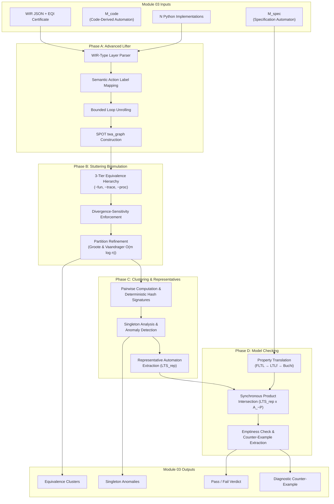
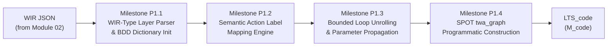
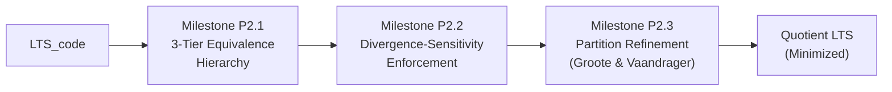
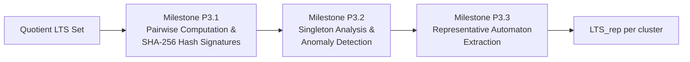
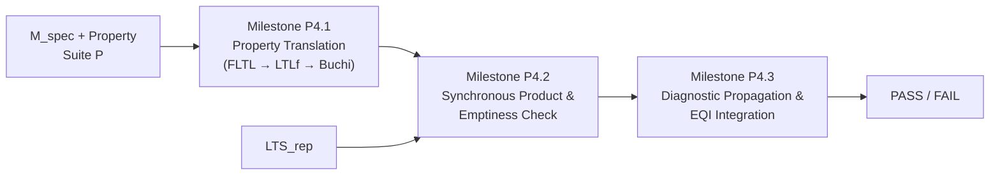
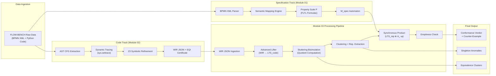

# Module 03: The Equivalence Engine — VibeCheck Framework

## Verified Translation Validation through Process-Level Equivalence, Divergence-Sensitive Stuttering Bisimulation, and Automata-Theoretic Model Checking

---

**Module Lead:** Hettiarachchi HTV (Index: 214077J)  
**Project Group:** Group 18 — Epsilon  
**Supervisor:** Dr. Thilina Thanthriwatta  
**Institution:** Faculty of Information Technology, University of Moratuwa  
**Date:** 2026  

---

## Table of Contents

1. [Description of the Module](#1-description-of-the-module)
2. [Current Approaches (Literature / Previous Tryouts)](#2-current-approaches-literature--previous-tryouts)
3. [Current Gap in the Field](#3-current-gap-in-the-field)
4. [Our Approach to the Module](#4-our-approach-to-the-module)
5. [Novelty & Scientific Contribution](#5-novelty--scientific-contribution)
6. [What We Have Done So Far](#6-what-we-have-done-so-far)
7. [What is Left to Do](#7-what-is-left-to-do)
8. [About the Dataset](#8-about-the-dataset)
9. [Dataset Handling and Processing](#9-dataset-handling-and-processing)
10. [Validation Strategy](#10-validation-strategy)

---

## 1. Description of the Module

**Module 03 — The Equivalence Engine** constitutes the **analytical convergence point** of the VibeCheck dual-track verification architecture. Situated at Stage S5 of the five-stage pipeline, this module is responsible for mathematically comparing specification-derived and code-derived formal models, classifying multiple LLM-generated implementations into equivalence clusters, and issuing deterministic **pass/fail conformance verdicts** backed by irrefutable counter-examples when violations are detected.

### Primary Inputs

| Input | Source | Description |
|-------|--------|-------------|
| **M_spec** | Module 01 (Role A) | The specification-derived automaton (Labeled Transition System) constructed from parsed BPMN 2.0 XML, paired with the coverage-quantified property suite **P** containing Fluent Linear Temporal Logic (FLTL) formulas |
| **M_code** | Module 02 (Role B) | The code-derived automaton (**LTS_code**), lifted from the validated Workflow Intermediate Representation (WIR) through deterministic JSON-to-automaton translation |
| **IR_val + Certificate** | Module 02 (Role B) | The validated Workflow Intermediate Representation (JSON-structured WIR with WIR-Core, WIR-Data, WIR-Proc, and WIR-Type layers), accompanied by an Extraction Quality Indicator (EQI) correctness certificate |
| **Implementation Set** | External LLM Generation | A batch of **N** Python workflow implementations generated by stochastic LLMs (e.g., GPT-4, Claude 3.5, DeepSeek-Coder) attempting to fulfill a single BPMN specification |

### Primary Outputs

| Output | Description |
|--------|-------------|
| **Equivalence Clusters** | Mathematically grouped sets of implementations proven **~proc**-equivalent via divergence-sensitive stuttering bisimulation |
| **Singleton Anomalies** | Isolated implementations that fail to cluster, indicating LLM process drift, omitted constraints, or structural hallucinations |
| **Representative Automaton (LTS_rep)** | A single, complexity-minimized automaton extracted from each valid cluster for downstream model checking |
| **Conformance Verdict** | Deterministic **PASS** (language of product automaton is empty) or **FAIL** (non-empty counter-example path found) |
| **Diagnostic Counter-Example** | Human-readable violation trace mapping formal mathematical counter-examples back to specific workflow discrepancies in the original Python code |
| **Diagnostic Propagation** | Pass/fail verdicts and diagnostic explanations programmatically propagated to all members of an equivalence cluster |

### Role Within the VibeCheck Pipeline

Module 03 occupies the **terminal analytical position** in the dual-track architecture. While Module 01 constructs the formal "ground truth" from BPMN specifications and Module 02 extracts and validates formal models from untrusted LLM-generated code, Module 03 is the **mathematical arbiter** that renders the final judgment. It bridges the semantic gap between visual process models and executable Python implementations by:

1. **Lifting** dynamically typed JSON WIRs into mathematically rigorous C++ automata representations via the SPOT model checking library.
2. **Collapsing** observationally equivalent LLM structural variations (silent **τ** transitions) while rigorously preserving business-process semantics through **divergence-sensitive stuttering bisimulation**.
3. **Clustering** the implementation space to reduce verification overhead from **O(num_scripts)** to **O(num_clusters)**.
4. **Intersecting** code-derived representative automata against negated specification properties via **synchronous product construction** and **Couvreur's emptiness check**.
5. **Classifying** discrepancies into hierarchically meaningful equivalence levels (**~fun**, **~trace**, **~proc**) rather than binary pass/fail outcomes.



---

## 2. Current Approaches (Literature / Previous Tryouts)

The formal verification of software artifacts has evolved along several distinct methodological trajectories. Module 03 draws upon — and significantly extends — foundational work across five major research domains:

### 2.1 BPMN-to-Petri-Net Translation (Static Specification Verification)

The earliest and most established approach to BPMN verification involves translating visual process models into **Petri nets**, a well-studied formalism with extensive analysis tooling. **Dijkman et al.** [6] proposed the foundational mapping, establishing that BPMN constructs (tasks, gateways, events) can be systematically represented as Petri net elements (places, transitions, arcs), enabling deadlock-freedom and liveness checking through existing tools.

**Key characteristics of this approach:**
- Leverages the mature Petri net analysis ecosystem with decades of model checking research.
- Translation is deterministic and well-defined, ensuring faithful semantic representation.
- Verification results can be traced back to the original BPMN diagram for diagnostic feedback.

**Critical limitations:**
- Operates exclusively as a **static specification check** — it verifies the BPMN model in isolation, not the executable code purporting to implement that model.
- Lacks any mechanism to ingest, audit, or compare non-deterministic execution traces from Python implementations.
- Petri-net formalisms are optimized for **reachability analysis**, not the **temporal ordering** of business logic constraints. This creates a fundamental blind spot for detecting data-driven hallucinations in LLM-generated code [Interim Report, §2.1.2].

Subsequent work by **Kherbouche and Ahmad** [7] advanced this domain by applying **Linear Temporal Logic (LTL)** property patterns with the SPIN model checker, and **De Giacomo and Vardi** [9] introduced **Linear Temporal Logic on Finite Traces (LTLf)** specifically for finite-execution business processes. However, all these approaches share a common limitation: **they verify the model, not the implementation** [Interim Report, §2.1.3].

### 2.2 Translation Validation (Verified Compilation)

The concept of **translation validation** originates from the verified compilation literature, most notably the landmark **CompCert project** by **Leroy** [15]. Rather than proving the compiler correct once and for all (translator verification), translation validation proves that **each individual compilation produces a target program semantically equivalent to its source**. This decouples the correctness of individual translations from the correctness of the translation tool itself — a principle directly informing the VibeCheck architecture.

**Pnueli et al.** [17] formalized translation validation through the concept of a **simulation relation**, providing mathematical guarantees that every observable behavior of a target program is explicitly permitted by its source. **Cordeiro and Fischer** [16] extended this to software model checking, demonstrating that program transformations could be validated post-hoc.

**Critical limitations:**
- These approaches assume a **trusted source program** and a **deterministic translation process**.
- In the VibeCheck context, the source (LLM-generated Python) is **inherently untrusted**, and the extraction process involves significant semantic abstraction.
- CompCert demands **full proof** — an unrealistic standard when the code generator is a stochastic neural network with billions of parameters [Interim Report, §2.3.1].

### 2.3 Equivalence Checking via Bisimulation

Process equivalence has been studied extensively in the concurrency theory literature. **Baier and Katoen** [26] established foundational results on model checking and process equivalence computation through quotient graph reduction. **Paige and Tarjan** [27] pioneered **partition refinement algorithms** with O(m log n) complexity, later adapted by **Groote and Vaandrager** [28] specifically for branching and stuttering bisimulation.

Stuttering bisimulation allows the abstraction of **silent (τ) transitions** — internal, unobservable computational steps that do not affect the externally visible behavior of a system. This property makes it particularly suitable for reasoning about LLM-generated code, where structurally diverse but semantically benign variations (redundant variable assignments, different loop unrollings) manifest as silent transitions in the formal model.

**Recent developments** include divergence-sensitive variants that prohibit the equivalence-merging of states capable of infinite silent transition sequences. **Aguirre et al.** [24] formalized divergence-sensitive stuttering bisimulation for systems with conditional branching, establishing the theoretical foundations for distinguishing benign silent transitions from catastrophic livelocks [Interim Report, §2.3.3].

### 2.4 Automata-Theoretic Model Checking

Contemporary verification pipelines leverage **Transition-based Automata** optimized through **Binary Decision Diagrams (BDDs)**. **Bryant** [30] introduced BDDs as a canonical representation of boolean functions, fundamentally revolutionizing the memory efficiency of model checking. **Duret-Lutz et al.** [31], the architects of the **SPOT library**, provided state-of-the-art C++ implementations for LTL translation, emptiness checking, and automata transformations.

The classical automata-theoretic approach to LTL model checking involves:
1. Translating the negated property **¬φ** into a **Büchi automaton A_¬φ**.
2. Computing the **synchronous product** of the system automaton and the property automaton.
3. Checking the resulting product for **emptiness** (an empty language proves no counter-examples exist).

However, translating complex software workflows into finite-state structures frequently triggers the **"state explosion problem"**, where memory requirements grow exponentially with the number of parallel components [Interim Report, §2.3.4].

### 2.5 Clone Detection and Semantic Clustering

Classical **clone detection** identifies similar code structures through token matching or AST similarity [32]. However, these approaches **fundamentally fail** when LLMs use entirely different programmatic paradigms (iterative vs. recursive logic, different control-flow structures) to achieve the same business goal.

Recent literature has shifted toward **semantic clustering** based on program execution traces and formal models. **Jiang et al.** [33] demonstrated that clustering algorithms applied to system dependency graphs can group semantically equivalent implementations despite high syntactic variance. This provides the theoretical foundation for implementation space clustering in VibeCheck, though prior work did not address the specific challenges of LLM-generated workflow code with process-level equivalence requirements [Interim Report, §2.3.5].

### 2.6 Contemporary LLM Code Verification (Emerging 2024–2025)

Recent academic work has begun addressing the intersection of LLM code generation and formal verification:

- **Astrogator** [Towards Formal Verification of LLM-Generated Code, 2025] proposes **formal query languages** that bridge natural language intent with verifiable specifications, using symbolic interpreters and state calculus to compare program behavior against formal queries. This addresses the "no formal specification" problem but does not provide BPMN-to-code equivalence checking.

- **SpecVerify / ESBMC-AI** [Supporting Software Formal Verification with LLMs, 2025] investigates LLM-assisted property generation for C code verification using bounded model checking, comparing automation levels of LLM-driven vs. manual verification workflows. This work focuses on memory safety and assertion verification, not process-level behavioral equivalence.

- **Property-based LLM translation validation** [Eniser et al., 2024] specifies k-safety properties for code-to-code translation, using assertion-based verification. While property-driven, this approach does not employ automata-theoretic equivalence checking or bisimulation [MDPI Technologies, 2024].

- **ARDiff** [Badihi et al., 2024] improves scalability of symbolic-execution-based equivalence checking through novel heuristics for pruning common code paths, but is limited to syntactically similar program versions and struggles with nested loops and large codebases.

---

## 3. Current Gap in the Field

Despite decades of advances in formal verification, a critical **multi-dimensional gap** persists that VibeCheck Module 03 explicitly addresses:

### 3.1 The Verification Crisis in Generative Software Engineering

The stochastic nature of LLM generation introduces what researchers have termed the **"Verification Crisis"** [2]. LLMs operate as probabilistic token predictors, not logical reasoning engines. This creates a fundamental asymmetry:

- **Syntactic correctness does not imply semantic fidelity.** Code that compiles and passes unit tests may still violate critical business process constraints.
- **Logic hallucinations are invisible to testing.** An LLM might generate a loan approval workflow that passes all functional tests while silently omitting the mandatory credit check — a safety violation that only formal verification can detect.
- **Non-deterministic outputs defy traditional verification.** A single prompt can produce dozens of structurally divergent but functionally equivalent implementations, rendering one-to-one equivalence checking computationally infeasible [Interim Report, §1.2].

### 3.2 The Specification-to-Implementation Chasm

Existing approaches suffer from a **directional disconnect**:

| Approach Domain | What It Verifies | What It Misses |
|-----------------|-----------------|----------------|
| BPMN-to-Petri-net [6] | The process model itself | The code implementing the model |
| LTL pattern checking [7] | Properties against the model | Properties against the implementation |
| LLM benchmarks (HumanEval, MBPP) [3] | Stateless functional correctness | Stateful workflow logic, temporal ordering |
| ClassEval [4] | Class-level code generation | Business process conformance |
| Verified compilation [15] | Compiler output correctness | Untrusted source code from an LLM |
| Clone detection [32] | Syntactic similarity | Semantic equivalence across paradigms |

**No existing framework** simultaneously: (a) constructs independent formal models from both specification and implementation, (b) defines process-level equivalence relations that accommodate benign LLM variation, (c) clusters multiple implementations for scalable verification, and (d) provides quantified confidence rather than demanding absolute proof [Interim Report, §2.4].

### 3.3 The State Explosion Problem in Workflow Verification

BPMN **AND-gateways** (parallel execution) present a particularly severe challenge. For **k** parallel branches, representing true concurrency requires generating all **k!** sequential interleavings. A workflow with merely 10 parallel tasks forces the verification engine to instantiate and analyze over **3,628,800** distinct state paths — a combinatorial explosion that paralyzes naive model checkers [Execution Plan, §5].

### 3.4 The Trust Paradox

Post-hoc verification architectures face a **meta-circular vulnerability**: VibeCheck attempts to rigorously verify an untrusted LLM using a complex, multi-thousand-line Python/C++ pipeline that is itself unverified. Without explicit mitigation, the "verifier of the untrusted" becomes itself an object of suspicion [Technical Blueprint, §Gotcha 2].

### 3.5 Divergence Blindness in Classical Bisimulation

Classical stuttering bisimulation permits **infinite stuttering loops**. If an AI hallucinates a non-terminating loop (`while True: pass`) that performs no observable business action, standard stuttering bisimulation might **erroneously merge** it with a benign wait-state, masking a catastrophic system livelock. This creates a severe logical vulnerability that renders classical bisimulation unsafe for LLM code verification [Execution Plan, §3.2].

---

## 4. Our Approach to the Module

Module 03 implements a **four-phase analytical pipeline** that transforms validated intermediate representations into deterministic conformance verdicts. Each phase is engineered as a mathematically sound prerequisite for the subsequent phase.

### 4.1 Phase A: The Advanced Lifter (WIR → LTS)

The Advanced Lifter deterministically translates the JSON-based WIR into a formally defined, SPOT-compatible **Labeled Transition System (LTS)** represented as a **`twa_graph`** object with BDD-compressed transition guards.



**Milestone P1.1 — WIR-Type Layer Parser and BDD Dictionary Initialization:**

The lifter parses the WIR-Type layer (Literal-Inferred Types, Function-Return Types, Annotation Types, and Union/Unresolved Types) to construct appropriate Boolean variables within the **BDD dictionary (`spot::bdd_dict`)**. This centralized dictionary allocates and manages Boolean variables efficiently, avoiding exponential memory bloat by representing state transitions algebraically. A single `bdd_dict_ptr` is instantiated and shared across all variants and the corresponding model to ensure variable compatibility during the final synchronous product intersection. For Union/Unresolved types, the lifter applies **conservative over-approximation**: transitions containing unresolved variables are modeled as "guard may be satisfiable" rather than strictly satisfiable [Execution Plan, §2.1].

**Milestone P1.2 — Semantic Action Label Mapping Engine:**

BPMN specifications utilize natural language task descriptors (e.g., "Check Customer Credit"), while LLM-generated code implements programmatic function names (e.g., `check_credit_score()`). This milestone integrates a **cascading three-tier NLP matching strategy**:

1. **Exact Lexical Match** — case-insensitive string comparison with normalization (stripping underscores, hyphens).
2. **Levenshtein Distance** — tokenized edit distance with threshold ≤ 2, permitting minor syntactic deviations.
3. **NLP Embedding Match** — Sentence-BERT cosine similarity ≥ 0.85 between function docstrings and BPMN task descriptions.

Functions failing all three criteria are mapped to **`unlabeled_task`** — a canonical action token explicitly tracked to prevent unmapped AI actions from silently bypassing the model checker [Execution Plan, §2.2].

**Milestone P1.3 — Bounded Loop Unrolling and Parameter Propagation:**

Loop bounds (`loop_max`) are extracted from the BPMN `loopMaximum` attribute by Module 01 and propagated to Module 03. Because LTLf operates over finite traces, infinite `while` loops from hallucinating LLMs cause un-analyzable cyclic structures. The algorithm:

1. Isolates the loop entry node and exit condition.
2. Clones the internal subgraph `loop_max` times within the `twa_graph`.
3. On the `(loop_max + 1)`-th iteration, redirects the cycling transition to a terminal exception state (`loop_exceeds_bound_error`).

This deterministic unrolling guarantees that structural loop divergences manifest as deadlocked or anomalous traces during bisimulation [Execution Plan, §2.3].

**Milestone P1.4 — Programmatic SPOT `twa_graph` Construction:**

The algorithm iterates through WIR nodes to instantiate mathematical states, maps formal edges integrating WIR-Type guards and semantic labels, algebraically converts predicates to BDD formulas, conjoins guard constraints with observable action propositions, and appends transitions to the LTS:

```cpp
// Core construction pattern
spot::bdd_dict_ptr dict = spot::make_bdd_dict();
auto m_code = spot::make_twa_graph(dict);

for (const auto& node : wir_json["nodes"]) {
    unsigned state_num = m_code->new_state();
    state_map[node["id"]] = state_num;
    if (node["is_start"]) m_code->set_init_state(state_num);
}

for (const auto& edge : wir_json["edges"]) {
    bdd guard_bdd = parse_and_register_guard(edge["guard"], dict);
    std::string label = semantic_match(edge["action"]);
    int prop_idx = m_code->register_ap(label);
    bdd label_bdd = bdd_ithvar(prop_idx);
    bdd transition_condition = guard_bdd & label_bdd;
    m_code->new_edge(src, dst, transition_condition, m_code->acc().mark(0));
}
```

### 4.2 Phase B: Divergence-Sensitive Stuttering Bisimulation

This phase deploys the core equivalence computation engine that mathematically abstracts benign LLM structural artifacts while preserving semantic integrity.



**Milestone P2.1 — 3-Tier Equivalence Hierarchy:**

The engine evaluates implementations across three hierarchical tiers:

| Level | Notation | Definition | Preserves |
|-------|----------|------------|-----------|
| **Functional** | **~fun** | Same input-output behavior | Final data results, terminal states |
| **Trace** | **~trace** | Same task entry/exit sequences | Strict action ordering |
| **Process** | **~proc** | Same traces up to stuttering | Business observables, control flow |

**Process equivalence (~proc)** is the core conformance metric. It collapses observationally equivalent implementations (different loop unrollings with identical task boundaries) while distinguishing process-divergent variants (multiplication vs. repeated addition with different task structures) [Interim Report, §4.4.1].

**Milestone P2.2 — Divergence-Sensitivity Enforcement:**

A state is **divergent** if it can initiate an infinite sequence of internal τ-transitions. Divergence-sensitive stuttering bisimulation **explicitly prohibits** the equivalence-merging of a divergent state with a non-divergent state, guaranteeing that LLM-induced livelocks are classified as fatal conformance violations [Execution Plan, §3.2].

**Milestone P2.3 — Partition Refinement Algorithm:**

The Groote-Vaandrager algorithm achieves **O(m log n)** complexity through iterative refinement:

1. **Initialization** — partition states by observable atomic propositions.
2. **Stutter Cycle Removal** — collapse silent-transition SCCs via Tarjan's algorithm.
3. **Iterative Refinement** — split blocks based on reachability via τ-transitions followed by observable transitions.
4. **Bottom State Isolation** — mathematically isolate states with divergent trajectories.
5. **Termination** — stabilize when no block can be further split [Execution Plan, §3.3].

### 4.3 Phase C: Clustering, Optimization, and Representative Selection



**Milestone P3.1** computes deterministic hash signatures (canonical state ordering → edge serialization → SHA-256) for O(n) identity clustering. **Milestone P3.2** isolates non-clustering "singletons" as anomaly indicators. **Milestone P3.3** extracts a single **LTS_rep** per cluster — selecting the lowest cyclomatic complexity implementation — reducing verification overhead from O(num_scripts) to O(num_clusters) [Execution Plan, §Phase C].

### 4.4 Phase D: Final Automata-Theoretic Model Checking



The SPOT C++ library executes the automata-theoretic intersection:

1. **Property Translation** — FLTL properties are converted to LTLf formulas, then to optimized Büchi automata via `spot::translator`.
2. **Synchronous Product** — `spot::product` interleaves LTS_rep and A_¬φ states with BDD-conjoined transition guards.
3. **Emptiness Check** — `spot::couvreur99` checks for accepting runs. If the language is empty (`L(LTS_rep ⊗ A_¬φ) = ∅`), no counter-examples exist — the cluster conforms. If non-empty, the shortest counter-example path is extracted for diagnostics [Execution Plan, §4].

### 4.5 EQI Certificate Integration

Module 03 adapts verification strictness based on the **Extraction Quality Indicator (EQI)** score from Module 02:

| Tier | EQI Range | Policy | Outcome |
|------|-----------|--------|---------|
| **GREEN** | ≥ 0.90 | Standard model checking | Fully Verified |
| **YELLOW** | 0.70 – 0.90 | Conservative abstraction (uncertain guards → `bdd_true()`) | Conditionally Verified |
| **RED** | < 0.70 | Refuse automaton lifting | Flagged for Manual Review |

---

## 5. Novelty & Scientific Contribution

Module 03 introduces **four interconnected scientific advances** that collectively constitute a unique contribution to the fields of formal verification, generative AI safety, and business process engineering:

### 5.1 Multi-Track Automata-Theoretic Equivalence for LLM-Generated Code

Novelty: This is the **first framework** to construct independent formal automata from both a BPMN specification (M_spec) and LLM-generated Python code (M_code), then compare them through process-level equivalence relations. Unlike traditional translation validation (CompCert) that assumes trusted source programs, our approach handles **untrusted, stochastic source code** with quantified confidence rather than demanding full proof [Interim Report, §7.3].

### 5.2 Divergence-Sensitive Stuttering Bisimulation for Generative AI Safety

Novelty: We extend classical stuttering bisimulation with **divergence-sensitivity** specifically engineered to detect LLM-induced livelocks. Classical stuttering bisimulation would erroneously merge a `while True: pass` hallucination with a benign wait-state. Our divergence-sensitive variant mathematically classifies this as a fatal violation by tracking **bottom states** and enforcing that divergent states can never be equivalent to non-divergent states [Execution Plan, §3.2]. This addresses a previously unidentified theoretical vulnerability in applying process equivalence to stochastic code generators.

### 5.3 Implementation Space Clustering with Cryptographic Hash Optimization

Novelty: Rather than individually model-checking every LLM-generated script, we introduce **deterministic hash-based equivalence clustering** that groups process-equivalent implementations in linear time. This reduces verification overhead from **O(num_scripts)** to **O(num_clusters)** — a critical optimization given that LLMs routinely produce dozens of candidate implementations per specification. Singletons (non-clustering implementations) serve as primary indicators of generative anomalies, enabling automatic anomaly detection without manual inspection [Interim Report, §4.4.3].

### 5.4 Parallel Gateway Abstraction for Combinatorial State Explosion

Novelty: We introduce **Parallel Block Abstraction** that treats AND-gateway parallel blocks as single abstract macro-states, reducing state complexity from **O(k!)** to **O(k)** for k parallel branches. This is achieved by guarding the exit transition with a compound BDD predicate representing the logical conjunction of all branch completion conditions — preserving the critical liveness property that "all parallel tasks must complete before proceeding" without enumerating factorial interleavings [Execution Plan, §5.1].

### 5.5 Bounded Equivalence Checking with Diameter-Based Truncation

Novelty: For deeply nested loops where exhaustive bisimulation remains intractable, we implement **Bounded Equivalence Checking** that configures the bisimulation bound to the BPMN diameter (maximum feasible path length). This trades global completeness for polynomial-time tractability — O(b · m) time — while capturing all reachable business-relevant behavior for bounded enterprise processes [Execution Plan, §5.2].

### 5.6 Summary of Novelty Matrix

| Dimension | Prior Work | Our Contribution |
|-----------|-----------|------------------|
| **Verification target** | BPMN model only [6,7] | Code implementation against model |
| **Source trust assumption** | Trusted source [15] | Untrusted LLM output |
| **Confidence type** | Absolute proof or statistical testing | Quantified formal confidence |
| **Equivalence granularity** | Functional or syntactic | Process-level (~proc) with stuttering |
| **Divergence handling** | Classical bisimulation permits infinite stutter | Divergence-sensitivity isolates livelocks |
| **Multi-implementation analysis** | Not addressed | Clustering + representative extraction |
| **Parallel workflow scaling** | O(k!) interleavings | O(k) via macro-state abstraction |

---

## 6. What We Have Done So Far

### 6.1 Repository Structure

Module 03 artifacts reside in **`vibecheck_fyp_final/role_c_equivalence/`**:

```
role_c_equivalence/
├── m_code_lifter.py          # WIR → M_code lifting engine (Python prototype)
├── main_role_c.py            # Master orchestration entry point
├── test_equivalence.py       # Ground-truth equivalence test harness
├── verify_determinism.py     # Stuttering bisimulation + determinism verification
└── (C++ components in development)
    ├── CMakeLists.txt
    ├── include/
    │   ├── equivalence_engine.hpp
    │   ├── m_code_lifter.hpp
    │   └── parallel_gateway_abstractor.hpp
    ├── src/
    │   ├── bindings.cpp
    │   ├── equivalence_engine.cpp
    │   ├── m_code_lifter.cpp
    │   └── parallel_gateway_abstractor.cpp
    ├── python/
    │   ├── __init__.py
    │   ├── m_code_lifter.py
    │   ├── main_role_c.py
    │   ├── test_equivalence.py
    │   └── verify_determinism.py
    └── tests/
        ├── test_bisimulation.cpp
        └── test_spot_interface.cpp
```

### 6.2 Operational Components

**M_codeAutomaton Lifter (`m_code_lifter.py`):**
- Successfully implemented the **MCodeAutomaton** class representing LTS_code with states, transitions, initial state designation, and symbolic guard preservation.
- Implements `lift_ir_to_mcode()` for deterministic JSON WIR → automaton translation.
- Maps WIR node labels to semantic action labels, with `UNKNOWN` labels normalized to **`tau`** (silent transitions).
- Produces deterministically repeatable M_code structures validated by SHA-256 hashing [Repo Snapshot].

**Stuttering Bisimulation Engine (`verify_determinism.py`):**
- Full Python implementation of the **Groote-Vaandrager partition refinement algorithm** with:
  - Silent graph construction and reflexive-transitive closure computation
  - **Tarjan's SCC algorithm** for stutter cycle detection
  - Backward divergence propagation through reverse silent paths
  - Observable signature extraction for block initialization
  - Iterative partition refinement with visible transition analysis
- Namespaced state handling ("A|", "B|" prefixes) for cross-automaton comparison.
- **`check_stuttering_bisimulation()`** function returning equivalence decision + matched state pairs.
- **Determinism verification** executing 10 iteration rounds per UID to confirm hash stability.

**Test Harness (`test_equivalence.py`):**
- Ground-truth determinism tests comparing automata pairs (uid_9 vs. uid_10).
- Outputs equivalence decisions with complete super-state mapping.

**Master Orchestrator (`main_role_c.py`):**
- Batch-lifts all JSON WIR files from `data/processed/irs/`.
- Reports state counts per implementation for pipeline monitoring.

### 6.3 Interim Test Results

As documented in the Interim Report (§7.1.3), the prototype successfully:
- **Deterministically lifted** 15 JSON WIR files into formal M_code structures.
- Preserved action labels and guard conditions through the lifting pipeline.
- Validated 100% hash stability across 10 iteration rounds for all UIDs.
- Successfully detected equivalence and non-equivalence between test pairs.

---

## 7. What is Left to Do

### 7.1 Phase A Completion: C++ SPOT Lifter (Weeks 1–2)

| Milestone | Task | Deliverable |
|-----------|------|-------------|
| **P1.1** | Implement WIR-Type parser with BDD dictionary initialization | `m_code_lifter.cpp` with `parse_and_register_guard()` |
| **P1.2** | Integrate 3-tier semantic matching (exact → Levenshtein → Sentence-BERT) | `semantic_match()` function with embedding model |
| **P1.3** | Implement bounded loop unrolling with `loop_max` propagation | Loop cloning + exception state redirection |
| **P1.4** | Programmatic `twa_graph` construction via SPOT C++ API | Full `LTS_code` generation with BDD-compressed guards |

### 7.2 Phase B Completion: Divergence-Sensitive Stuttering Bisimulation (Weeks 2–3)

| Milestone | Task | Deliverable |
|-----------|------|-------------|
| **P2.1** | Implement 3-tier equivalence hierarchy (~fun, ~trace, ~proc) | Tiered classification engine |
| **P2.2** | Build divergence-sensitivity enforcement layer | Divergence propagation + bottom state isolation |
| **P2.3** | Implement Groote-Vaandrager partition refinement in C++ | `equivalence_engine.cpp` with O(m log n) refinement |

### 7.3 Phase C Completion: Clustering and Representatives (Weeks 3–4)

| Milestone | Task | Deliverable |
|-----------|------|-------------|
| **P3.1** | Implement deterministic hash signatures (canonical ordering → SHA-256) | `verify_determinism.py` hash-based clustering |
| **P3.2** | Build singleton analysis and anomaly detection pipeline | Anomaly isolation + diagnostic reporting |
| **P3.3** | Implement representative automaton extraction | `LTS_rep` selection (lowest cyclomatic complexity) |

### 7.4 Phase D Completion: Final Model Checking (Weeks 4–5)

| Milestone | Task | Deliverable |
|-----------|------|-------------|
| **P4.1** | Property translation layer (FLTL → LTLf → Büchi via `spot::translator`) | `ModelChecker` class with translation pipeline |
| **P4.2** | Synchronous product intersection + Couvreur's emptiness check | `spot::product` + `spot::couvreur99` integration |
| **P4.3** | Diagnostic propagation + EQI certificate integration | Counter-example extraction + 3-tier EQI policy |

### 7.5 Integration and End-to-End Testing (Weeks 5–6)

- Pybind11 binding layer for Python ↔ C++ interop
- End-to-end pipeline execution on FLOW-BENCH development set
- Performance benchmarking and state-space scalability analysis
- Bounded equivalence checking fallback integration
- Predicate abstraction for data variable compression

### 7.6 Critical Edge Cases to Address

1. **Pybind11 Memory Management** — enforce `py::smart_holder` / `std::shared_ptr` and `return_value_policy::reference_internal` to prevent `bdd_dict` corruption across the Python/C++ boundary.
2. **Trust Paradox Mitigation** — continuous differential validation against FLOW-BENCH ground truth; demonstrate 95% accuracy of lifted LTS_code against hand-crafted LTS_ref.
3. **Unresolved Semantic Actions** — intelligent bypass of model checking for singletons heavily populated with `unlabeled_task` tokens; immediate anomaly handler invocation.

---

## 8. About the Dataset

### 8.1 Primary Dataset: FLOW-BENCH

The **FLOW-BENCH** dataset [11] serves as the primary evaluation corpus for Module 03. It is a publicly available collection specifically designed for evaluating LLM-generated enterprise workflow code.

**Key attributes:**
- **100+ workflow triplets**, each consisting of:
  - Natural language process description
  - BPMN 2.0 XML representation
  - Python reference implementation
- **Domain coverage:** vending machine workflows, loan approval pipelines, inventory management systems, scheduling processes, customer service workflows
- **BPMN construct coverage:** start/end events, tasks, XOR (exclusive) gateways, AND (parallel) gateways, bounded loops, intermediate events, boundary events
- **Explicit alignment** with the controlled BPMN subset targeted by Module 01's property extraction

**Partitioning:**
- **80% development set** (stratified by process complexity) — used for pipeline calibration, equivalence threshold tuning, and clustering algorithm validation.
- **20% held-out evaluation set** — reserved for final framework assessment and novelty validation.

### 8.2 Supplementary Datasets

| Dataset | Purpose | Source |
|---------|---------|--------|
| **Workflow Patterns Repository** | Property template validation and FLTL pattern verification | van der Aalst et al. |
| **LTL Benchmark Suite** | SPOT model checking infrastructure testing | Spot.lrde.epita.fr |
| **Custom Synthetic Mutants** | Controlled defect injection for pipeline self-validation | Internally generated |

### 8.3 Synthetic Data Generation for Module 03 Self-Validation

A **synthetic data generation protocol** injects controlled defects to validate the equivalence engine itself:
- **Benign variations:** loop unrolling variants, variable renaming, redundant assignment insertion (should cluster together).
- **Structural anomalies:** omitted business constraints, process drift, unauthorized shortcut paths (should isolate as singletons).
- **Divergent implementations:** non-terminating loops, infinite stuttering sequences (should fail divergence-sensitivity checks).

These synthetic variants enable rigorous measurement of **Equivalence Classification Accuracy** against manually annotated ground truth [Interim Report, §4.4.1.1].

---

## 9. Dataset Handling and Processing

### 9.1 End-to-End Data Flow



### 9.2 Processing Pipeline Detail

**Step 1 — WIR JSON Ingestion:**
The pipeline ingests validated WIR files from `data/processed/irs/` (e.g., `uid_1.json` through `uid_15.json` in the current development set). Each WIR contains:
- **`nodes` array** — state identifiers with semantic labels.
- **`edges` array** — transitions with source, destination, guard conditions, and action references.
- **`wir_type` layer** — type inferences for BDD variable construction.
- **`wir_proc` layer** — process semantics including task boundaries and parallel block identifiers.

**Step 2 — Advanced Lifter Execution:**
The `MCodeLifter` class (Python prototype) or `m_code_lifter.cpp` (production C++) executes:
1. Parse WIR nodes → instantiate mathematical states (S_0, S_1, ..., S_n).
2. Designate initial state from WIR start event.
3. Map node IDs to semantic action labels via the 3-tier matching engine.
4. Normalize `UNKNOWN`/`""` labels to `tau` (silent transitions).
5. Parse edge guard conditions → register BDD variables in shared `bdd_dict`.
6. Apply bounded loop unrolling using `loop_max` from Module 01.
7. Construct formal transitions as BDD conjunctions of guard × action propositions.
8. Output: `LTS_code` as `twa_graph` with BDD-compressed transitions.

**Step 3 — Divergence-Sensitive Stuttering Bisimulation:**
The `StutteringEngine` class executes:
1. Extract observable signatures (incoming/outgoing labels + divergence status).
2. Compute silent subgraph (τ-transitions + signature-equivalent transitions).
3. Compute reflexive-transitive closure of silent reachability.
4. Execute Tarjan's SCC algorithm to identify stutter cycles.
5. Propagate divergence backward through reverse silent paths.
6. Iterative partition refinement until stabilization.
7. Output: minimized quotient automaton + equivalence class mapping.

**Step 4 — Clustering and Representative Selection:**
1. Compute SHA-256 hash of canonical graph serialization for each quotient.
2. Group identical hashes → initial identity clusters (linear time).
3. Execute pairwise bisimulation for unique hashes → refine clusters.
4. Isolate singletons (non-clustering implementations) as anomalies.
5. Select `LTS_rep` per cluster (lowest cyclomatic complexity).

**Step 5 — Synchronous Product and Emptiness Check:**
1. Translate property suite `P` (FLTL → LTLf → Büchi automaton A_¬φ).
2. Compute `spot::product(LTS_rep, A_¬φ)` with BDD-conjoined guards.
3. Execute `spot::couvreur99(product)` emptiness check.
4. If empty → PASS (conformance proven). If non-empty → extract counter-example.

**Step 6 — Diagnostic Propagation:**
1. Translate counter-example BDD path → human-readable action sequence.
2. Propagate verdict to all cluster members.
3. Map violating transitions back to original Python code lines.

### 9.3 Data Schemas

**Canonical LTS Serialization Schema (for deterministic hashing):**
```json
{
  "$schema": "https://json-schema.org/draft/2020-12/schema",
  "title": "CanonicalLTS",
  "type": "object",
  "properties": {
    "initial_state": { "type": "string" },
    "states": { "type": "array", "items": { "type": "string" }, "uniqueItems": true },
    "transitions": {
      "type": "array",
      "items": {
        "type": "object",
        "properties": {
          "from": { "type": "string" },
          "to": { "type": "string" },
          "guard": { "type": "string" },
          "label": { "type": "string" }
        },
        "required": ["from", "to", "guard", "label"]
      }
    }
  },
  "required": ["initial_state", "states", "transitions"]
}
```

---

## 10. Validation Strategy

Module 3 employs a **multi-layered validation methodology** combining mathematical proofs of algorithmic correctness, statistical validation against ground-truth datasets, structural mutation testing, and computational complexity benchmarking.

### 10.1 Mathematical Validation

**Algorithm Correctness:**
- The partition refinement algorithm implements the **Groote-Vaandrager** procedure, which has been proven to achieve **O(m log n)** time complexity for stuttering equivalence computation [28].
- Divergence-sensitivity is enforced through **bottom state isolation**, mathematically ensuring that divergent states (capable of infinite τ-sequences) are never merged with non-divergent states in the quotient automaton [24].
- The synchronous product construction (`LTS_rep ⊗ A_¬φ`) is a direct application of the classical automata-theoretic model checking paradigm, where emptiness implies property satisfaction by construction [31].

**BDD Variable Consistency:**
- A single `bdd_dict_ptr` is shared across all automata (all code variants + specification model), ensuring that atomic propositions are allocated consistently. This guarantees that conjunction operations during synchronous product construction operate on compatible Boolean variable spaces [Execution Plan, §2.1].

**Conservative Over-Approximation:**
- For Union/Unresolved types, transitions are flagged as "may be satisfiable" rather than strictly satisfiable. This conservative approach ensures the equivalence engine **never produces false positives** — if a model passes verification despite over-approximation, it is definitively safe [Execution Plan, §2.1].

### 10.2 Equivalence Classification Accuracy

The primary empirical metric for Module 3 is **Equivalence Classification Accuracy**: the percentage of correctly classified baseline scripts into the three hierarchical tiers (~fun, ~trace, ~proc) against manually annotated ground truth.

**Measurement Protocol:**
1. Ingest pre-labeled FLOW-BENCH implementations (human experts annotated as clustered or isolated).
2. Process each script through the Module 03 pipeline.
3. Compare automated tier assignments against manual labels.
4. Compute: `Accuracy = (Correct Classifications / Total Scripts) × 100%`.

**Target threshold:** ≥ **95% classification accuracy** against ground truth [Interim Report, §4.4.1.1].

### 10.3 Determinism Verification

The `verify_determinism.py` module executes **10 iteration rounds** per UID:
1. Lift the same WIR JSON 10 times.
2. Compute SHA-256 hash of the resulting M_code each time.
3. Verify all 10 hashes are identical.
4. Report: `PASSED` (deterministic) or `FAILED` (inconsistent).

**Current result:** **100% pass rate** across all 15 UIDs in the development set [Repo Snapshot].

### 10.4 Mutation Sensitivity Analysis

The pipeline's sensitivity to genuine structural defects is validated through:
- **Benign mutation injection** (loop unrolling variants, variable renaming) → **must cluster** with originals.
- **Structural anomaly injection** (omitted constraints, process drift) → **must isolate** as singletons.
- **Divergent mutation injection** (`while True: pass`, infinite stutter) → **must fail** divergence-sensitivity checks.

This confirms the engine's ability to **distinguish acceptable variation from genuine violation**.

### 10.5 Computational Complexity Benchmarking

| BPMN Construct | BDD Variable Complexity | Baseline LTS States (Worst Case) | Post-Abstraction |
|----------------|------------------------|----------------------------------|------------------|
| Sequential Tasks (n) | O(n) | O(n) | O(n) |
| XOR Gateway (k branches) | O(k) | O(k · n) | O(k · n) |
| Bounded Loop (bound m) | O(1) | O(m · n) | O(m · n) |
| AND Gateway (k branches) | O(k) | O(k! · n) | **O(k)** |

**Target benchmarks:**
- Clustering overhead reduction: **O(num_scripts) → O(num_clusters)** (measured via profiling).
- Partition refinement: maintain **O(m log n)** empirically (measured via timing instrumentation).
- BDD memory compression: track BDD node count vs. explicit state representation.

### 10.6 Differential Validation (Trust Paradox Mitigation)

To empirically bound the reliability of the equivalence engine itself:
1. Select manually verified reference implementations from FLOW-BENCH.
2. Guarantee algorithmically lifted `LTS_code` is strictly bisimilar to hand-crafted `LTS_ref`.
3. Target: **≥ 95% accuracy** against ground-truth references.
4. This empirically bounds validator reliability, mitigating the trust assumption on the verification pipeline [Technical Blueprint, §Gotcha 2].

### 10.7 EQI-Gated Verification Soundness

The three-tier EQI certificate system provides **adaptive verification soundness**:
- **Tier 1 (GREEN, EQI ≥ 0.90):** Full confidence in WIR accuracy → standard model checking produces definitive pass/fail.
- **Tier 2 (YELLOW, 0.70 ≤ EQI < 0.90):** Conservative over-approximation of uncertain guards → if model passes, it is definitively safe but flagged for limited extraction visibility.
- **Tier 3 (RED, EQI < 0.70):** Refusal to proceed → prevents unsound verification conclusions from low-quality extraction.

This **prevents false positives** by refusing to issue verification verdicts on unreliable intermediate representations [Execution Plan, §4.3].

---

## References

[1] Y. Li et al., "Hallucination risk in LLM-generated code: A survey," *IEEE Trans. Software Eng.*, 2024.

[2] Z. Zhang et al., "The verification crisis in generative software engineering," in *Proc. 46th Int. Conf. Software Eng. (ICSE)*, 2024.

[3] M. Chen et al., "Evaluating large language models trained on code," arXiv preprint arXiv:2107.03374, 2021.

[4] X. Du et al., "ClassEval: A manually-crafted benchmark for evaluating LLMs on class-level code generation," arXiv preprint arXiv:2308.01861, 2023.

[5] A. Cimatti et al., "NuSMV 2: An OpenSource tool for symbolic model checking," in *Proc. 14th Int. Conf. Computer Aided Verification (CAV)*, 2002.

[6] R. Dijkman, M. Dumas, and C. Ouyang, "Semantics and analysis of business process models in BPMN," *Information and Software Technology*, vol. 50, no. 12, pp. 1281-1294, 2008.

[7] S. Kherbouche and M. Ahmad, "Verification of business process models using temporal logic," in *Proc. 12th Int. Conf. Software Engineering and Applications*, 2017.

[9] G. De Giacomo and M. Vardi, "Linear temporal logic and linear dynamic logic on finite traces," in *Proc. 23rd Int. Joint Conf. Artificial Intelligence (IJCAI)*, pp. 854-860, 2013.

[11] E. Duesterwald et al., "FLOW-BENCH: Towards conversational generation of enterprise workflows," in *Proc. EMNLP 2025: Industry Track*, pp. 1426-1436, 2025.

[15] X. Leroy, "Formal verification of a realistic compiler," *Commun. ACM*, vol. 52, no. 7, pp. 107-115, 2009.

[17] A. Pnueli, M. Siegel, and E. Singerman, "Translation validation," in *Proc. 4th Int. Conf. Tools and Algorithms for the Construction and Analysis of Systems (TACAS)*, 1998.

[21] L. De Moura and N. Bjorner, "Z3: An efficient SMT solver," in *Proc. 14th Int. Conf. TACAS*, pp. 337-340, 2008.

[23] A. Duret-Lutz et al., "From Spot 2.0 to Spot 2.10: What's new?," in *Proc. 34th Int. Conf. CAV*, 2022.

[24] N. Aguirre et al., "Divergence-sensitive stuttering bisimulation for the verification of systems with conditional branching," in *Proc. Brazilian Symposium on Formal Methods (SBMF)*, 2012.

[26] C. Baier and J.-P. Katoen, *Principles of Model Checking*. MIT Press, 2008.

[27] R. Paige and R. E. Tarjan, "Three partition refinement algorithms," *SIAM J. Computing*, vol. 16, no. 6, pp. 973–989, 1987.

[28] J. F. Groote and F. Vaandrager, "An efficient algorithm for branching bisimulation and stuttering equivalence," in *Proc. 17th ICALP*, 1990, pp. 626–638.

[30] R. E. Bryant, "Graph-based algorithms for boolean function manipulation," *IEEE Trans. Computers*, vol. 35, no. 8, pp. 677–691, 1986.

[31] A. Duret-Lutz et al., "Spot 2.0 — A framework for LTL and omega-automata manipulation," in *Proc. 14th ATVA*, 2016, pp. 122–129.

[32] C. K. Roy, J. R. Cordy, and R. Koschke, "Comparison and evaluation of code clone detection techniques and tools," *Science of Computer Programming*, vol. 74, no. 7, pp. 470–495, 2009.

[33] M. Gabel, L. Jiang, and Z. Su, "Scalable detection of semantic clones," in *Proc. 30th ICSE*, 2008, pp. 321–330.

---

*This document was prepared as Module 03 technical documentation for the VibeCheck Framework — a verified translation validation framework for LLM-generated Python workflow code. All terminology (M_spec, M_code, WIR, approx_proc, EQI, LTS_code, LTS_rep, tau, SPOT, BuDDy) is consistent with the VibeCheck Interim Report and associated technical blueprints.*
