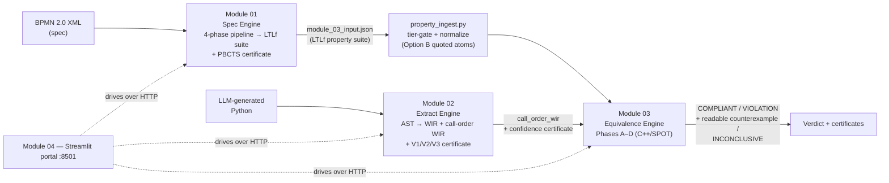

# VibeCheck — Project Overview

> **One-line pitch:** when an LLM writes workflow code from a BPMN business-process spec, VibeCheck formally checks — after the fact, with no cooperation from the LLM — whether the code actually does what the diagram says, and hands back a quantified, evidence-backed **certificate** (never an unqualified "proof").
>
> FYP Group Epsilon, Faculty of IT, University of Moratuwa.
> State described here: **2026-07-30, branch `main-demo` @ `5c65046` — declared the FINAL implementation** (future changes are bug fixes, not architecture).

## The problem

"Vibe coding" produces plausible workflow code fast, but business processes have hard ordering, exclusivity, and termination requirements that plausible code silently violates: a dropped approval step, two branches swapped, a hallucinated `while True` retry loop. Testing samples behavior; review trusts humans; asking the LLM to check itself is circular. VibeCheck's position is **post-hoc translation validation**: treat each generated program as untrusted input, independently formalize both the spec and the code, and let a model checker decide — with an honest `INCONCLUSIVE` whenever the evidence doesn't support a verdict.

## The core design decision: dual-track independence

Module 01 (spec track) never sees the generated code. Module 02 (code track) never sees the BPMN diagram. The two tracks meet only in Module 03 as independently produced mathematical objects. This prevents circular verification — the spec quietly bending to match the code. The discipline holds even at the seams: Module 03's `property_ingest.py` *ports* the LTLf normalization it needs rather than importing Module 01's source, because each module ships as its own container with only its own code.

## Pipeline

Everything runs as four docker-compose services (`spec-engine`, `extract-engine`, `equiv-engine`, `ui-engine` — only the UI is host-exposed, on 8501). CI (PR #80) runs per-module test suites plus a real docker-compose startup check.

## Module 01 — Specification Analysis (`module_01_spec/`, spec track)

FastAPI `spec-engine`, `POST /verify` with BPMN XML. Four phases, each behind an explicit quality gate:

1. **Semantic extraction** (`semantic_extractor.py`) — BPMN XML → semantic graph with Kripke labeling (`start(X)`/`done(X)`/`node(X)`); dynamic coverage denominator + one `_recovery_pass()` retry; gate: node coverage ≥ 1.0.
2. **LTLf synthesis** (`ltlf_synthesizer.py`) — tiered properties (P0 safety / P1 liveness / P2 fairness) with implicit-else inference; gate: guard-resolution ≥ 1.0.
3. **Mutation self-validation** (`mutation_refiner.py` + `adversarial_generator.py`) — 5 mutation operators against the synthesized suite, multi-round self-healing (≤ 3), adversarial red-team tier (simulated); gates: C_struct ≥ 1.0 and kill ratio δ ≥ 1.0.
4. **PBCTS** (`ltlf_progression.py`, `trace_synthesizer.py`, `bidirectional_alignment.py`) — pure-Python LTLf **progression** constructs satisfying traces `T_spec`, bidirectional alignment vs model traces yields `EAS_BDA`, gated by IDCD convergence, with the SCSL self-correction loop → **Formal Reliability Certificate v2.0**. (Replaced an abandoned SPOT/HOA design; stdlib-only.)

**Exports:** `module_02_input.json` (task_patterns — consumed by M02's randomized tracer) and `module_03_input.json` (LTLf property suite — consumed by M03's `property_ingest`). 56/56 `tests/` passing post PR #89 (98 total incl. `eval/`); slim SPOT-free Dockerfile. FLOW-BENCH evaluation (`eval/`, 148 diagrams): suite soundness **145/148** (98.0%/97.9% by corpus, up from 79/148 pre-PR #89), structural fidelity F1 **1.0000**; discriminative mutation kills remain **0/2900** — an open, disclosed weak spot, see `vibecheck-vault/Final Evaluation Results/Module 01 Evaluation Results.md`.

## Module 02 — Verified IR Extraction (`module_02_extract/`, code track)

FastAPI `extract-engine`, `POST /verify` with Python source (~5,200 LOC). Produces the **WIR** (Workflow Intermediate Representation — a JSON CFG validated by `shared_schemas/wir_schema.json`) in **two views**: `wir` (definition-order) and `call_order_wir` (D2 lifting: the driver function's CFG with sibling call sites as task boundaries — the view Module 03 actually needs). Three validator layers feed one certificate:

- **V3 structural** (`ast_extractor/`) — AST/dominator validation, hard gate (`abort=True`).
- **V2 symbolic** (`z3_sym_engine/`) — Z3 bounded concolic execution. Honest caveat, stated in the prominent docs: ≈ zero contribution on the current corpus; the certificate is effectively V1-driven.
- **V1 dynamic** (`dynamic_tracer/`) — PEP 669 `sys.monitoring` differential tracing against a WIR reference interpreter (settrace fallback + parity tests, LCS alignment, strict vs `task_only` modes, return values as first-class events).

Fusion: `combined = 1 − (1−v1)(1−v2)` in self-mode, `combined = v1` in differential mode; acceptance ≥ 0.95. Hardening: 30s wall-clock timeout, typed per-layer statuses, source guards, sandboxed exec.

**Evaluation** (`eval/`, all numbers committed with CIs and an archived audit trail): genuine-bug detection **0.9952** (n=210), false-alarm **0.0588** (n=51), WIR structural F1 **1.0** over 101 FLOW-BENCH workflows, natural-bug detection **1.0 strict / 0.9329 task_only** on a 3-LLM-family corpus; calibration frozen at τ=0.1 via Youden's J. 256 tests.

## Module 03 — Equivalence Engine (`module_03_equiv/`, convergence point)

FastAPI `equiv-engine` (`/lift`, `/check`, `/health`). Canonical path: **`process_wir_batch()`** — the C++/SPOT engine (`lifter.cpp`, 1,423 LOC, pybind11 module `vibecheck_lifter`) covering all four phases:

- **Phase A — Lifter:** call-order WIR → labeled transition system; action matching cascade exact → edit-distance → Sentence-BERT.
- **Phase B — Divergence-sensitive stuttering bisimulation:** compresses without merging a silently-infinite loop into a wait state (Groote–Vaandrager + `spot::scc_info` τ-collapse).
- **Phase C — Behavioral clustering:** isomorphism-based grouping so N LLM implementations cost ~#distinct behaviors model-checking runs.
- **Phase D — Model checking:** ¬φ → Büchi → product → emptiness + counterexample (`check_compliance`), with the **alive-extension LTLf→LTL bridge** (`spot::from_ltlf`, De Giacomo–Vardi) + mutual-exclusion edge closure for non-looping automata, and an atom-matching gate that reports `INCONCLUSIVE` rather than fabricating verdicts. `counterexample.py` renders the raw BDD trace as a readable task sequence.

**The bridge that closed the headline gap:** `property_ingest.py` ingests Module 01's exported suite — tier-gated (only `node()`-free P1 properties are conformance-checkable today, 17.6% of the tier, corpus-measured; P0/P2/P3 excluded with explicit reasons), de-duplicated, atoms collapsed to flat quoted "Option B" form. Validated: 29 specs, 58 checks, **100% agreement with Module 01's own `evaluate_ltlf` oracle on all 35 decisive verdicts**. 142 test functions; a pure-Python legacy pipeline (37 tests) is kept intact — it is also the only current home of loop-bound checking, a tracked gap.

## Module 04 — Verification Portal (`module_04_ui/`)

Streamlit app: dashboard + one page per engine, all three engines called over HTTP with live sidebar health checks, plus (added 2026-08-03) a "🔄 E2E Pipeline" page that chains all three engines live over HTTP for a real `/check` demo (`module_04_ui/src/e2e_orchestrator.py`). Explicitly disclaims research novelty (integration layer). Gaps: zero automated tests of its own.

## End-to-end demo and measurement

- **`demo/e2e_demo.py`** (PR #76) — the full chain in one script (demo harness *outside* all modules; production stays containerized): BPMN → M01 property suite → M02 call-order WIR → M03 Phase A–D → verdict + readable counterexample, on real FLOW-BENCH LLM implementations. Building it surfaced and fixed two real bugs (M01's `tier_semantics` export gap; counterexample rendering).
- **`demo/eval_e2e/`** (PR #77, gold set expanded 2026-08-03 by P4_Task_Coverage ingestion) — mutation-based E2E evaluation (methodology ported from M02, Clopper-Pearson CIs throughout), 18 gold spec/implementation pairs: abstention **0.383** [0.26, 0.52] (n=60) — task-drop mutants often make the dropped atom unobservable, so the pipeline honestly abstains; detection **0.162** [0.06, 0.32] (n=37); false-alarm **0.000** [0.00, 0.34] (n=9); counterexample quality **0.833** [0.36, 1.00] (n=6). Small n, every rate carries its CI by design. See `vibecheck-vault/Final Evaluation Results/` for a full plain-English writeup of these numbers and how they're produced, per module and end-to-end.
- **Live HTTP demo of the deployed services** (2026-08-03) — `module_04_ui/src/e2e_orchestrator.py` + the UI's "🔄 E2E Pipeline" page drives the three actually-running containers (not an in-process script) end-to-end; verified against a real caught order-swap violation with counterexample, shown in the browser.

## Repo layout

| Path | What it is |
|---|---|
| `module_01_spec/` | Spec engine (Python 3.10, FastAPI) |
| `module_02_extract/` | Extract engine + eval harness (Python 3.11, FastAPI, Z3) |
| `module_03_equiv/` | Equivalence engine (Python + C++/SPOT/pybind11, FastAPI) |
| `module_04_ui/` | Streamlit portal |
| `shared_schemas/wir_schema.json` | The WIR producer/consumer contract |
| `demo/` | E2E demo + E2E eval harness |
| `flow-bench/` | Vendored IBM FLOW-BENCH (arXiv 2505.11646), pristine |
| `vibecheck-vault/` | This Obsidian research vault |

## Honest limitations (the project's own accounting)

1. Checkable property slice = node()-free P1 only (17.6% of the tier); widening needs an event-lifecycle mapping (start/done atoms) and an X-operator bridge for P3.
2. Loop-bound safety checking has no home in the canonical Phase D.
3. Non-terminating traces vs termination-requiring properties: explicitly deferred design decision.
4. V2 symbolic layer contributes ≈ nothing on the current corpus; the "multi-modal" certificate is V1-driven.
5. E2E detection is 0.162 at small n (18 gold specs) — with abstention (0.383) reported separately rather than averaged away.
6. Numeric-boundary bugs and equivalent-mutant specificity (0.1111) are known M02 blind spots.
7. M04 has zero automated tests of its own (though `/check` now has a live UI demo, added 2026-08-03).

## Links

- [[Home]] · [[Next Steps]] (the roadmap audit trail) · [[Claude Science Plan]]
- Canvases: [[Project Architecture.canvas|Project Architecture]] · [[Project Status.canvas|Project Status]]
- Module notes: [[Module 01 - Specification Analysis/Module 01 Knowledge|M01]] · [[Module 02 - Verified IR Extraction/Module 02 Knowledge|M02]] · [[Module 03 - Equivalence Engine/Module 03 Knowledge|M03]] · [[Module 04 - Verification Portal/Module 04 Knowledge|M04]]
- Novelty: [[Module 01 - Specification Analysis/Module 01 Novelty|M01 Novelty]] · [[Module 02 - Verified IR Extraction/Module 02 Novelty|M02 Novelty]] · [[Module 03 - Equivalence Engine/Module 03 Novelty|M03 Novelty]]
