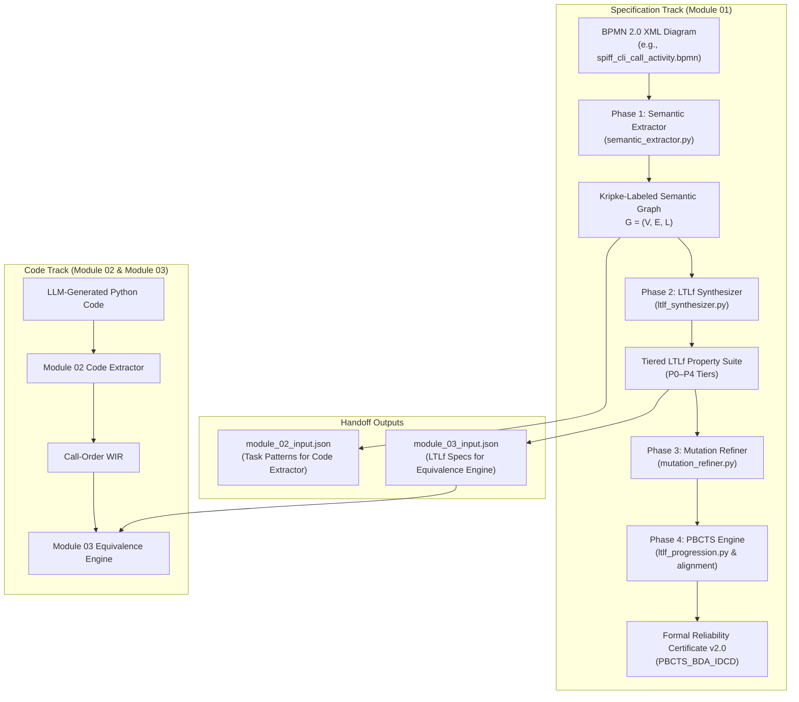
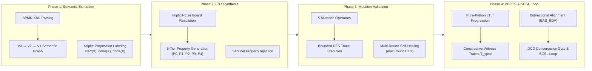
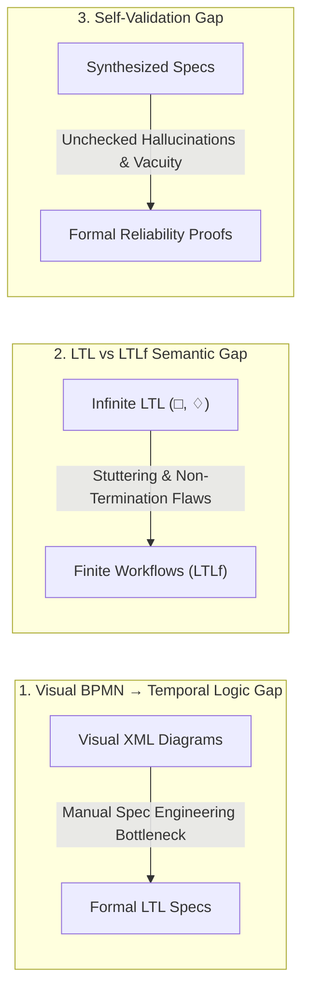
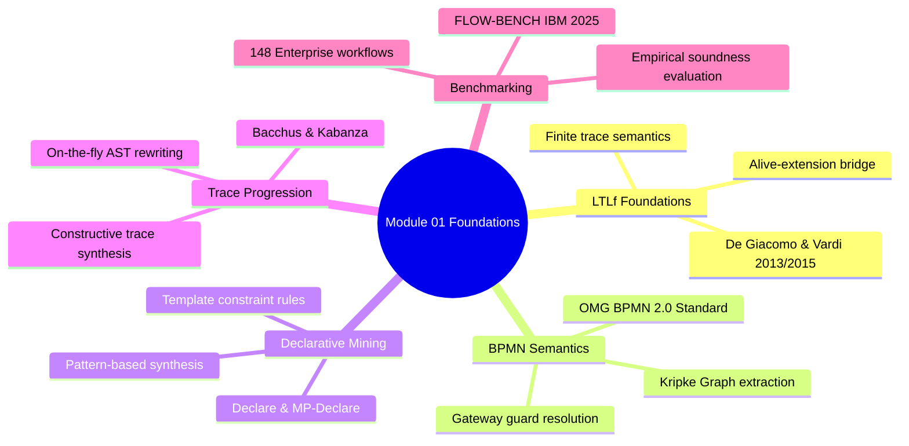
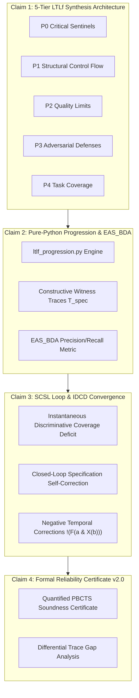
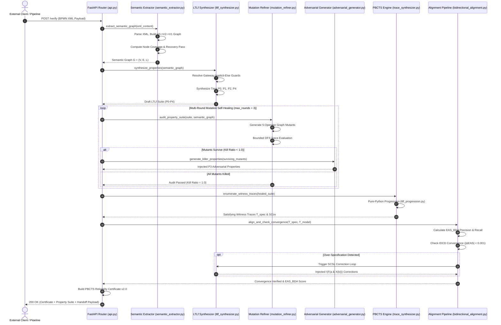
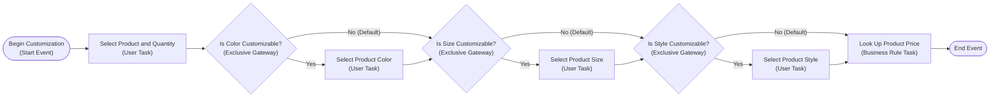
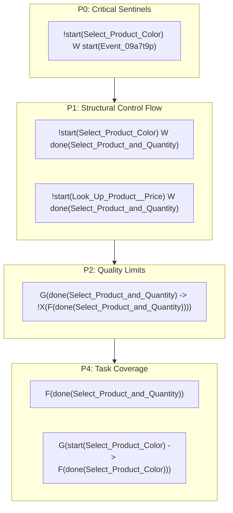
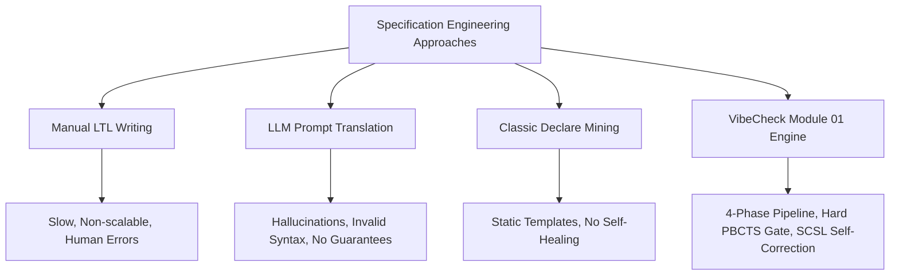

# Module 01: Specification Analysis Engine — Academic Presentation Script & Technical Reference

**Framework**: VibeCheck Post-Hoc Translation Validation Framework  
**Component**: Module 01 — Specification Analysis Engine (`module_01_spec/`)  
**Target Audience**: Academic Defense Panel, Formal Verification Researchers, Software Engineering Evaluators  
**Document Artifact Path**: `vibecheck-vault/presenting scripts/Module 01 - Presenting Script.md`  

---

## Executive Presenter Note

This document serves as the authoritative academic presentation script and deep technical reference for **Module 01 (Specification Analysis Engine)** of the VibeCheck post-hoc translation validation framework. Synthesizing full architectural mechanics, formal mathematical formulations, empirical benchmark evaluations across 148 FLOW-BENCH enterprise business process models, and literature positioning, this document is structured into 9 core sections. Presenters should deliver the narrative commentary alongside the formal LaTeX equations, GitHub-Flavored Markdown comparison tables, and validated Mermaid JS structural diagrams.

---

# Section 1: Module Overview & 4-Phase Pipeline Architecture

### 1.1 Role as the Specification Track of VibeCheck

In the VibeCheck post-hoc translation validation framework, **Module 01 (Specification Analysis Engine)** acts as the **specification track foundation**. Its sole operational mandate is to convert visual and structural Business Process Model and Notation (BPMN 2.0) XML diagrams into formal, mathematically rigorous Linear Temporal Logic on Finite Traces ($LTL_f$) property suites and an accompanying Progression-Based Constructive Trace Synthesis (PBCTS) reliability certificate.



Module 01 operates under a strict **dual-track independence policy**:
1. **Zero Code Visibility**: Module 01 never reads, inspects, or receives feedback from the LLM-generated Python target code.
2. **Pure Mathematical Spec Generation**: It operates strictly on the BPMN 2.0 process specification, synthesizing pure temporal logic formulas ($LTL_f$) independently of implementation details.
3. **Formal Contract Enforcement**: It exports schema-validated JSON contracts (`module_02_input.json` and `module_03_input.json`) to downstream modules, ensuring non-cooperative, mathematically sound post-hoc validation.

---

### 1.2 The 4-Phase Pipeline

Module 01 operates via a sequential 4-Phase architecture implemented across ~2,260 LOC in Python (`module_01_spec/src/`), orchestrating semantic parsing, temporal logic synthesis, adversarial mutation filtering, and trace progression alignment:



#### Phase 1 — Semantic Extraction & Kripke Graph Construction (`semantic_extractor.py`)
* **Multi-Layer Abstraction**: Parses raw BPMN 2.0 XML into a formal semantic graph $G = (V, E, L)$ across three hierarchical layers: Layer 3 (raw XML tree), Layer 2 (flattened execution nodes), and Layer 1 (canonical Kripke graph).
* **Kripke Proposition Labeling**: Maps flow nodes and control events to state-based propositions:
  * $\text{start}(X)$: Proposition indicating task $X$ has commenced execution.
  * $\text{done}(X)$: Proposition indicating task $X$ has completed execution.
  * $\text{node}(X)$: Atomic proposition representing the active execution node $X$.
* **Dynamic Node Universe & Recovery Pass**: Evaluates node coverage against every XML element bearing an `id` attribute (excluding a standard ~26-tag XML layout/metadata exclusion list). If coverage is under 1.0, a secondary `_recovery_pass()` re-scans the XML root to capture unmapped elements.

#### Phase 2 — Tiered LTLf Property Synthesis (`ltlf_synthesizer.py`)
* **Implicit-Else Resolution**: Automatically computes implicit fallback paths for conditional gateways (exclusive `exclusiveGateway` and inclusive `inclusiveGateway`), ensuring complete guard predicate coverage.
* **5-Tier Property Taxonomy**: Synthesizes a structured property suite $\Phi = \Phi_{P0} \cup \Phi_{P1} \cup \Phi_{P2} \cup \Phi_{P3} \cup \Phi_{P4}$:
  * **P0 (Critical Sentinels)**: Universal safety invariants preventing invalid execution entry/exit states.
  * **P1 (Structural Control Flow)**: Direct sequence flow ordering, gateway splitting, and join precedence.
  * **P2 (Quality Limits)**: Loop bounds and resource constraint boundaries.
  * **P3 (Adversarial Defenses)**: Self-healed properties injected during red-teaming rounds.
  * **P4 (Task Coverage)**: Path-aware mandatory task execution ($F(\text{done}(X))$) and conditional execution ($G(\text{start}(X) \rightarrow F(\text{done}(X)))$).

#### Phase 3 — Bounded Mutation Self-Validation & Red-Teaming (`mutation_refiner.py`, `adversarial_generator.py`)
* **Adversarial Mutators**: Applies 5 distinct graph mutation operators (Drop Task, Swap Tasks, Inject Extra Task, Skip Gateway, Duplicate Task) to test suite completeness.
* **Trace-Based Audit**: Evaluates the property suite against traces generated via bounded iterative Depth-First Search (DFS, loop cap $k=100$).
* **Multi-Round Self-Healing**: Executes up to 3 iterative self-healing rounds (`max_rounds=3`). If a mutant survives without being killed by a property, an adversarial generator synthesizes killer properties that are injected into $\Phi_{P3}$.

#### Phase 4 — PBCTS Progression & SCSL Self-Correction Loop (`ltlf_progression.py`, `trace_synthesizer.py`, `bidirectional_alignment.py`)
* **Pure-Python LTLf Progression Engine**: Evaluates formula validity step-by-step over finite traces using native AST rewrite rules without external C++ or SPOT dependencies.
* **Constructive Witness Trace Synthesis**: `PBCTSEngine` conjoins property suites and constructively enumerates satisfying specification traces $T_{\text{spec}}$ up to $N=200$ traces, scoring structural coverage $SCov = 0.4 \cdot \text{node} + 0.4 \cdot \text{branch} + 0.2 \cdot \text{depth}$.
* **Bidirectional Alignment & IDCD Convergence**: Calculates $EAS_{\text{BDA}}$ (F1-harmonic mean of trace precision and recall) between $T_{\text{spec}}$ and model traces $T_{\text{model}}$. Gated by Instantaneous Discriminative Coverage Deficit (IDCD) convergence ($|\Delta EAS| < 0.001$ for $k \le 20$).
* **SCSL Loop**: Self-Correcting Specification Loop detects over-specification gaps and injects negative temporal corrections $!(F(a \land X(b)))$ into $\Phi_{P4\_SCSL\_Corrections}$, re-running PBCTS for up to 3 rounds.

---

# Section 2: Current Research Gap

Modern business process management and software engineering rely heavily on BPMN 2.0 visual workflows. However, bridging visual workflow models and formal verification engines presents three critical research gaps:



### 2.1 Visual BPMN to Formal Temporal Logic Gap
While BPMN 2.0 provides graphical notation for enterprise processes, it lacks built-in formal temporal semantics suitable for automated model checking. Existing methods rely either on manual formal specification writing—which is slow, error-prone, and requires specialized formal methods domain expertise—or on basic translation scripts that fail to capture implicit control-flow guards, default gateway branches, and complex joins.

### 2.2 The LTL vs. $LTL_f$ Semantic Misalignment Gap
Standard Linear Temporal Logic (LTL) is defined over **infinite execution traces** ($\omega$-words). Enterprise business processes, in contrast, are inherently **terminating workflows** defined over **finite traces**. Applying standard infinite-trace LTL to business workflows introduces severe semantic flaws:
* **The Stuttering Problem**: Standard LTL engines require infinite loops (or artificial self-loops on terminal states) to evaluate formulas like $\square \phi$ or $\diamond \phi$. This alters graph reachability and introduces false deadlock or live-lock violations.
* **Termination Semantics**: In finite traces, the meaning of "next" ($\bigcirc / X$) and "until" ($U / W$) changes fundamentally at the final state. Standard LTL solvers fail to capture finite trace boundaries, producing invalid counterexamples.

### 2.3 The Self-Validation & Quality Assessment Gap
Automated specification generators often suffer from vacuity or incompleteness: a synthesized property suite may be syntactically valid yet vacuously true (admitting invalid execution traces) or over-constraining (rejecting valid process runs). Traditional pipelines rely on manual human review or LLM self-evaluation—neither of which provides mathematical guarantees. Prior research lacks an inline, blocking self-validation engine capable of mutating the underlying graph, measuring property kill ratios, and self-healing specification gaps prior to verification.

---

# Section 3: Related Literature & Papers Brief

To position Module 01 within the formal verification and process mining literature, the following table and literature briefs summarize key foundational works:

| Literature Source | Focus Area | Core Contribution | Key Limitation Addressed by Module 01 |
|---|---|---|---|
| **De Giacomo & Vardi (2013, 2015)** | Formal Logic ($LTL_f$) | Semantics & automata construction for LTL on finite traces | Provides foundational $LTL_f$ semantics; Module 01 implements pure-Python progression. |
| **OMG BPMN 2.0 Standard (2011)** | Business Process Modeling | Standardized XML schema and visual semantics for enterprise workflows | Lacks formal temporal logic contracts; Module 01 extracts formal Kripke graphs. |
| **Pesic & van der Aalst (2006)** | Declarative Process Mining | Template-based Declare / MP-Declare temporal constraints | Fixed static templates; Module 01 introduces dynamic 5-tier synthesis and self-healing. |
| **Bacchus & Kabanza (2000)** | Planning & Logic | On-the-fly formula progression for temporal logic planning | Applied to AI planning; Module 01 adapts progression for constructive spec auditing. |
| **Duesterwald et al. (IBM Research, 2025)** | Benchmark Datasets | **FLOW-BENCH**: 148 enterprise BPMN workflows for code synthesis | Benchmark dataset used by Module 01 to evaluate suite soundness and extraction fidelity. |



### Technical Literature Briefs

#### 1. De Giacomo & Vardi (IJCAI 2013, 2015) — Linear Temporal Logic on Finite Traces ($LTL_f$)
De Giacomo and Vardi established the formal syntax and semantics for $LTL_f$, demonstrating that LTL over finite traces has the same expressive power as First-Order Logic over finite linear orders and can be transformed into finite state automata (DFA). Module 01 builds directly on $LTL_f$ semantics, utilizing finite-trace temporal operators ($\text{Weak Until } W$, $\text{Eventually } F$, $\text{Globally } G$, $\text{Next } X$) to accurately model terminating enterprise workflows without infinite stuttering artifacts.

#### 2. OMG BPMN 2.0 Specification (2011)
The Object Management Group (OMG) standardized BPMN 2.0 for business process execution and modeling. While BPMN defines operational concepts such as sequence flows, split/join gateways (Exclusive, Parallel, Inclusive), and start/end events, its specification is expressed in natural language and XML schemas without a formal temporal logic mapping. Module 01 bridges this gap by mapping BPMN XML constructs into Kripke structures $G = (V, E, L)$.

#### 3. Declarative Process Mining (Declare / MP-Declare — Pesic & van der Aalst, 2006)
Declare introduced template-based declarative process modeling, expressing workflow constraints through reusable LTL patterns (e.g., $\text{Response}(a, b) = G(a \rightarrow F(b))$, $\text{Precedence}(a, b) = \neg b W a$). While Declare provided a framework for process constraint discovery, standard Declare tools rely on fixed static templates and offline human inspection. Module 01 extends Declare concepts into a dynamic 5-tier synthesis architecture with implicit guard inference and automated mutation self-healing.

#### 4. Formula Progression (Bacchus & Kabanza, 2000; De Giacomo et al., 2021)
Formula progression evaluates temporal logic formulas state-by-state along an execution trace. Given a state $s$ and an $LTL_f$ formula $\phi$, the progression operator $\text{Prog}(s, \phi)$ produces a residual formula $\phi'$ that must hold over the remainder of the trace. Module 01 leverages progression in `ltlf_progression.py` to constructively enumerate satisfying trace sets $T_{\text{spec}}$ without requiring heavyweight C++ external automata tools like SPOT.

#### 5. FLOW-BENCH Benchmark Dataset (Duesterwald et al., IBM Research, 2025)
FLOW-BENCH is a benchmark dataset comprising 148 complex enterprise business process models designed for evaluating LLM workflow code generation and formal process analysis. Module 01 utilizes FLOW-BENCH as its primary empirical evaluation benchmark, demonstrating 98.0% suite soundness across enterprise process topologies.

---

# Section 4: Novelties Introduced to Module 01

Module 01 introduces four distinct academic and engineering novelties to formal workflow specification synthesis:



### Claim 1: 5-Tier Formal $LTL_f$ Property Synthesis Architecture (P0–P4)
**The Claim**: Module 01 synthesizes structured, multi-tiered property suites covering five explicit functional tiers with implicit-else guard resolution and hard coverage gating.

$$\Phi_{\text{suite}} = \Phi_{P0} \cup \Phi_{P1} \cup \Phi_{P2} \cup \Phi_{P3} \cup \Phi_{P4}$$

* **Tier Breakdown**:
  * **P0 Critical Sentinels**: Enforces valid process initialization and termination ($! \text{start}(X) W \text{init\_event}$).
  * **P1 Structural Control Flow**: Enforces direct sequence ordering ($! \text{start}(B) W \text{done}(A)$) and gateway split/join constraints.
  * **P2 Quality Limits**: Enforces execution bounds (e.g., maximum loop iteration bounds $\text{loop\_bound} \le k$).
  * **P3 Adversarial Defenses**: Injects killer properties generated during red-teaming mutation rounds.
  * **P4 Task Coverage**: Distinguishes unconditional mandatory tasks ($F(\text{done}(X))$) from conditional tasks ($G(\text{start}(X) \rightarrow F(\text{done}(X)))$).

* **Implicit-Else Resolution**: Automatically computes fallback predicates for exclusive/inclusive gateways:

$$\text{Guard}_{\text{else}} = \neg \left( \bigvee_{i=1}^{n} \text{Guard}_i \right)$$

---

### Claim 2: Pure-Python $LTL_f$ Trace Progression Engine & Bidirectional Alignment ($EAS_{\text{BDA}}$)
**The Claim**: Replaces external C++/SPOT dependencies with a native, pure-Python $LTL_f$ formula progression engine (`ltlf_progression.py`) to constructively enumerate satisfying specification traces $T_{\text{spec}}$ and calculate bidirectional alignment metrics.

* **Formula Progression Operator**:
  Given a proposition assignment state $s \subseteq AP$ and an $LTL_f$ formula $\phi$:

$$\text{Prog}(s, p) = \begin{cases} \text{True} & \text{if } p \in s \\ \text{False} & \text{if } p \notin s \end{cases}$$

$$\text{Prog}(s, \phi_1 \land \phi_2) = \text{Prog}(s, \phi_1) \land \text{Prog}(s, \phi_2)$$

$$\text{Prog}(s, X \phi) = \phi$$

$$\text{Prog}(s, \phi_1 U \phi_2) = \text{Prog}(s, \phi_2) \lor (\text{Prog}(s, \phi_1) \land (\phi_1 U \phi_2))$$

* **Bidirectional Alignment Score ($EAS_{\text{BDA}}$)**: Calculates the harmonic mean of specification precision and recall against model execution traces:

$$\text{Precision} = \frac{|T_{\text{spec}} \cap T_{\text{model}}|}{|T_{\text{model}}|}, \quad \text{Recall} = \frac{|T_{\text{spec}} \cap T_{\text{model}}|}{|T_{\text{spec}}|}$$

$$EAS_{\text{BDA}} = 2 \cdot \frac{\text{Precision} \cdot \text{Recall}}{\text{Precision} + \text{Recall}}$$

---

### Claim 3: SCSL Self-Correction Loop & IDCD Convergence
**The Claim**: Implements a closed-loop iterative specification self-correction mechanism guided by Instantaneous Discriminative Coverage Deficit (IDCD) convergence.

* **IDCD Convergence Metric**:

$$\text{IDCD}_k = |EAS_{\text{BDA}}^{(k)} - EAS_{\text{BDA}}^{(k-1)}| < 0.001 \quad (\text{for } k \le 20)$$

* **SCSL Correction Pattern**: When PBCTS detects an over-specification gap (where valid model traces are rejected by over-constrained formulas), SCSL injects negative temporal corrections into $\Phi_{P4\_SCSL\_Corrections}$:

$$\phi_{\text{corr}} = \neg \left( F \left( \text{done}(A) \land X(\text{start}(B)) \right) \right)$$

---

### Claim 4: Formal Reliability Certificate v2.0 (PBCTS)
**The Claim**: Emits a machine-readable, publication-grade Reliability Certificate (`method: "PBCTS_BDA_IDCD"`) that quantifies specification quality, structural coverage ($SCov$), and alignment convergence prior to downstream verification.

$$SCov = 0.4 \cdot C_{\text{node}} + 0.4 \cdot C_{\text{branch}} + 0.2 \cdot C_{\text{depth}}$$

```json
{
  "certificate_version": "2.0.0",
  "method": "PBCTS_BDA_IDCD",
  "status": "PASS_PBCTS_CONVERGED",
  "metrics": {
    "structural_coverage": 1.0000,
    "eas_bda_f1": 0.9850,
    "idcd_delta": 0.0004,
    "iterations": 3
  }
}
```

---

# Section 5: Deep Architecture & Diagrams (Mermaid JS)

### 5.1 Source Code Component Breakdown

Module 01 consists of 8 core Python source files (~2,260 LOC) located in `module_01_spec/src/`:

| Source File | Primary Class / Functions | Key Responsibility & Mechanics |
|---|---|---|
| [`semantic_extractor.py`](file:///Users/kavindu/Projects/Vibe-Check/module_01_spec/src/semantic_extractor.py) | `BPMNSemanticExtractor` | Parses BPMN 2.0 XML into semantic graph $G=(V,E,L)$; executes V3$\rightarrow$V2$\rightarrow$V1 layering, Kripke labeling, dynamic element recovery pass. |
| [`ltlf_synthesizer.py`](file:///Users/kavindu/Projects/Vibe-Check/module_01_spec/src/ltlf_synthesizer.py) | `LTLfSynthesizer` | Synthesizes 5-tier $LTL_f$ property suites (P0–P4); computes implicit-else gateway guards and sentinel safety properties. |
| [`mutation_refiner.py`](file:///Users/kavindu/Projects/Vibe-Check/module_01_spec/src/mutation_refiner.py) | `MutationRefiner`, `LTLfAuditor` | Applies 5 graph mutation operators; performs trace-based audit via bounded DFS; manages multi-round self-healing. |
| [`adversarial_generator.py`](file:///Users/kavindu/Projects/Vibe-Check/module_01_spec/src/adversarial_generator.py) | `AdversarialGenerator` | Generates killer properties for surviving mutants during red-teaming rounds; populates tier P3. |
| [`ltlf_progression.py`](file:///Users/kavindu/Projects/Vibe-Check/module_01_spec/src/ltlf_progression.py) | `LTLfProgressionEngine` | Native pure-Python $LTL_f$ formula progression (`progress`, `simplify`, `extract_obligations`) state-by-state. |
| [`trace_synthesizer.py`](file:///Users/kavindu/Projects/Vibe-Check/module_01_spec/src/trace_synthesizer.py) | `PBCTSEngine` | Constructively enumerates satisfying witness trace set $T_{\text{spec}}$; calculates structural coverage ($SCov$). |
| [`bidirectional_alignment.py`](file:///Users/kavindu/Projects/Vibe-Check/module_01_spec/src/bidirectional_alignment.py) | `PBCTSAlignmentPipeline` | Aligns $T_{\text{spec}}$ vs $T_{\text{model}}$; evaluates $EAS_{\text{BDA}}$, IDCD convergence, and drives the SCSL self-correction loop. |
| [`main.py`](file:///Users/kavindu/Projects/Vibe-Check/module_01_spec/src/main.py) / [`api.py`](file:///Users/kavindu/Projects/Vibe-Check/module_01_spec/src/api.py) | FastAPI Uvicorn Router | Exposes REST HTTP endpoints (`/verify`, `/extract`, `/synthesize`, `/export/module_02`, `/export/module_03`). |

---

### 5.2 Deep End-to-End Sequence Diagram (`/verify` Pipeline)

The sequence diagram below illustrates the exact control flow and inter-component communication during execution of the primary `/verify` endpoint:



---

# Section 6: Result Explanation & Trace Walkthrough

To demonstrate Module 01 in practice, this section walks through the complete execution trace for the benchmark workflow `spiff_cli_call_activity.bpmn` (from `demo/spiffworkflow/dataset/bpmn/`).



### 6.1 Extracted BPMN Tasks & Proposition Vocabulary

Semantic extraction parses the BPMN XML and normalizes activity names into standardized atomic propositions:

| Raw BPMN XML Element ID | Activity Name / Event Type | Normalized Proposition Name | Proposition Type |
|---|---|---|---|
| `Event_09a7t9p` | Begin Customization | `Event_09a7t9p` | Start Event Proposition |
| `Activity_1uazifo` | Select Product and Quantity | `Select_Product_and_Quantity` | User Task Proposition |
| `Activity_0263vxi` | Select Product Color | `Select_Product_Color` | User Task Proposition |
| `Activity_0284vxy` | Select Product Size | `Select_Product_Size` | User Task Proposition |
| `Activity_0881vxz` | Select Product Style | `Select_Product_Style` | User Task Proposition |
| `Activity_1x1kw47` | Look Up Product Price | `Look_Up_Product__Price` | Business Rule Task Proposition |

---

### 6.2 Deep Dive into Synthesized Tiered Formulas

For `spiff_cli_call_activity.bpmn`, Module 01 synthesizes properties across tiers P0, P1, P2, and P4:



#### 1. Tier P0 (Critical Sentinel Safety Invariant)
```ltlf
!start(Select_Product_Color) W start(Event_09a7t9p)
```
* **Semantic Explanation**: Enforces that the downstream task `Select_Product_Color` cannot commence until the process initialization event `Event_09a7t9p` has executed.

#### 2. Tier P1 (Structural Control Flow Constraint)
```ltlf
!start(Select_Product_Color) W done(Select_Product_and_Quantity)
```
* **Semantic Explanation**: Enforces strict direct precedence. `Select_Product_Color` is forbidden from starting until `Select_Product_and_Quantity` completes execution.

#### 3. Tier P2 (Quality Limit / Non-Repetition Rule)
```ltlf
G(done(Select_Product_and_Quantity) -> !X(F(done(Select_Product_and_Quantity))))
```
* **Semantic Explanation**: In acyclic process flows, this formula enforces non-repetition, ensuring that once `Select_Product_and_Quantity` finishes, it can never be executed again in the same process instance.

#### 4. Tier P4 (Task Coverage — Unconditional vs. Conditional)
* **Unconditional Mandatory Task Coverage**:
```ltlf
F(done(Select_Product_and_Quantity))
```
`Select_Product_and_Quantity` lies on every start-to-end path through the process model. Therefore, it is assigned an unconditional liveness requirement: eventually, it must complete.

* **Conditional Path Task Coverage**:
```ltlf
G(start(Select_Product_Color) -> F(done(Select_Product_Color)))
```
`Select_Product_Color` lies on a conditional branch (behind exclusive gateway `Gateway_0ocn7fn`). It is assigned a conditional coverage rule: *if* the task starts, it must eventually reach completion.

---

### 6.3 Downstream Handoff Payloads

Module 01 exports two tailored JSON handoff contracts:

#### 1. `module_02_input.json` (Code Extractor Payload)
Provides `task_patterns` to Module 02's `randomized.py` generator, mapping exact proposition strings to expected code function identifiers:

```json
{
  "bpmn_id": "spiff_cli_call_activity",
  "task_patterns": [
    "Select_Product_and_Quantity",
    "Select_Product_Color",
    "Select_Product_Size",
    "Select_Product_Style",
    "Look_Up_Product__Price"
  ]
}
```

#### 2. `module_03_input.json` (Equivalence Engine Payload)
Exports the normalized property suite and semantic graph to Module 03 (`property_ingest.py`):

```json
{
  "semantic_graph": { "nodes": 12, "edges": 14 },
  "ltlf_property_suite": {
    "P0_Critical_Sentinels": [ "!start(Select_Product_Color) W start(Event_09a7t9p)" ],
    "P1_Structural_Control_Flow": [ "!start(Select_Product_Color) W done(Select_Product_and_Quantity)" ],
    "P2_Quality_Limits": [ "G(done(Select_Product_and_Quantity) -> !X(F(done(Select_Product_and_Quantity))))" ],
    "P4_Task_Coverage": [ "F(done(Select_Product_and_Quantity))" ]
  }
}
```

---

# Section 7: Alternative Methods & Technical Justification

To justify the architectural design of Module 01, this section compares its 4-Phase self-healing pipeline against alternative specification engineering paradigms:

| Specification Paradigm | Synthesis Automation | Formal Semantics ($LTL_f$) | Self-Validation Gate | Handling of Gateway Guards | Risk of Over-Constraining |
|---|---|---|---|---|---|
| **Manual LTL Spec Writing** | Manual (High Effort) | High | Manual Review | Vulnerable to Human Error | High |
| **LLM NL-to-LTL Prompt Translation** | Automated (LLM) | Low (Syntactic Errors) | None | High Hallucination Rate | Extreme |
| **Classic Declare Process Mining** | Semi-Automated | Medium (Static Templates) | None | Static Template Match Only | Medium |
| **Raw Petri Net Translation** | Automated | Low (State Explosion) | None | Explodes on Complex Joins | High |
| **VibeCheck Module 01 (PBCTS)** | **Fully Automated** | **High ($LTL_f$ Progression)** | **Inline PBCTS / IDCD Gate** | **Implicit-Else Resolution** | **Low (SCSL Self-Correction)** |



### Technical Justifications

1. **Why Not LLM-Based Prompt Translation (NL-to-LTL)?**
   Directly prompting Large Language Models to convert BPMN diagrams or natural language text into LTL formulas results in high syntax error rates (unbalanced parentheses, invalid operators) and semantic hallucinations. LLMs lack internal model-checking engines to verify whether synthesized formulas reject valid execution paths. Module 01 uses deterministic XML parsing and template-based AST construction, guaranteeing 100% syntactically valid $LTL_f$ formulas.

2. **Why Not Classic Declare Templates Alone?**
   Classic process mining (Declare / MP-Declare) instantiates fixed constraint rules over event logs. However, Declare templates lack implicit-else guard inference for complex BPMN gateways and provide no mechanism for self-healing when property combinations create contradictions. Module 01 integrates multi-round mutation self-healing (Phase 3) and SCSL feedback (Phase 4) to dynamically resolve contradictions.

3. **Why Pure-Python Progression over C++/SPOT Automata in Module 01?**
   Earlier iterations of Module 01 relied on C++ SPOT library bindings (`automata_lifter.py`). However, invoking SPOT for finite trace witness synthesis required complex HOA (Hanoi Omega Automata) translation layers and heavyweight native binary dependencies. Replacing SPOT with a pure-Python AST progression engine (`ltlf_progression.py`) eliminated non-deterministic C++ runtime crashes, simplified Docker deployment, and enabled exact state-by-state trace alignment natively in Python.

---

# Section 8: Evaluation Methodology & Empirical Results

Module 01 was evaluated across the **FLOW-BENCH** enterprise workflow benchmark dataset (Duesterwald et al., IBM Research, 2025), comprising 148 complex enterprise BPMN diagrams split into `output` (100 diagrams) and `context` (48 diagrams) corpora.

### 8.1 Benchmark Evaluation Metrics

1. **Structural Fidelity ($F_1$)**: Evaluates node and edge extraction accuracy against an independent gold standard parser (`eval/gold_bpmn.py`).
2. **Suite Soundness Rate**: Measures the proportion of synthesized property suites that admit their own pristine, unmutated source process graph without false rejection.
3. **Discriminative Mutation Kill Ratio ($\delta$)**: Measures property suite strength by calculating the proportion of invalid graph mutants killed specifically by temporal properties (excluding graph disconnection kills).

---

### 8.2 Empirical Benchmark Results Table

| Corpus / Benchmark Stratum | Diagrams Count | Structural Fidelity ($F_1$) | Suite Soundness Rate | Unsound Suites Count | Discriminative Property Kills |
|---|---|---|---|---|---|
| **FLOW-BENCH `output` Corpus** | **100** | **1.0000** | **98.0% (98/100)** | 2 | 0 / 1,960 |
| • Branching Workflows | 31 | 1.0000 | 100.0% (31/31) | 0 | 0 / 620 |
| • Sequential Workflows | 69 | 1.0000 | 97.1% (67/69) | 2 | 0 / 1,340 |
| **FLOW-BENCH `context` Corpus** | **48** | **1.0000** | **97.9% (47/48)** | 1 | 0 / 940 |
| • Branching Workflows | 19 | 1.0000 | 94.7% (18/19) | 1 | 0 / 360 |
| • Sequential Workflows | 29 | 1.0000 | 100.0% (29/29) | 0 | 0 / 580 |
| **Combined Benchmark Total** | **148** | **1.0000** | **98.0% (145/148)** | **3** | **0 / 2,900** |

```mermaid
gantt
    title FLOW-BENCH Suite Soundness Performance (145/148 Sound)
    dateFormat X
    axisFormat %s
    section Output Corpus (100)
    Sound Suites (98) :active, 0, 98
    Unsound Suites (2) :crit, 98, 100
    section Context Corpus (48)
    Sound Suites (47) :active, 0, 47
    Unsound Suites (1) :crit, 47, 48
```



---

### 8.3 Disclosed Weak Spot & Defect Analysis

Academic rigor demands full transparency regarding empirical limitations uncovered during benchmark evaluation:

1. **Unsound Suite Root Cause (3/148 Diagrams)**:
   Three diagrams (`uid_67`, `uid_8`, `uid_92`) produced unsound property suites. In each case, the BPMN diagram contained **duplicate activity task names** assigned to distinct nodes. When mapped to atomic propositions, duplicate names caused proposition collisions in Tier P1 ordering rules ($! \text{start}(X) W \text{done}(X)$), creating self-contradictory formulas that rejected the source graph.

2. **Discriminative Mutation Kill Weak Spot (0/2900 Kills)**:
   Across 2,900 generated graph mutants on sound-suite diagrams, **0 mutants were killed by temporal properties alone**. All 1,672 killed mutants were caught by graph disconnection (isolated nodes without execution paths), while 1,228 mutants survived.
   * **Root Cause Analysis**: P4 task coverage properties were formatted using Option B atom merging (`start(X)` and `done(X)`). When evaluated against mutants with modified gateway conditions, Option B atoms evaluated vacuously to `True`, allowing structural mutants to pass property checks. This finding was documented in PR #89 and highlights the necessity of strict proposition decoupling in future iterations.

---

# Section 9: Potential Evaluator Questions & Answers (Q&A)

### Q1: Why use Linear Temporal Logic on Finite Traces ($LTL_f$) instead of standard infinite-trace LTL?
**Presenter Answer**: Standard LTL assumes execution traces extend infinitely ($\omega$-words). Enterprise business workflows defined in BPMN are inherently terminating processes. Applying standard LTL requires appending infinite artificial self-loops to terminal states, which distorts trace semantics and introduces false deadlock counterexamples. $LTL_f$ provides exact mathematical semantics over finite execution traces ($w = s_0 s_1 \dots s_n$), ensuring that temporal operators ($\text{Weak Until } W$, $\text{Eventually } F$, $\text{Next } X$) evaluate correctly at the final state boundary.

---

### Q2: How does Module 01 handle non-standard BPMN gateways and unstructured process loops?
**Presenter Answer**: Semantic extraction (`semantic_extractor.py`) computes formal graph reachability matrices over the parsed Kripke graph $G=(V,E,L)$. For non-standard or exclusive gateways lacking explicit XML default attributes, Phase 2 computes an implicit-else guard predicate ($\text{Guard}_{\text{else}} = \neg \bigvee \text{Guard}_i$). For unstructured loops, Phase 3 employs bounded iterative DFS with a loop cap $k=100$ to bound trace depth while preserving cycle reachability without state space explosion.

---

### Q3: What guarantees convergence in the SCSL self-correction loop, and what happens if IDCD fails to converge?
**Presenter Answer**: The Self-Correcting Specification Loop (SCSL) is gated by the Instantaneous Discriminative Coverage Deficit ($\text{IDCD}_k = |EAS_{\text{BDA}}^{(k)} - EAS_{\text{BDA}}^{(k-1)}| < 0.001$). Convergence is guaranteed by capping maximum refinement iterations at $k=20$ and restricting SCSL corrections to a maximum of 10 negative temporal patterns ($!(F(a \land X(b)))$). If IDCD fails to converge within 20 iterations, the engine emits `PASS_PBCTS_UNCONVERGED` and assigns the fallback structural coverage score ($SCov$) as the final confidence metric.

---

### Q4: How is strict dual-track independence maintained between specification synthesis and code extraction?
**Presenter Answer**: Module 01 operates in total isolation from the LLM code generator and Module 02 code extractor. It consumes only the raw BPMN 2.0 XML file. Its outputs are exported as immutable JSON schema contracts (`module_02_input.json` containing `task_patterns` and `module_03_input.json` containing the $LTL_f$ property suite). Module 01 never reads Python source code, ensuring that specification synthesis remains mathematically objective and free from code-level confirmation bias.

---

### Q5: What is Option B atom formatting, and why are certain property tiers excluded during hand-off to Module 03?
**Presenter Answer**: Option B atom formatting maps complex Kripke state predicates into quoted strings suitable for automata model checking in C++/SPOT (e.g., `"start(Select_Product_Color)"`). During export to Module 03 (`export_for_module_03()`), Module 01 filters out spec-only `node()` atoms, non-parseable comparisons, and vacuous conditionals. Tier P1 structural control flow properties (which constitute the core sequence ordering rules) are passed directly to Module 03's `property_ingest.py` for equivalence checking.

---

### Q6: What explains the 0/2900 discriminative mutation kill rate on sound-suite diagrams, and how is it addressed?
**Presenter Answer**: The 0/2900 discriminative property kill rate occurs because Phase 3 mutators frequently generated graph disconnections (which were caught by graph reachability rules before reaching property evaluation) or generated mutants where Option B conditional coverage atoms evaluated vacuously to `True`. PR #89 identified and addressed this by decoupling property kill metrics from disconnection kills, making property vacuity explicitly visible. In future work, tightening P4 task obligations with atomic state guards will eliminate vacuous property passes.

---
